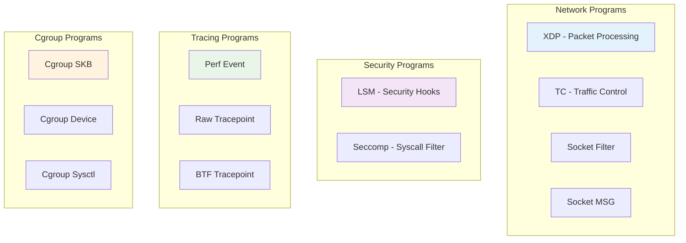

# Custom Program Types

Beyond basic tracepoints and kprobes, eBPF supports many specialized program types for different use cases. This guide explores advanced program types and how to implement them.

## 🎯 eBPF Program Types Overview



## 🌐 Network Programs

### 1. XDP (eXpress Data Path)

XDP programs run at the earliest point in the network stack, providing line-rate packet processing.

#### Basic XDP Program
```c
#include "common.h"
#include <linux/if_ether.h>
#include <linux/ip.h>
#include <linux/tcp.h>
#include <linux/udp.h>

// Statistics map
struct {
    __uint(type, BPF_MAP_TYPE_PERCPU_ARRAY);
    __type(key, u32);
    __type(value, u64);
    __uint(max_entries, 5);
} xdp_stats SEC(".maps");

enum {
    STAT_PACKETS = 0,
    STAT_BYTES,
    STAT_TCP,
    STAT_UDP,
    STAT_DROPPED,
};

SEC("xdp")
int xdp_packet_filter(struct xdp_md *ctx) {
    void *data_end = (void *)(long)ctx->data_end;
    void *data = (void *)(long)ctx->data;
    
    // Update packet statistics
    u32 key = STAT_PACKETS;
    u64 *counter = bpf_map_lookup_elem(&xdp_stats, &key);
    if (counter) (*counter)++;
    
    // Parse Ethernet header
    struct ethhdr *eth = data;
    if ((void *)(eth + 1) > data_end)
        return XDP_ABORTED;
        
    // Only process IP packets
    if (eth->h_proto != bpf_htons(ETH_P_IP))
        return XDP_PASS;
    
    // Parse IP header
    struct iphdr *ip = (void *)(eth + 1);
    if ((void *)(ip + 1) > data_end)
        return XDP_ABORTED;
    
    // Update byte statistics
    key = STAT_BYTES;
    counter = bpf_map_lookup_elem(&xdp_stats, &key);
    if (counter) (*counter) += bpf_ntohs(ip->tot_len);
    
    // Process TCP packets
    if (ip->protocol == IPPROTO_TCP) {
        struct tcphdr *tcp = (void *)(ip + 1);
        if ((void *)(tcp + 1) > data_end)
            return XDP_ABORTED;
            
        key = STAT_TCP;
        counter = bpf_map_lookup_elem(&xdp_stats, &key);
        if (counter) (*counter)++;
        
        // Example: Drop packets to specific port
        if (tcp->dest == bpf_htons(22)) { // SSH port
            key = STAT_DROPPED;
            counter = bpf_map_lookup_elem(&xdp_stats, &key);
            if (counter) (*counter)++;
            return XDP_DROP;
        }
    }
    
    // Process UDP packets  
    else if (ip->protocol == IPPROTO_UDP) {
        key = STAT_UDP;
        counter = bpf_map_lookup_elem(&xdp_stats, &key);
        if (counter) (*counter)++;
    }
    
    return XDP_PASS;
}

char _license[] SEC("license") = "GPL";
```

#### XDP Return Codes
- **XDP_ABORTED**: Error occurred, drop packet
- **XDP_DROP**: Drop packet intentionally
- **XDP_PASS**: Continue normal processing
- **XDP_TX**: Transmit packet out same interface
- **XDP_REDIRECT**: Redirect to another interface

#### Go XDP Integration
```go
//go:generate go run github.com/cilium/ebpf/cmd/bpf2go -target native xdp ../bpf/xdp_filter.c

func attachXDPProgram(iface string) error {
    objs := xdpObjects{}
    if err := loadXdpObjects(&objs, nil); err != nil {
        return fmt.Errorf("loading XDP objects: %w", err)
    }
    defer objs.Close()
    
    // Get network interface
    ifc, err := net.InterfaceByName(iface)
    if err != nil {
        return fmt.Errorf("getting interface %s: %w", iface, err)
    }
    
    // Attach XDP program
    l, err := link.AttachXDP(link.XDPOptions{
        Program:   objs.XdpPacketFilter,
        Interface: ifc.Index,
        Flags:     link.XDPGenericMode, // Use generic mode for compatibility
    })
    if err != nil {
        return fmt.Errorf("attaching XDP program: %w", err)
    }
    defer l.Close()
    
    log.Printf("XDP program attached to interface %s", iface)
    
    // Monitor statistics
    return monitorXDPStats(objs.XdpStats)
}

func monitorXDPStats(statsMap *ebpf.Map) error {
    ticker := time.NewTicker(time.Second)
    defer ticker.Stop()
    
    for range ticker.C {
        var stats [5]uint64
        if err := statsMap.Lookup(uint32(0), &stats[0]); err != nil {
            continue
        }
        
        fmt.Printf("XDP Stats - Packets: %d, Bytes: %d, TCP: %d, UDP: %d, Dropped: %d\n",
            stats[0], stats[1], stats[2], stats[3], stats[4])
    }
    
    return nil
}
```

### 2. TC (Traffic Control)

TC programs can modify, redirect, or drop packets at the ingress/egress points.

```c
#include "common.h"
#include <linux/pkt_cls.h>

SEC("tc")
int tc_classifier(struct __sk_buff *skb) {
    // Access packet data
    void *data = (void *)(long)skb->data;
    void *data_end = (void *)(long)skb->data_end;
    
    // Parse Ethernet header
    struct ethhdr *eth = data;
    if ((void *)(eth + 1) > data_end)
        return TC_ACT_OK;
    
    // Example: Mark all TCP traffic
    if (eth->h_proto == bpf_htons(ETH_P_IP)) {
        struct iphdr *ip = (void *)(eth + 1);
        if ((void *)(ip + 1) > data_end)
            return TC_ACT_OK;
            
        if (ip->protocol == IPPROTO_TCP) {
            // Mark packet for special handling
            skb->mark = 0x1234;
            return TC_ACT_OK;
        }
    }
    
    return TC_ACT_OK;
}
```

## 🔒 Security Programs

### 1. LSM (Linux Security Module)

LSM hooks allow implementing custom security policies.

```c
#include "common.h"
#include <linux/security.h>

// Track file access attempts
struct file_access_event {
    u32 pid;
    u32 uid;
    char comm[16];
    char filename[256];
    u32 access_type;  // read=1, write=2, execute=4
    u8 allowed;
};

struct {
    __uint(type, BPF_MAP_TYPE_RINGBUF);
    __uint(max_entries, 1 << 24);
} security_events SEC(".maps");

// Whitelist of allowed executables
struct {
    __uint(type, BPF_MAP_TYPE_HASH);
    __type(key, char[256]);
    __type(value, u8);
    __uint(max_entries, 1000);
} allowed_executables SEC(".maps");

SEC("lsm/file_open")
int lsm_file_open(struct file *file) {
    // Get process information
    u32 pid = bpf_get_current_pid_tgid() & 0xFFFFFFFF;
    u32 uid = bpf_get_current_uid_gid() & 0xFFFFFFFF;
    
    // Get filename (simplified - real implementation needs path resolution)
    char filename[256];
    struct dentry *dentry = file->f_path.dentry;
    bpf_probe_read_kernel_str(filename, sizeof(filename), dentry->d_name.name);
    
    // Check if this is an executable file being opened
    bool is_executable = false;
    if (file->f_mode & FMODE_EXEC) {
        is_executable = true;
        
        // Check whitelist for executables
        u8 *allowed = bpf_map_lookup_elem(&allowed_executables, filename);
        if (!allowed) {
            // Log security event
            struct file_access_event *event = 
                bpf_ringbuf_reserve(&security_events, sizeof(*event), 0);
            if (event) {
                event->pid = pid;
                event->uid = uid;
                event->access_type = 4; // execute
                event->allowed = 0;
                bpf_get_current_comm(&event->comm, sizeof(event->comm));
                __builtin_memcpy(event->filename, filename, sizeof(event->filename));
                bpf_ringbuf_submit(event, 0);
            }
            
            // Deny execution of non-whitelisted binaries
            return -EPERM;
        }
    }
    
    // Log allowed access
    struct file_access_event *event = 
        bpf_ringbuf_reserve(&security_events, sizeof(*event), 0);
    if (event) {
        event->pid = pid;
        event->uid = uid;
        event->access_type = is_executable ? 4 : 1; // execute or read
        event->allowed = 1;
        bpf_get_current_comm(&event->comm, sizeof(event->comm));
        __builtin_memcpy(event->filename, filename, sizeof(event->filename));
        bpf_ringbuf_submit(event, 0);
    }
    
    return 0; // Allow access
}

char _license[] SEC("license") = "GPL";
```

### 2. Seccomp (Secure Computing)

Seccomp filters can allow/deny system calls based on arguments.

```c
#include <linux/seccomp.h>
#include <linux/filter.h>

SEC("seccomp")
int seccomp_filter(struct seccomp_data *ctx) {
    // Get system call number
    u32 syscall = ctx->nr;
    
    // Example: Block dangerous system calls
    switch (syscall) {
        case __NR_execve:
        case __NR_execveat:
            // Allow only specific executables
            return SECCOMP_RET_TRACE; // Trace for further inspection
            
        case __NR_ptrace:
            // Block ptrace completely
            return SECCOMP_RET_KILL;
            
        case __NR_open:
        case __NR_openat:
            // Check file path (simplified)
            char __user *filename = (char __user *)ctx->args[1];
            char path[256];
            if (bpf_probe_read_user_str(path, sizeof(path), filename) > 0) {
                // Block access to /etc/passwd
                if (__builtin_memcmp(path, "/etc/passwd", 11) == 0) {
                    return SECCOMP_RET_ERRNO | EPERM;
                }
            }
            break;
    }
    
    return SECCOMP_RET_ALLOW;
}
```

## 📊 Performance Monitoring Programs

### 1. Perf Event Programs

Attach to hardware performance counters and software events.

```c
#include "common.h"

struct perf_sample {
    u32 pid;
    u32 cpu;
    u64 timestamp;
    u64 instruction_count;
    u64 cache_misses;
};

struct {
    __uint(type, BPF_MAP_TYPE_RINGBUF);
    __uint(max_entries, 1 << 20);
} perf_samples SEC(".maps");

SEC("perf_event")
int perf_event_handler(struct bpf_perf_event_data *ctx) {
    struct perf_sample *sample = 
        bpf_ringbuf_reserve(&perf_samples, sizeof(*sample), 0);
    if (!sample)
        return 0;
    
    sample->pid = bpf_get_current_pid_tgid() & 0xFFFFFFFF;
    sample->cpu = bpf_get_smp_processor_id();
    sample->timestamp = bpf_ktime_get_ns();
    
    // Read performance counters (pseudo-code)
    sample->instruction_count = ctx->sample_period;
    sample->cache_misses = 0; // Would need additional perf event setup
    
    bpf_ringbuf_submit(sample, 0);
    return 0;
}
```

### 2. Raw Tracepoint Programs

More efficient than regular tracepoints, with direct access to kernel arguments.

```c
SEC("raw_tracepoint/sched_switch")
int raw_tp_sched_switch(struct bpf_raw_tracepoint_args *ctx) {
    // Direct access to tracepoint arguments
    struct task_struct *prev = (struct task_struct *)ctx->args[1];
    struct task_struct *next = (struct task_struct *)ctx->args[2];
    
    // Access task information directly (be careful with kernel versions)
    u32 prev_pid, next_pid;
    bpf_probe_read_kernel(&prev_pid, sizeof(prev_pid), &prev->pid);
    bpf_probe_read_kernel(&next_pid, sizeof(next_pid), &next->pid);
    
    // Process context switch information
    struct sched_event *event = bpf_ringbuf_reserve(&events, sizeof(*event), 0);
    if (event) {
        event->prev_pid = prev_pid;
        event->next_pid = next_pid;
        event->cpu = bpf_get_smp_processor_id();
        event->timestamp = bpf_ktime_get_ns();
        bpf_ringbuf_submit(event, 0);
    }
    
    return 0;
}
```

## 🏗️ Cgroup Programs

### 1. Cgroup Device Filter

Control device access for processes in a cgroup.

```c
#include <linux/device_cgroup.h>

SEC("cgroup/dev")
int cgroup_device_filter(struct bpf_cgroup_dev_ctx *ctx) {
    // Get device information
    u32 major = ctx->major;
    u32 minor = ctx->minor;
    u32 access_type = ctx->access_type;
    
    // Example: Block access to /dev/kmem (major=1, minor=2)
    if (major == 1 && minor == 2) {
        return 0; // Deny access
    }
    
    // Block write access to all block devices for non-root users
    if (ctx->type == BPF_DEVCG_DEV_BLOCK && 
        (access_type & BPF_DEVCG_ACC_WRITE)) {
        u32 uid = bpf_get_current_uid_gid() & 0xFFFFFFFF;
        if (uid != 0) {
            return 0; // Deny access
        }
    }
    
    return 1; // Allow access
}
```

### 2. Cgroup Socket Programs

Filter and control socket operations for processes in a cgroup.

```c
SEC("cgroup/sock")
int cgroup_sock_filter(struct bpf_sock *sk) {
    // Only allow IPv4 sockets
    if (sk->family != AF_INET) {
        return 0; // Deny
    }
    
    // Block connections to specific IP addresses
    u32 dst_ip = sk->dst_ip4;
    if (dst_ip == bpf_htonl(0x08080808)) { // 8.8.8.8
        return 0; // Deny connection to Google DNS
    }
    
    // Allow only specific ports for non-root users
    u32 uid = bpf_get_current_uid_gid() & 0xFFFFFFFF;
    if (uid != 0) {
        u16 dst_port = sk->dst_port;
        if (dst_port != bpf_htons(80) && dst_port != bpf_htons(443)) {
            return 0; // Only allow HTTP/HTTPS for non-root
        }
    }
    
    return 1; // Allow
}
```

## 🔧 Go Integration Examples

### Loading Different Program Types

```go
func attachCustomPrograms() error {
    // XDP Program
    if err := attachXDPProgram("eth0"); err != nil {
        return fmt.Errorf("XDP attachment: %w", err)
    }
    
    // TC Program
    if err := attachTCProgram("eth0"); err != nil {
        return fmt.Errorf("TC attachment: %w", err)  
    }
    
    // LSM Program
    if err := attachLSMProgram(); err != nil {
        return fmt.Errorf("LSM attachment: %w", err)
    }
    
    // Perf Event Program
    if err := attachPerfEventProgram(); err != nil {
        return fmt.Errorf("Perf event attachment: %w", err)
    }
    
    return nil
}

func attachPerfEventProgram() error {
    objs := perfObjects{}
    if err := loadPerfObjects(&objs, nil); err != nil {
        return err
    }
    defer objs.Close()
    
    // Attach to CPU cycles perf event
    l, err := link.AttachPerfEvent(link.PerfEventOptions{
        Program: objs.PerfEventHandler,
        Group:   unix.PERF_TYPE_HARDWARE,
        Config:  unix.PERF_COUNT_HW_CPU_CYCLES,
        PID:     -1, // All processes
        CPU:     0,  // CPU 0
    })
    if err != nil {
        return err
    }
    defer l.Close()
    
    return monitorPerfEvents(objs.PerfSamples)
}
```

## 📋 Program Type Selection Guide

| Use Case | Program Type | Attachment Point | Key Benefits |
|----------|--------------|------------------|--------------|
| **Packet Filtering** | XDP | Network interface | Line-rate processing |
| **Traffic Shaping** | TC | Network qdisc | Modify/redirect packets |
| **Security Policy** | LSM | Security hooks | Fine-grained access control |
| **Syscall Filtering** | Seccomp | Process context | Block dangerous syscalls |
| **Performance Analysis** | Perf Event | Hardware counters | Low-overhead profiling |
| **Container Security** | Cgroup | Cgroup hierarchy | Per-container policies |

## ⚡ Best Practices

### 1. Choose the Right Program Type
```c
// ❌ Wrong: Using kprobe for packet processing
SEC("kprobe/netif_rx")
int slow_packet_processing(struct pt_regs *ctx) {
    // This adds overhead to packet processing
}

// ✅ Correct: Using XDP for packet processing
SEC("xdp")
int fast_packet_processing(struct xdp_md *ctx) {
    // Direct packet access, much faster
}
```

### 2. Understand Performance Implications
- **XDP**: Fastest, but limited functionality
- **TC**: More flexible than XDP, still fast
- **Kprobes**: Most flexible, but highest overhead
- **Tracepoints**: Good balance of performance and functionality

### 3. Handle Errors Gracefully
```c
SEC("lsm/file_open")
int secure_file_open(struct file *file) {
    // Always provide fallback behavior
    if (!file) {
        return 0; // Allow if we can't determine file
    }
    
    // Validate pointers before dereferencing
    if (!file->f_path.dentry) {
        return 0; // Allow if path is invalid
    }
    
    // Your security logic here
    
    // Default to allow to avoid breaking system
    return 0;
}
```

Custom program types unlock the full power of eBPF for specialized use cases. Choose the right program type for your specific needs and always consider the performance and security implications! 🚀