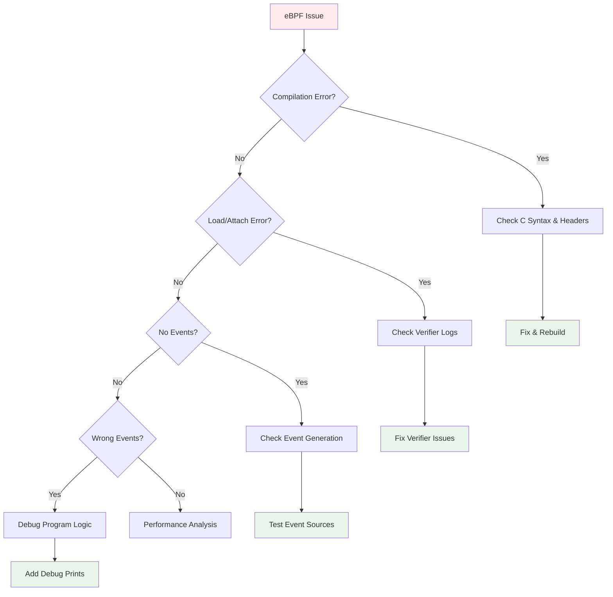

# Debugging Techniques

Debugging eBPF programs requires specialized techniques and tools. This comprehensive guide covers everything from basic troubleshooting to advanced debugging strategies.

## 🔍 Debugging Workflow



## 🛠️ Essential Debugging Tools

### 1. bpftool - The Swiss Army Knife

#### Program Inspection
```bash
# List all loaded eBPF programs
sudo bpftool prog list

# Show detailed program information
sudo bpftool prog show id <program_id>

# Dump program bytecode (after JIT compilation)
sudo bpftool prog dump xlated id <program_id>

# Dump original eBPF instructions
sudo bpftool prog dump jited id <program_id>

# Show program statistics
sudo bpftool prog show id <program_id> --json | jq '.run_cnt, .run_time_ns'
```

#### Map Inspection
```bash
# List all maps
sudo bpftool map list

# Show map contents
sudo bpftool map dump id <map_id>

# Monitor map changes in real-time
watch -n 1 'sudo bpftool map dump id <map_id>'

# Get map information
sudo bpftool map show id <map_id>
```

### 2. Verifier Debugging

#### Enable Verbose Verifier Logs
```bash
# Enable verifier logging
echo 1 | sudo tee /sys/kernel/debug/tracing/trace_on
echo 1 | sudo tee /proc/sys/kernel/bpf_stats_enabled

# View verifier logs
sudo cat /sys/kernel/debug/tracing/trace | grep bpf

# Or use dmesg for load-time errors
dmesg | tail -50 | grep -i bpf
```

#### Common Verifier Errors and Solutions

!!! failure "R1 invalid mem access"
    **Problem**: Direct memory access without proper validation
    ```c
    // ❌ This will fail
    struct task_struct *task = (struct task_struct *)bpf_get_current_task();
    u32 pid = task->pid;  // Direct access not allowed
    ```
    
    **Solution**: Use helper functions
    ```c
    // ✅ This works
    u32 pid = bpf_get_current_pid_tgid() & 0xFFFFFFFF;
    
    // Or use probe_read for kernel structures
    struct task_struct *task = (struct task_struct *)bpf_get_current_task();
    u32 pid;
    bpf_probe_read_kernel(&pid, sizeof(pid), &task->pid);
    ```

!!! failure "invalid indirect read from stack"
    **Problem**: Reading from uninitialized stack memory
    ```c
    // ❌ Stack not initialized
    char buffer[256];
    bpf_probe_read_user_str(&buffer, sizeof(buffer), ptr);
    ```
    
    **Solution**: Initialize or use helper return value
    ```c
    // ✅ Initialize first
    char buffer[256] = {};
    bpf_probe_read_user_str(&buffer, sizeof(buffer), ptr);
    ```

!!! failure "back-edge from insn X to Y"
    **Problem**: Unbounded loops detected
    ```c
    // ❌ Unbounded loop
    for (int i = 0; i < unknown_size; i++) {
        // Process data
    }
    ```
    
    **Solution**: Use bounded loops
    ```c
    // ✅ Bounded loop
    #pragma unroll
    for (int i = 0; i < 16; i++) {
        if (i >= actual_size) break;
        // Process data
    }
    ```

## 🐛 eBPF Program Debugging

### 1. Add Debug Prints

#### Using bpf_printk (Development Only)
```c
#include "common.h"

// Enable debug prints (remove in production)
#define DEBUG 1

#if DEBUG
#define debug_print(fmt, ...) bpf_printk(fmt, ##__VA_ARGS__)
#else
#define debug_print(fmt, ...)
#endif

SEC("tracepoint/syscalls/sys_enter_openat")
int debug_file_monitor(struct trace_event_raw_sys_enter *ctx) {
    u32 pid = bpf_get_current_pid_tgid() & 0xFFFFFFFF;
    
    debug_print("file_monitor: PID %d entering openat\n", pid);
    
    char filename[256];
    long ret = bpf_probe_read_user_str(&filename, sizeof(filename), 
                                      (void *)ctx->args[1]);
    
    if (ret < 0) {
        debug_print("file_monitor: failed to read filename, ret=%ld\n", ret);
        return 0;
    }
    
    debug_print("file_monitor: PID %d opening file: %.64s\n", pid, filename);
    
    // Check if we should filter this file
    if (filename[0] == '/' && filename[1] == 't' && 
        filename[2] == 'm' && filename[3] == 'p') {
        debug_print("file_monitor: skipping /tmp file\n");
        return 0;
    }
    
    struct file_event *event = bpf_ringbuf_reserve(&events, sizeof(*event), 0);
    if (!event) {
        debug_print("file_monitor: failed to reserve ring buffer space\n");
        return 0;
    }
    
    event->pid = pid;
    __builtin_memcpy(event->filename, filename, sizeof(event->filename));
    bpf_get_current_comm(&event->comm, sizeof(event->comm));
    
    debug_print("file_monitor: submitting event for PID %d\n", pid);
    bpf_ringbuf_submit(event, 0);
    
    return 0;
}
```

#### View Debug Output
```bash
# View bpf_printk output
sudo cat /sys/kernel/debug/tracing/trace_pipe

# Or filter for your program
sudo cat /sys/kernel/debug/tracing/trace_pipe | grep file_monitor

# Clear previous traces
echo > /sys/kernel/debug/tracing/trace
```

### 2. Debugging with Maps

#### Create Debug Counters
```c
// Debug counters map
struct {
    __uint(type, BPF_MAP_TYPE_ARRAY);
    __type(key, u32);
    __type(value, u64);
    __uint(max_entries, 16);
} debug_counters SEC(".maps");

enum debug_counter_keys {
    DEBUG_EVENTS_TOTAL = 0,
    DEBUG_EVENTS_FILTERED,
    DEBUG_EVENTS_SUBMITTED,
    DEBUG_RINGBUF_FAILURES,
    DEBUG_READ_FAILURES,
    DEBUG_MAX_FILENAME_LEN,
};

static __always_inline void increment_debug_counter(u32 key) {
    u64 *counter = bpf_map_lookup_elem(&debug_counters, &key);
    if (counter) {
        (*counter)++;
    }
}

SEC("tracepoint/syscalls/sys_enter_openat")
int debug_with_counters(struct trace_event_raw_sys_enter *ctx) {
    increment_debug_counter(DEBUG_EVENTS_TOTAL);
    
    // Your program logic with debug increments
    char filename[256];
    long ret = bpf_probe_read_user_str(&filename, sizeof(filename), 
                                      (void *)ctx->args[1]);
    if (ret < 0) {
        increment_debug_counter(DEBUG_READ_FAILURES);
        return 0;
    }
    
    // Track maximum filename length seen
    u32 key = DEBUG_MAX_FILENAME_LEN;
    u64 *max_len = bpf_map_lookup_elem(&debug_counters, &key);
    if (max_len && ret > *max_len) {
        *max_len = ret;
    }
    
    // Filter logic
    if (should_filter(filename)) {
        increment_debug_counter(DEBUG_EVENTS_FILTERED);
        return 0;
    }
    
    struct file_event *event = bpf_ringbuf_reserve(&events, sizeof(*event), 0);
    if (!event) {
        increment_debug_counter(DEBUG_RINGBUF_FAILURES);
        return 0;
    }
    
    // Fill event and submit
    bpf_ringbuf_submit(event, 0);
    increment_debug_counter(DEBUG_EVENTS_SUBMITTED);
    
    return 0;
}
```

#### Monitor Debug Counters
```bash
# View debug counters
sudo bpftool map dump name debug_counters

# Create a monitoring script
#!/bin/bash
watch -n 1 'echo "Debug Counters:" && sudo bpftool map dump name debug_counters | \
  awk "/key/ { key=\$2 } /value/ { value=\$2; print \"Counter\", key\":\", value }"'
```

### 3. State Tracking

#### Track Program State
```c
// State tracking for complex programs
struct program_state {
    u64 last_event_time;
    u32 current_phase;
    u32 error_count;
    char last_error[64];
};

struct {
    __uint(type, BPF_MAP_TYPE_ARRAY);
    __type(key, u32);
    __type(value, struct program_state);
    __uint(max_entries, 1);
} program_state_map SEC(".maps");

static __always_inline void update_program_state(u32 phase, const char *error) {
    u32 key = 0;
    struct program_state *state = bpf_map_lookup_elem(&program_state_map, &key);
    if (!state) return;
    
    state->last_event_time = bpf_ktime_get_ns();
    state->current_phase = phase;
    
    if (error) {
        state->error_count++;
        bpf_probe_read_kernel_str(state->last_error, sizeof(state->last_error), error);
    }
}
```

## 🔧 Userspace Debugging

### 1. Go eBPF Application Debugging

#### Enhanced Error Handling
```go
func loadAndAttachProgram() error {
    // Enable eBPF verifier logging
    if os.Getenv("DEBUG_EBPF") != "" {
        // This would require custom loading logic
        log.Println("eBPF debug mode enabled")
    }
    
    objs := programObjects{}
    
    // Load with detailed error information
    if err := loadProgramObjects(&objs, nil); err != nil {
        // Try to extract verifier error details
        if ve, ok := err.(*ebpf.VerifierError); ok {
            log.Printf("Verifier error (line %d): %s", ve.Line, ve.Error())
            
            // Print the problematic instruction
            for _, line := range ve.Log {
                if strings.Contains(line, "invalid") || strings.Contains(line, "error") {
                    log.Printf("Verifier: %s", line)
                }
            }
        }
        return fmt.Errorf("loading eBPF objects: %w", err)
    }
    defer objs.Close()
    
    // Attach with error details
    l, err := link.Tracepoint("syscalls", "sys_enter_openat", objs.TraceFileOpen, nil)
    if err != nil {
        return fmt.Errorf("attaching tracepoint: %w", err)
    }
    defer l.Close()
    
    return nil
}
```

#### Debug Event Processing
```go
type DebugEventProcessor struct {
    eventsProcessed   uint64
    eventsDropped     uint64
    processingErrors  uint64
    lastEventTime     time.Time
    debugMode         bool
}

func (d *DebugEventProcessor) processEvent(rawSample []byte) error {
    atomic.AddUint64(&d.eventsProcessed, 1)
    d.lastEventTime = time.Now()
    
    var event FileEvent
    if err := binary.Read(bytes.NewReader(rawSample), binary.LittleEndian, &event); err != nil {
        atomic.AddUint64(&d.processingErrors, 1)
        if d.debugMode {
            log.Printf("Failed to decode event: %v (raw: %x)", err, rawSample[:min(16, len(rawSample))])
        }
        return err
    }
    
    if d.debugMode {
        log.Printf("DEBUG: Processed event - PID: %d, Comm: %s, File: %s",
            event.PID, nullTerminatedString(event.Comm[:]), nullTerminatedString(event.Filename[:]))
    }
    
    // Validate event data
    if event.PID == 0 {
        if d.debugMode {
            log.Printf("DEBUG: Suspicious event with PID 0")
        }
    }
    
    if len(nullTerminatedString(event.Filename[:])) == 0 {
        if d.debugMode {
            log.Printf("DEBUG: Event with empty filename from PID %d", event.PID)
        }
    }
    
    return nil
}

func (d *DebugEventProcessor) printStats() {
    events := atomic.LoadUint64(&d.eventsProcessed)
    dropped := atomic.LoadUint64(&d.eventsDropped)
    errors := atomic.LoadUint64(&d.processingErrors)
    
    log.Printf("Stats: Events=%d, Dropped=%d, Errors=%d, Last=%v",
        events, dropped, errors, d.lastEventTime)
    
    if events > 0 {
        errorRate := float64(errors) / float64(events) * 100
        log.Printf("Error rate: %.2f%%", errorRate)
    }
}
```

### 2. Ring Buffer Debugging

#### Monitor Ring Buffer Health
```go
type RingBufferMonitor struct {
    reader     *ringbuf.Reader
    lastCheck  time.Time
    lostEvents uint64
}

func (r *RingBufferMonitor) monitorHealth(ctx context.Context) {
    ticker := time.NewTicker(5 * time.Second)
    defer ticker.Stop()
    
    for {
        select {
        case <-ctx.Done():
            return
        case <-ticker.C:
            r.checkHealth()
        }
    }
}

func (r *RingBufferMonitor) checkHealth() {
    // This would require access to ring buffer internals
    // In practice, you'd monitor for:
    
    // 1. Processing rate
    now := time.Now()
    if !r.lastCheck.IsZero() {
        duration := now.Sub(r.lastCheck)
        log.Printf("Ring buffer check interval: %v", duration)
    }
    r.lastCheck = now
    
    // 2. Lost events (would need custom ring buffer implementation)
    if r.lostEvents > 0 {
        log.Printf("WARNING: Lost %d events due to ring buffer overflow", r.lostEvents)
    }
    
    // 3. Memory pressure
    var m runtime.MemStats
    runtime.ReadMemStats(&m)
    if m.Alloc > 100*1024*1024 { // 100MB
        log.Printf("WARNING: High memory usage: %d MB", m.Alloc/1024/1024)
    }
}
```

## 🔬 Advanced Debugging Techniques

### 1. Program Tracing

#### Trace Program Execution
```bash
#!/bin/bash
# Advanced eBPF program tracing

PROG_ID=$(sudo bpftool prog list | grep your_program | awk '{print $1}' | cut -d: -f1)

if [ -z "$PROG_ID" ]; then
    echo "Program not found"
    exit 1
fi

echo "Tracing program ID: $PROG_ID"

# Enable function tracing for eBPF
echo function > /sys/kernel/debug/tracing/current_tracer
echo "bpf_*" > /sys/kernel/debug/tracing/set_ftrace_filter
echo 1 > /sys/kernel/debug/tracing/tracing_on

# Monitor for 10 seconds
timeout 10 cat /sys/kernel/debug/tracing/trace_pipe

# Disable tracing
echo 0 > /sys/kernel/debug/tracing/tracing_on
echo > /sys/kernel/debug/tracing/set_ftrace_filter
```

### 2. Performance Profiling

#### Profile eBPF Program Performance
```c
// Add performance tracking to your program
struct perf_event {
    u32 pid;
    u64 start_time;
    u64 end_time;
    u32 instruction_count;
};

struct {
    __uint(type, BPF_MAP_TYPE_RINGBUF);
    __uint(max_entries, 1 << 20);
} perf_events SEC(".maps");

SEC("tracepoint/syscalls/sys_enter_openat")
int profiled_file_monitor(struct trace_event_raw_sys_enter *ctx) {
    u64 start = bpf_ktime_get_ns();
    
    // Your program logic here
    struct file_event *event = bpf_ringbuf_reserve(&events, sizeof(*event), 0);
    if (!event) return 0;
    
    event->pid = bpf_get_current_pid_tgid() & 0xFFFFFFFF;
    bpf_get_current_comm(&event->comm, sizeof(event->comm));
    bpf_ringbuf_submit(event, 0);
    
    u64 end = bpf_ktime_get_ns();
    
    // Record performance data
    struct perf_event *perf = bpf_ringbuf_reserve(&perf_events, sizeof(*perf), 0);
    if (perf) {
        perf->pid = event->pid;
        perf->start_time = start;
        perf->end_time = end;
        bpf_ringbuf_submit(perf, 0);
    }
    
    return 0;
}
```

### 3. Memory Debugging

#### Detect Memory Leaks in Userspace
```go
func debugMemoryUsage() {
    var m1, m2 runtime.MemStats
    
    runtime.GC()
    runtime.ReadMemStats(&m1)
    
    // Run your event processing
    processEventsForTesting()
    
    runtime.GC()
    runtime.ReadMemStats(&m2)
    
    log.Printf("Memory stats:")
    log.Printf("  Alloc: %d -> %d (%+d)", m1.Alloc, m2.Alloc, int64(m2.Alloc)-int64(m1.Alloc))
    log.Printf("  HeapObjects: %d -> %d (%+d)", m1.HeapObjects, m2.HeapObjects, int64(m2.HeapObjects)-int64(m1.HeapObjects))
    log.Printf("  NumGC: %d -> %d", m1.NumGC, m2.NumGC)
    
    if m2.Alloc > m1.Alloc+1024*1024 { // More than 1MB increase
        log.Printf("WARNING: Potential memory leak detected!")
        
        // Enable memory profiling
        if os.Getenv("MEMPROFILE") != "" {
            f, _ := os.Create("memprofile.prof")
            pprof.WriteHeapProfile(f)
            f.Close()
        }
    }
}
```

## 🧪 Testing and Validation

### 1. Unit Testing eBPF Programs

```c
// Test helper functions
#ifdef TESTING
#include "test_helpers.h"

// Mock helper functions for testing
#define bpf_get_current_pid_tgid() test_get_current_pid_tgid()
#define bpf_get_current_comm(comm, size) test_get_current_comm(comm, size)

static u64 test_get_current_pid_tgid(void) {
    return (1234ULL << 32) | 5678ULL; // tgid=1234, pid=5678
}

static int test_get_current_comm(char *comm, int size) {
    const char *test_comm = "test_process";
    for (int i = 0; i < size && i < 12; i++) {
        comm[i] = test_comm[i];
        if (test_comm[i] == '\0') break;
    }
    return 0;
}
#endif
```

### 2. Integration Testing

```go
func TestEventProcessing(t *testing.T) {
    // Create test ring buffer
    testEvents := []RawEvent{
        {PID: 1234, Comm: [16]byte{'t', 'e', 's', 't'}},
        {PID: 5678, Comm: [16]byte{'a', 'n', 'o', 't', 'h', 'e', 'r'}},
    }
    
    processor := NewEventProcessor()
    
    for _, event := range testEvents {
        buf := new(bytes.Buffer)
        binary.Write(buf, binary.LittleEndian, event)
        
        if err := processor.processEvent(buf.Bytes()); err != nil {
            t.Errorf("Failed to process event: %v", err)
        }
    }
    
    // Verify results
    stats := processor.GetStats()
    if stats.EventsProcessed != uint64(len(testEvents)) {
        t.Errorf("Expected %d events processed, got %d", len(testEvents), stats.EventsProcessed)
    }
}
```

## 📋 Debugging Checklist

### When Your eBPF Program Doesn't Work

!!! tip "Systematic Debugging Approach"
    1. **Compilation Issues**
       - [ ] Check C syntax and includes
       - [ ] Verify vmlinux.h is generated and current
       - [ ] Check for unsupported language features
    
    2. **Load/Attach Issues**  
       - [ ] Check verifier logs with `dmesg`
       - [ ] Verify program type matches attachment point
       - [ ] Check required capabilities/permissions
    
    3. **No Events Generated**
       - [ ] Verify attachment point is correct
       - [ ] Test if events should be generated (trigger manually)
       - [ ] Check event source is active
    
    4. **Wrong or Missing Data**
       - [ ] Add debug prints to eBPF program
       - [ ] Check data structure alignment
       - [ ] Verify helper function usage
    
    5. **Performance Issues**
       - [ ] Monitor ring buffer utilization
       - [ ] Check for event drops
       - [ ] Profile program execution time

### Tools Quick Reference

```bash
# Essential debugging commands
sudo bpftool prog list                    # List programs
sudo bpftool map dump id <id>            # Dump map contents
sudo cat /sys/kernel/debug/tracing/trace_pipe  # View debug prints
dmesg | grep -i bpf                       # Verifier errors
sudo bpftool prog tracelog               # Program execution trace
```

Remember: debugging eBPF programs requires patience and systematic investigation. Start with simple debug prints and gradually add more sophisticated debugging techniques as needed! 🔧