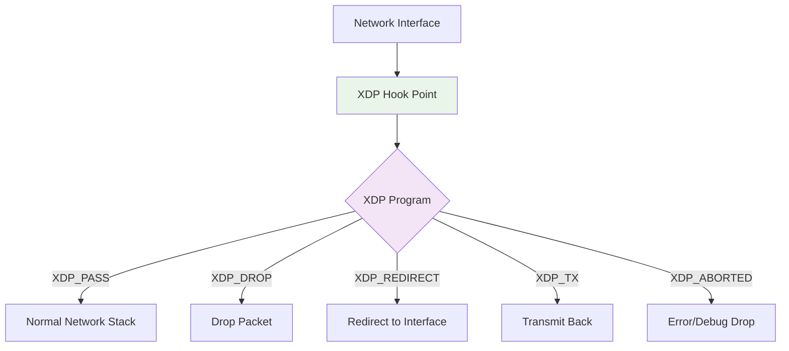

# Network eBPF Programs: XDP and TC

Network eBPF programs enable high-performance packet processing directly in the kernel, achieving line-rate speeds with minimal CPU overhead. This guide covers XDP (eXpress Data Path) and TC (Traffic Control) programs for network monitoring, filtering, and manipulation.

## 🚀 XDP (eXpress Data Path)

XDP provides the earliest possible point in the kernel networking stack to process packets, delivering exceptional performance for network applications.

### XDP Overview



### XDP Return Codes

| Return Code | Action | Use Case |
|-------------|--------|----------|
| `XDP_PASS` | Continue to network stack | Allow packet normally |
| `XDP_DROP` | Drop packet | DDoS protection, filtering |
| `XDP_TX` | Transmit back out same interface | Load balancer response |
| `XDP_REDIRECT` | Redirect to another interface | Traffic forwarding |
| `XDP_ABORTED` | Drop with trace | Error handling, debugging |

## 📦 Complete XDP Examples

### 1. DDoS Protection Tool

```c
// xdp_ddos_protection.c
#include <linux/bpf.h>
#include <linux/if_ether.h>
#include <linux/ip.h>
#include <linux/tcp.h>
#include <linux/udp.h>
#include <bpf/bpf_helpers.h>
#include <bpf/bpf_endian.h>

#define MAX_TRACKED_IPS 10000
#define RATE_LIMIT_PPS 1000  // packets per second
#define TIME_WINDOW_NS 1000000000ULL  // 1 second in nanoseconds

struct ip_stats {
    u64 packet_count;
    u64 last_seen;
    u64 bytes_count;
    u32 is_blocked;
};

// Maps for tracking IP statistics
struct {
    __uint(type, BPF_MAP_TYPE_LRU_HASH);
    __type(key, u32);  // IP address
    __type(value, struct ip_stats);
    __uint(max_entries, MAX_TRACKED_IPS);
} ip_tracker SEC(".maps");

// Blocked IPs list
struct {
    __uint(type, BPF_MAP_TYPE_HASH);
    __type(key, u32);  // IP address
    __type(value, u32); // block duration
    __uint(max_entries, 1000);
} blocked_ips SEC(".maps");

// Statistics
struct {
    __uint(type, BPF_MAP_TYPE_PERCPU_ARRAY);
    __type(key, u32);
    __type(value, u64);
    __uint(max_entries, 10);
} stats SEC(".maps");

enum stats_keys {
    STAT_TOTAL_PACKETS = 0,
    STAT_DROPPED_PACKETS,
    STAT_PASSED_PACKETS,
    STAT_BLOCKED_IPS,
    STAT_TCP_PACKETS,
    STAT_UDP_PACKETS,
    STAT_ICMP_PACKETS,
    STAT_SYN_PACKETS,
    STAT_BYTES_TOTAL,
    STAT_BYTES_DROPPED,
};

static inline void update_stats(u32 key, u64 value) {
    u64 *stat = bpf_map_lookup_elem(&stats, &key);
    if (stat) {
        (*stat) += value;
    }
}

static inline int parse_packet(void *data, void *data_end,
                              u32 *src_ip, u16 *src_port,
                              u8 *protocol, u32 *packet_size) {
    struct ethhdr *eth = data;

    // Bounds check for Ethernet header
    if ((void *)(eth + 1) > data_end)
        return -1;

    // Only handle IPv4
    if (eth->h_proto != bpf_htons(ETH_P_IP))
        return -1;

    struct iphdr *ip = (void *)(eth + 1);
    if ((void *)(ip + 1) > data_end)
        return -1;

    *src_ip = ip->saddr;
    *protocol = ip->protocol;
    *packet_size = bpf_ntohs(ip->tot_len);

    // Extract port for TCP/UDP
    *src_port = 0;
    if (ip->protocol == IPPROTO_TCP) {
        struct tcphdr *tcp = (void *)ip + (ip->ihl * 4);
        if ((void *)(tcp + 1) > data_end)
            return -1;
        *src_port = bpf_ntohs(tcp->source);

        // Track SYN packets specifically (potential SYN flood)
        if (tcp->syn && !tcp->ack) {
            update_stats(STAT_SYN_PACKETS, 1);
        }

        update_stats(STAT_TCP_PACKETS, 1);
    } else if (ip->protocol == IPPROTO_UDP) {
        struct udphdr *udp = (void *)ip + (ip->ihl * 4);
        if ((void *)(udp + 1) > data_end)
            return -1;
        *src_port = bpf_ntohs(udp->source);
        update_stats(STAT_UDP_PACKETS, 1);
    } else if (ip->protocol == IPPROTO_ICMP) {
        update_stats(STAT_ICMP_PACKETS, 1);
    }

    return 0;
}

SEC("xdp")
int xdp_ddos_protection(struct xdp_md *ctx) {
    void *data_end = (void *)(long)ctx->data_end;
    void *data = (void *)(long)ctx->data;

    u32 src_ip;
    u16 src_port;
    u8 protocol;
    u32 packet_size;

    // Parse packet
    if (parse_packet(data, data_end, &src_ip, &src_port, &protocol, &packet_size) < 0) {
        return XDP_PASS;  // Non-IPv4 traffic passes through
    }

    u64 now = bpf_ktime_get_ns();

    // Update global statistics
    update_stats(STAT_TOTAL_PACKETS, 1);
    update_stats(STAT_BYTES_TOTAL, packet_size);

    // Check if IP is in blocked list
    u32 *blocked = bpf_map_lookup_elem(&blocked_ips, &src_ip);
    if (blocked) {
        update_stats(STAT_DROPPED_PACKETS, 1);
        update_stats(STAT_BYTES_DROPPED, packet_size);
        return XDP_DROP;
    }

    // Rate limiting logic
    struct ip_stats *stats = bpf_map_lookup_elem(&ip_tracker, &src_ip);
    if (!stats) {
        // New IP - create entry
        struct ip_stats new_stats = {
            .packet_count = 1,
            .last_seen = now,
            .bytes_count = packet_size,
            .is_blocked = 0,
        };
        bpf_map_update_elem(&ip_tracker, &src_ip, &new_stats, BPF_ANY);
    } else {
        // Existing IP - update statistics
        u64 time_diff = now - stats->last_seen;

        if (time_diff > TIME_WINDOW_NS) {
            // Reset counter after time window
            stats->packet_count = 1;
            stats->last_seen = now;
            stats->bytes_count = packet_size;
        } else {
            // Increment counter
            stats->packet_count++;
            stats->bytes_count += packet_size;
            stats->last_seen = now;

            // Check rate limit
            if (stats->packet_count > RATE_LIMIT_PPS) {
                // Block this IP
                u32 block_duration = 60;  // seconds
                bpf_map_update_elem(&blocked_ips, &src_ip, &block_duration, BPF_ANY);

                stats->is_blocked = 1;
                update_stats(STAT_BLOCKED_IPS, 1);
                update_stats(STAT_DROPPED_PACKETS, 1);
                update_stats(STAT_BYTES_DROPPED, packet_size);

                return XDP_DROP;
            }
        }

        // Update the map with new stats
        bpf_map_update_elem(&ip_tracker, &src_ip, stats, BPF_EXIST);
    }

    update_stats(STAT_PASSED_PACKETS, 1);
    return XDP_PASS;
}

char _license[] SEC("license") = "GPL";
```

### 2. Layer 4 Load Balancer

```c
// xdp_load_balancer.c
#include <linux/bpf.h>
#include <linux/if_ether.h>
#include <linux/ip.h>
#include <linux/tcp.h>
#include <bpf/bpf_helpers.h>
#include <bpf/bpf_endian.h>

#define MAX_BACKENDS 10

struct backend {
    u32 ip;
    u16 port;
    u8 weight;
    u8 active;
    u64 connection_count;
    u64 last_health_check;
};

struct lb_config {
    u32 vip;         // Virtual IP
    u16 vport;       // Virtual port
    u8 algorithm;    // Load balancing algorithm
    u8 backend_count;
};

// Load balancer configuration
struct {
    __uint(type, BPF_MAP_TYPE_ARRAY);
    __type(key, u32);
    __type(value, struct lb_config);
    __uint(max_entries, 1);
} lb_config_map SEC(".maps");

// Backend servers
struct {
    __uint(type, BPF_MAP_TYPE_ARRAY);
    __type(key, u32);
    __type(value, struct backend);
    __uint(max_entries, MAX_BACKENDS);
} backends SEC(".maps");

// Connection tracking
struct connection_key {
    u32 client_ip;
    u16 client_port;
    u32 server_ip;
    u16 server_port;
    u8 protocol;
};

struct connection_value {
    u32 backend_ip;
    u16 backend_port;
    u64 last_seen;
    u64 packet_count;
    u64 byte_count;
};

struct {
    __uint(type, BPF_MAP_TYPE_LRU_HASH);
    __type(key, struct connection_key);
    __type(value, struct connection_value);
    __uint(max_entries, 100000);
} connections SEC(".maps");

// Load balancing algorithms
enum {
    LB_ROUND_ROBIN = 0,
    LB_LEAST_CONNECTIONS = 1,
    LB_WEIGHTED_ROUND_ROBIN = 2,
};

static inline u32 select_backend_round_robin(struct lb_config *config) {
    static u32 current_backend = 0;
    u32 backend_id = current_backend % config->backend_count;
    current_backend++;
    return backend_id;
}

static inline u32 select_backend_least_connections(struct lb_config *config) {
    u32 min_connections = ~0;
    u32 selected_backend = 0;

    #pragma unroll
    for (u32 i = 0; i < MAX_BACKENDS; i++) {
        if (i >= config->backend_count)
            break;

        struct backend *backend = bpf_map_lookup_elem(&backends, &i);
        if (!backend || !backend->active)
            continue;

        if (backend->connection_count < min_connections) {
            min_connections = backend->connection_count;
            selected_backend = i;
        }
    }

    return selected_backend;
}

static inline int rewrite_packet(struct xdp_md *ctx, u32 new_ip, u16 new_port) {
    void *data_end = (void *)(long)ctx->data_end;
    void *data = (void *)(long)ctx->data;

    struct ethhdr *eth = data;
    if ((void *)(eth + 1) > data_end)
        return -1;

    struct iphdr *ip = (void *)(eth + 1);
    if ((void *)(ip + 1) > data_end)
        return -1;

    struct tcphdr *tcp = (void *)ip + (ip->ihl * 4);
    if ((void *)(tcp + 1) > data_end)
        return -1;

    // Calculate checksums before modification
    u32 old_ip = ip->daddr;
    u16 old_port = tcp->dest;

    // Update destination IP and port
    ip->daddr = new_ip;
    tcp->dest = bpf_htons(new_port);

    // Update IP checksum
    u32 checksum = bpf_ntohs(ip->check);
    checksum = ~checksum & 0xffff;
    checksum -= (old_ip >> 16) + (old_ip & 0xffff);
    checksum += (new_ip >> 16) + (new_ip & 0xffff);
    checksum = (checksum & 0xffff) + (checksum >> 16);
    ip->check = bpf_htons(~checksum & 0xffff);

    // Update TCP checksum (simplified)
    u32 tcp_checksum = bpf_ntohs(tcp->check);
    tcp_checksum = ~tcp_checksum & 0xffff;
    tcp_checksum -= (old_ip >> 16) + (old_ip & 0xffff) + old_port;
    tcp_checksum += (new_ip >> 16) + (new_ip & 0xffff) + bpf_ntohs(tcp->dest);
    tcp_checksum = (tcp_checksum & 0xffff) + (tcp_checksum >> 16);
    tcp->check = bpf_htons(~tcp_checksum & 0xffff);

    return 0;
}

SEC("xdp")
int xdp_load_balancer(struct xdp_md *ctx) {
    void *data_end = (void *)(long)ctx->data_end;
    void *data = (void *)(long)ctx->data;

    struct ethhdr *eth = data;
    if ((void *)(eth + 1) > data_end)
        return XDP_PASS;

    if (eth->h_proto != bpf_htons(ETH_P_IP))
        return XDP_PASS;

    struct iphdr *ip = (void *)(eth + 1);
    if ((void *)(ip + 1) > data_end)
        return XDP_PASS;

    if (ip->protocol != IPPROTO_TCP)
        return XDP_PASS;

    struct tcphdr *tcp = (void *)ip + (ip->ihl * 4);
    if ((void *)(tcp + 1) > data_end)
        return XDP_PASS;

    // Get load balancer configuration
    u32 config_key = 0;
    struct lb_config *config = bpf_map_lookup_elem(&lb_config_map, &config_key);
    if (!config)
        return XDP_PASS;

    // Check if packet is destined for our VIP
    if (ip->daddr != config->vip || bpf_ntohs(tcp->dest) != config->vport)
        return XDP_PASS;

    // Create connection key
    struct connection_key conn_key = {
        .client_ip = ip->saddr,
        .client_port = tcp->source,
        .server_ip = ip->daddr,
        .server_port = tcp->dest,
        .protocol = ip->protocol,
    };

    u64 now = bpf_ktime_get_ns();

    // Check existing connection
    struct connection_value *conn = bpf_map_lookup_elem(&connections, &conn_key);
    if (conn) {
        // Use existing backend
        conn->last_seen = now;
        conn->packet_count++;
        conn->byte_count += bpf_ntohs(ip->tot_len);

        // Rewrite packet to backend
        if (rewrite_packet(ctx, conn->backend_ip, conn->backend_port) < 0)
            return XDP_ABORTED;

        return XDP_TX;  // Send back out the same interface
    }

    // New connection - select backend
    u32 backend_id;
    switch (config->algorithm) {
        case LB_ROUND_ROBIN:
            backend_id = select_backend_round_robin(config);
            break;
        case LB_LEAST_CONNECTIONS:
            backend_id = select_backend_least_connections(config);
            break;
        default:
            backend_id = 0;
    }

    struct backend *backend = bpf_map_lookup_elem(&backends, &backend_id);
    if (!backend || !backend->active)
        return XDP_DROP;

    // Create new connection entry
    struct connection_value new_conn = {
        .backend_ip = backend->ip,
        .backend_port = backend->port,
        .last_seen = now,
        .packet_count = 1,
        .byte_count = bpf_ntohs(ip->tot_len),
    };

    bpf_map_update_elem(&connections, &conn_key, &new_conn, BPF_ANY);

    // Update backend connection count
    backend->connection_count++;
    bpf_map_update_elem(&backends, &backend_id, backend, BPF_EXIST);

    // Rewrite packet to backend
    if (rewrite_packet(ctx, backend->ip, backend->port) < 0)
        return XDP_ABORTED;

    return XDP_TX;
}

char _license[] SEC("license") = "GPL";
```

## 🌐 TC (Traffic Control) Programs

TC programs provide more advanced packet processing capabilities with access to socket buffers and kernel networking metadata.

### TC vs XDP Comparison

| Feature | XDP | TC |
|---------|-----|-----|
| **Attachment Point** | Before SKB allocation | After SKB creation |
| **Performance** | Highest (no SKB overhead) | High (SKB available) |
| **Packet Modification** | Limited | Full packet manipulation |
| **Metadata Access** | Minimal | Rich (mark, priority, etc.) |
| **Use Cases** | Filtering, simple forwarding | Complex processing, QoS |

### Complete TC Example: Traffic Shaper

```c
// tc_traffic_shaper.c
#include <linux/bpf.h>
#include <linux/pkt_cls.h>
#include <linux/if_ether.h>
#include <linux/ip.h>
#include <linux/tcp.h>
#include <bpf/bpf_helpers.h>

#define MAX_CLASSES 100

struct traffic_class {
    u32 class_id;
    u64 rate_bps;        // Bits per second
    u64 burst_bytes;     // Burst size
    u64 tokens;          // Current tokens
    u64 last_update;     // Last token update time
    u64 packets_sent;
    u64 packets_dropped;
    u64 bytes_sent;
    u64 bytes_dropped;
};

// Traffic classes configuration
struct {
    __uint(type, BPF_MAP_TYPE_HASH);
    __type(key, u32);  // Class ID
    __type(value, struct traffic_class);
    __uint(max_entries, MAX_CLASSES);
} traffic_classes SEC(".maps");

// Classification rules (IP -> Class ID mapping)
struct {
    __uint(type, BPF_MAP_TYPE_HASH);
    __type(key, u32);  // Source IP
    __type(value, u32); // Class ID
    __uint(max_entries, 10000);
} ip_classification SEC(".maps");

static inline int token_bucket_check(struct traffic_class *tc, u32 packet_size, u64 now) {
    // Calculate tokens to add based on time elapsed
    u64 time_elapsed = now - tc->last_update;
    u64 tokens_to_add = (time_elapsed * tc->rate_bps) / (8ULL * 1000000000ULL); // Convert to bytes

    // Add tokens up to burst limit
    tc->tokens += tokens_to_add;
    if (tc->tokens > tc->burst_bytes) {
        tc->tokens = tc->burst_bytes;
    }

    tc->last_update = now;

    // Check if we have enough tokens
    if (tc->tokens >= packet_size) {
        tc->tokens -= packet_size;
        return 1;  // Allow packet
    }

    return 0;  // Drop packet
}

SEC("classifier")
int tc_traffic_shaper(struct __sk_buff *skb) {
    void *data_end = (void *)(long)skb->data_end;
    void *data = (void *)(long)skb->data;

    struct ethhdr *eth = data;
    if ((void *)(eth + 1) > data_end)
        return TC_ACT_OK;

    if (eth->h_proto != bpf_htons(ETH_P_IP))
        return TC_ACT_OK;

    struct iphdr *ip = (void *)(eth + 1);
    if ((void *)(ip + 1) > data_end)
        return TC_ACT_OK;

    u32 src_ip = ip->saddr;
    u32 packet_size = skb->len;
    u64 now = bpf_ktime_get_ns();

    // Look up traffic class for this IP
    u32 *class_id = bpf_map_lookup_elem(&ip_classification, &src_ip);
    if (!class_id) {
        return TC_ACT_OK;  // No classification rule, allow
    }

    struct traffic_class *tc = bpf_map_lookup_elem(&traffic_classes, class_id);
    if (!tc) {
        return TC_ACT_OK;  // Class not found, allow
    }

    // Apply token bucket algorithm
    if (token_bucket_check(tc, packet_size, now)) {
        // Packet allowed
        tc->packets_sent++;
        tc->bytes_sent += packet_size;

        // Set packet priority based on class
        skb->priority = *class_id;

        bpf_map_update_elem(&traffic_classes, class_id, tc, BPF_EXIST);
        return TC_ACT_OK;
    } else {
        // Packet dropped due to rate limiting
        tc->packets_dropped++;
        tc->bytes_dropped += packet_size;

        bpf_map_update_elem(&traffic_classes, class_id, tc, BPF_EXIST);
        return TC_ACT_SHOT;  // Drop packet
    }
}

char _license[] SEC("license") = "GPL";
```

## 🛠️ Building and Deploying Network Programs

### 1. Makefile for Network Programs

```makefile
# Build XDP programs
build_xdp:
	clang -O2 -target bpf -c bpf/xdp_ddos_protection.c -o bpf/xdp_ddos_protection.o
	clang -O2 -target bpf -c bpf/xdp_load_balancer.c -o bpf/xdp_load_balancer.o

# Build TC programs
build_tc:
	clang -O2 -target bpf -c bpf/tc_traffic_shaper.c -o bpf/tc_traffic_shaper.o

# Load XDP program
load_xdp_ddos:
	sudo ip link set dev eth0 xdp obj bpf/xdp_ddos_protection.o sec xdp

# Load TC program
load_tc_shaper:
	sudo tc qdisc add dev eth0 clsact
	sudo tc filter add dev eth0 ingress bpf obj bpf/tc_traffic_shaper.o sec classifier

# Unload programs
unload_xdp:
	sudo ip link set dev eth0 xdp off

unload_tc:
	sudo tc qdisc del dev eth0 clsact
```

### 2. Go Integration for Network Programs

```go
// network_monitor.go
package main

import (
    "encoding/binary"
    "fmt"
    "log"
    "net"
    "os"
    "os/signal"
    "syscall"
    "time"

    "github.com/cilium/ebpf"
    "github.com/cilium/ebpf/link"
    "github.com/vishyakarna/netlink"
)

type DDosStats struct {
    TotalPackets   uint64
    DroppedPackets uint64
    PassedPackets  uint64
    BlockedIPs     uint64
    TCPPackets     uint64
    UDPPackets     uint64
    ICMPPackets    uint64
    SYNPackets     uint64
    BytesTotal     uint64
    BytesDropped   uint64
}

type NetworkMonitor struct {
    xdpProgram *ebpf.Program
    xdpLink    link.Link
    maps       map[string]*ebpf.Map
}

func NewNetworkMonitor(ifaceName string) (*NetworkMonitor, error) {
    // Load XDP program
    spec, err := ebpf.LoadCollectionSpec("bpf/xdp_ddos_protection.o")
    if err != nil {
        return nil, fmt.Errorf("loading collection spec: %w", err)
    }

    coll, err := ebpf.NewCollection(spec)
    if err != nil {
        return nil, fmt.Errorf("creating collection: %w", err)
    }

    // Get network interface
    iface, err := net.InterfaceByName(ifaceName)
    if err != nil {
        return nil, fmt.Errorf("getting interface %s: %w", ifaceName, err)
    }

    // Attach XDP program
    xdpLink, err := link.AttachXDP(link.XDPOptions{
        Program:   coll.Programs["xdp_ddos_protection"],
        Interface: iface.Index,
        Flags:     link.XDPGenericMode, // Use generic mode for compatibility
    })
    if err != nil {
        return nil, fmt.Errorf("attaching XDP program: %w", err)
    }

    return &NetworkMonitor{
        xdpProgram: coll.Programs["xdp_ddos_protection"],
        xdpLink:    xdpLink,
        maps: map[string]*ebpf.Map{
            "stats":       coll.Maps["stats"],
            "ip_tracker":  coll.Maps["ip_tracker"],
            "blocked_ips": coll.Maps["blocked_ips"],
        },
    }, nil
}

func (nm *NetworkMonitor) GetStats() (*DDosStats, error) {
    stats := &DDosStats{}

    // Read from per-CPU stats map
    statKeys := []uint32{0, 1, 2, 3, 4, 5, 6, 7, 8, 9} // STAT_* enum values

    for i, key := range statKeys {
        var values []uint64
        if err := nm.maps["stats"].Lookup(&key, &values); err != nil {
            continue // Skip missing keys
        }

        // Sum per-CPU values
        var total uint64
        for _, val := range values {
            total += val
        }

        // Assign to appropriate field
        switch i {
        case 0: stats.TotalPackets = total
        case 1: stats.DroppedPackets = total
        case 2: stats.PassedPackets = total
        case 3: stats.BlockedIPs = total
        case 4: stats.TCPPackets = total
        case 5: stats.UDPPackets = total
        case 6: stats.ICMPPackets = total
        case 7: stats.SYNPackets = total
        case 8: stats.BytesTotal = total
        case 9: stats.BytesDropped = total
        }
    }

    return stats, nil
}

func (nm *NetworkMonitor) GetTopSourceIPs(limit int) (map[string]uint64, error) {
    topIPs := make(map[string]uint64)

    iterator := nm.maps["ip_tracker"].Iterate()
    var key uint32
    var value struct {
        PacketCount uint64
        LastSeen    uint64
        BytesCount  uint64
        IsBlocked   uint32
    }

    for iterator.Next(&key, &value) {
        ip := net.IP(binary.LittleEndian.AppendUint32(nil, key))
        topIPs[ip.String()] = value.PacketCount

        if len(topIPs) >= limit {
            break
        }
    }

    return topIPs, iterator.Err()
}

func (nm *NetworkMonitor) BlockIP(ipStr string) error {
    ip := net.ParseIP(ipStr)
    if ip == nil {
        return fmt.Errorf("invalid IP address: %s", ipStr)
    }

    // Convert to uint32 (assuming IPv4)
    ipv4 := ip.To4()
    if ipv4 == nil {
        return fmt.Errorf("IPv6 not supported: %s", ipStr)
    }

    ipUint32 := binary.LittleEndian.Uint32(ipv4)
    blockDuration := uint32(300) // 5 minutes

    return nm.maps["blocked_ips"].Update(&ipUint32, &blockDuration, ebpf.UpdateAny)
}

func (nm *NetworkMonitor) UnblockIP(ipStr string) error {
    ip := net.ParseIP(ipStr)
    if ip == nil {
        return fmt.Errorf("invalid IP address: %s", ipStr)
    }

    ipv4 := ip.To4()
    if ipv4 == nil {
        return fmt.Errorf("IPv6 not supported: %s", ipStr)
    }

    ipUint32 := binary.LittleEndian.Uint32(ipv4)
    return nm.maps["blocked_ips"].Delete(&ipUint32)
}

func (nm *NetworkMonitor) Close() error {
    if nm.xdpLink != nil {
        nm.xdpLink.Close()
    }

    for _, m := range nm.maps {
        m.Close()
    }

    if nm.xdpProgram != nil {
        nm.xdpProgram.Close()
    }

    return nil
}

func main() {
    if len(os.Args) < 2 {
        log.Fatal("Usage: network_monitor <interface>")
    }

    ifaceName := os.Args[1]

    monitor, err := NewNetworkMonitor(ifaceName)
    if err != nil {
        log.Fatalf("Failed to create network monitor: %v", err)
    }
    defer monitor.Close()

    log.Printf("DDoS protection active on interface %s", ifaceName)

    // Statistics reporting
    ticker := time.NewTicker(5 * time.Second)
    defer ticker.Stop()

    // Signal handling
    sigChan := make(chan os.Signal, 1)
    signal.Notify(sigChan, syscall.SIGINT, syscall.SIGTERM)

    for {
        select {
        case <-ticker.C:
            stats, err := monitor.GetStats()
            if err != nil {
                log.Printf("Error getting stats: %v", err)
                continue
            }

            fmt.Printf("\n=== DDoS Protection Stats ===\n")
            fmt.Printf("Total Packets: %d\n", stats.TotalPackets)
            fmt.Printf("Passed: %d, Dropped: %d\n", stats.PassedPackets, stats.DroppedPackets)
            fmt.Printf("Blocked IPs: %d\n", stats.BlockedIPs)
            fmt.Printf("Protocol breakdown - TCP: %d, UDP: %d, ICMP: %d\n",
                      stats.TCPPackets, stats.UDPPackets, stats.ICMPPackets)
            fmt.Printf("SYN packets: %d\n", stats.SYNPackets)
            fmt.Printf("Bytes: %d total, %d dropped\n", stats.BytesTotal, stats.BytesDropped)

            // Show top source IPs
            topIPs, err := monitor.GetTopSourceIPs(5)
            if err != nil {
                log.Printf("Error getting top IPs: %v", err)
                continue
            }

            fmt.Printf("\nTop Source IPs:\n")
            for ip, count := range topIPs {
                fmt.Printf("  %s: %d packets\n", ip, count)
            }

        case <-sigChan:
            log.Println("Shutting down...")
            return
        }
    }
}
```

## 🔧 Performance Optimization for Network Programs

### 1. XDP Performance Tips

```c
// Optimize for performance
SEC("xdp")
int xdp_optimized(struct xdp_md *ctx) {
    void *data_end = (void *)(long)ctx->data_end;
    void *data = (void *)(long)ctx->data;

    // Early bounds check
    if (data + sizeof(struct ethhdr) + sizeof(struct iphdr) > data_end)
        return XDP_PASS;

    struct ethhdr *eth = data;

    // Fast protocol check
    if (eth->h_proto != bpf_htons(ETH_P_IP))
        return XDP_PASS;

    struct iphdr *ip = (struct iphdr *)(eth + 1);

    // Use efficient map lookups
    u32 key = ip->saddr;
    u64 *counter = bpf_map_lookup_elem(&fast_counter, &key);
    if (counter) {
        (*counter)++;
    }

    return XDP_PASS;
}
```

### 2. Memory Access Optimization

```c
// Minimize memory accesses
static inline int process_tcp_packet(struct tcphdr *tcp, void *data_end) {
    // Single bounds check for all TCP operations
    if ((void *)(tcp + 1) > data_end)
        return -1;

    // Cache frequently accessed fields
    u16 src_port = bpf_ntohs(tcp->source);
    u16 dst_port = bpf_ntohs(tcp->dest);
    u8 flags = ((u8 *)tcp)[13];  // TCP flags byte

    // Process cached values
    if (flags & 0x02) {  // SYN flag
        // Handle SYN packet
    }

    return 0;
}
```

## 📊 Monitoring Network Programs

### 1. Performance Metrics

```bash
#!/bin/bash
# Monitor XDP/TC program performance

echo "=== XDP Program Statistics ==="
bpftool prog show type xdp
bpftool prog dump xlated id <prog_id> | head -20

echo -e "\n=== Map Statistics ==="
bpftool map show
bpftool map dump id <map_id> | head -10

echo -e "\n=== Network Interface Statistics ==="
ip -s link show eth0

echo -e "\n=== TC Statistics ==="
tc -s filter show dev eth0 ingress
```

### 2. Debugging Network Programs

```c
// Add debug tracing
SEC("xdp")
int xdp_debug(struct xdp_md *ctx) {
    void *data_end = (void *)(long)ctx->data_end;
    void *data = (void *)(long)ctx->data;

    // Debug: packet size
    u32 packet_size = data_end - data;
    bpf_trace_printk("XDP: packet size %d\n", packet_size);

    struct ethhdr *eth = data;
    if ((void *)(eth + 1) > data_end) {
        bpf_trace_printk("XDP: packet too small for ethernet\n");
        return XDP_PASS;
    }

    // Debug: protocol type
    bpf_trace_printk("XDP: protocol 0x%x\n", bpf_ntohs(eth->h_proto));

    return XDP_PASS;
}
```

Network eBPF programs enable incredibly powerful and efficient packet processing capabilities. Master these patterns to build production-grade network tools! 🚀