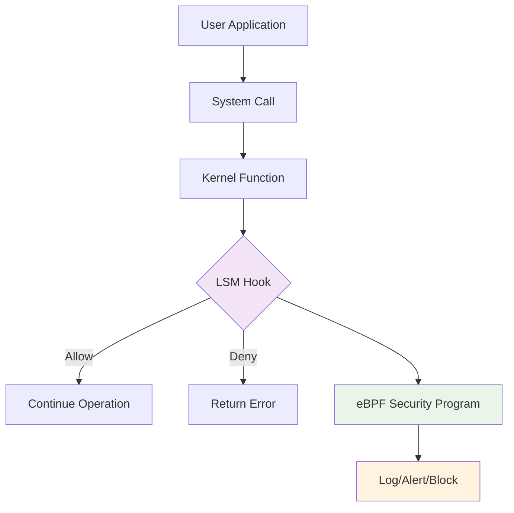

# Security Monitoring with eBPF: LSM Hooks and Beyond

eBPF enables powerful security monitoring capabilities by intercepting security-relevant events at the kernel level. This guide covers Linux Security Module (LSM) hooks, security event correlation, and building comprehensive security monitoring tools.

## 🛡️ Linux Security Modules (LSM) Overview

LSM provides a framework for implementing security policies in the Linux kernel. eBPF programs can attach to LSM hooks to monitor and potentially block security-relevant operations.

### LSM Hook Points



### Common LSM Hooks

| Hook | Purpose | Use Cases |
|------|---------|-----------|
| `file_open` | File access control | Monitor sensitive file access |
| `file_permission` | File permission checks | Detect privilege escalation |
| `task_alloc` | Process creation | Track process lineage |
| `socket_create` | Network socket creation | Monitor network activity |
| `ptrace_access_check` | Debugging access | Detect debugging attempts |
| `kernel_module_request` | Module loading | Monitor kernel modifications |

## 🔍 Complete Security Monitoring Examples

### 1. File Access Monitor with LSM

```c
// lsm_file_monitor.c
#include "vmlinux.h"
#include <bpf/bpf_helpers.h>
#include <bpf/bpf_core_read.h>

#define MAX_FILENAME_LEN 256
#define MAX_COMM_LEN 16

struct file_access_event {
    u32 pid;
    u32 tid;
    u32 uid;
    u32 gid;
    char comm[MAX_COMM_LEN];
    char filename[MAX_FILENAME_LEN];
    u32 mode;           // Access mode (read/write/execute)
    u64 timestamp;
    u32 action;         // 0=allow, 1=deny
    u32 inode;
    u32 dev;
};

// Event ring buffer
struct {
    __uint(type, BPF_MAP_TYPE_RINGBUF);
    __uint(max_entries, 1 << 24);
} security_events SEC(".maps");

// Sensitive paths to monitor
struct {
    __uint(type, BPF_MAP_TYPE_HASH);
    __type(key, char[MAX_FILENAME_LEN]);
    __type(value, u32);  // sensitivity level
    __uint(max_entries, 1000);
} sensitive_paths SEC(".maps");

// Process whitelist
struct {
    __uint(type, BPF_MAP_TYPE_HASH);
    __type(key, char[MAX_COMM_LEN]);
    __type(value, u32);  // privilege level
    __uint(max_entries, 100);
} process_whitelist SEC(".maps");

static inline int is_sensitive_path(const char *path) {
    // Check if path matches sensitive patterns
    u32 *sensitivity = bpf_map_lookup_elem(&sensitive_paths, path);
    return sensitivity ? *sensitivity : 0;
}

static inline int is_whitelisted_process(const char *comm) {
    u32 *privilege = bpf_map_lookup_elem(&process_whitelist, comm);
    return privilege ? *privilege : 0;
}

static inline void log_file_access(struct file *file, u32 mode, u32 action) {
    struct file_access_event *event;
    struct task_struct *task;
    const struct cred *cred;

    event = bpf_ringbuf_reserve(&security_events, sizeof(*event), 0);
    if (!event)
        return;

    task = (struct task_struct *)bpf_get_current_task();
    cred = BPF_CORE_READ(task, cred);

    // Fill basic process information
    event->pid = bpf_get_current_pid_tgid() >> 32;
    event->tid = bpf_get_current_pid_tgid() & 0xFFFFFFFF;
    event->uid = BPF_CORE_READ(cred, uid.val);
    event->gid = BPF_CORE_READ(cred, gid.val);
    event->timestamp = bpf_ktime_get_ns();
    event->mode = mode;
    event->action = action;

    bpf_get_current_comm(&event->comm, sizeof(event->comm));

    // Get file information
    if (file) {
        struct dentry *dentry = BPF_CORE_READ(file, f_path.dentry);
        struct inode *inode = BPF_CORE_READ(dentry, d_inode);

        if (inode) {
            event->inode = BPF_CORE_READ(inode, i_ino);
            event->dev = BPF_CORE_READ(inode, i_sb, s_dev);
        }

        // Get filename
        BPF_CORE_READ_STR_INTO(&event->filename, dentry, d_name.name);
    }

    bpf_ringbuf_submit(event, 0);
}

SEC("lsm/file_open")
int BPF_PROG(lsm_file_open, struct file *file) {
    char filename[MAX_FILENAME_LEN];
    char comm[MAX_COMM_LEN];

    if (!file)
        return 0;

    // Get current process name
    bpf_get_current_comm(&comm, sizeof(comm));

    // Get filename
    struct dentry *dentry = BPF_CORE_READ(file, f_path.dentry);
    BPF_CORE_READ_STR_INTO(&filename, dentry, d_name.name);

    // Check if this is a sensitive path
    int sensitivity = is_sensitive_path(filename);
    if (sensitivity == 0)
        return 0;  // Not sensitive, allow

    // Check if process is whitelisted
    int privilege = is_whitelisted_process(comm);

    // Log the access attempt
    log_file_access(file, 0, 0);  // mode=0 (open), action=0 (allow)

    // Security policy: block non-whitelisted processes from sensitive files
    if (sensitivity > privilege) {
        log_file_access(file, 0, 1);  // action=1 (deny)
        return -EPERM;  // Deny access
    }

    return 0;  // Allow access
}

SEC("lsm/file_permission")
int BPF_PROG(lsm_file_permission, struct file *file, int mask) {
    char filename[MAX_FILENAME_LEN];
    char comm[MAX_COMM_LEN];

    if (!file)
        return 0;

    bpf_get_current_comm(&comm, sizeof(comm));

    struct dentry *dentry = BPF_CORE_READ(file, f_path.dentry);
    BPF_CORE_READ_STR_INTO(&filename, dentry, d_name.name);

    // Monitor write/execute permissions to sensitive files
    if (mask & (MAY_WRITE | MAY_EXEC)) {
        int sensitivity = is_sensitive_path(filename);
        if (sensitivity > 0) {
            log_file_access(file, mask, 0);
        }
    }

    return 0;
}

char _license[] SEC("license") = "GPL";
```

### 2. Process Execution Security Monitor

```c
// lsm_process_monitor.c
#include "vmlinux.h"
#include <bpf/bpf_helpers.h>
#include <bpf/bpf_core_read.h>

struct process_exec_event {
    u32 pid;
    u32 ppid;
    u32 uid;
    u32 gid;
    char comm[16];
    char parent_comm[16];
    char filename[256];
    char args[512];
    u64 timestamp;
    u32 suspicious_score;
    u32 action;  // 0=allow, 1=block
};

struct {
    __uint(type, BPF_MAP_TYPE_RINGBUF);
    __uint(max_entries, 1 << 24);
} process_events SEC(".maps");

// Suspicious process patterns
struct suspicious_pattern {
    char name_pattern[32];
    u32 score;
    u32 enabled;
};

struct {
    __uint(type, BPF_MAP_TYPE_ARRAY);
    __type(key, u32);
    __type(value, struct suspicious_pattern);
    __uint(max_entries, 100);
} suspicious_patterns SEC(".maps");

// Process execution statistics
struct {
    __uint(type, BPF_MAP_TYPE_HASH);
    __type(key, u32);  // UID
    __type(value, u64); // execution count
    __uint(max_entries, 1000);
} user_exec_stats SEC(".maps");

static inline u32 calculate_suspicion_score(const char *filename, const char *comm, u32 uid) {
    u32 score = 0;

    // Check for suspicious patterns
    #pragma unroll
    for (u32 i = 0; i < 20; i++) {  // Check first 20 patterns
        struct suspicious_pattern *pattern = bpf_map_lookup_elem(&suspicious_patterns, &i);
        if (!pattern || !pattern->enabled)
            continue;

        // Simple substring check (simplified for eBPF)
        if (bpf_strncmp(comm, pattern->name_pattern, 16) == 0) {
            score += pattern->score;
        }
    }

    // Unusual execution patterns
    u64 *exec_count = bpf_map_lookup_elem(&user_exec_stats, &uid);
    if (!exec_count) {
        // First execution by this user - slightly suspicious
        score += 10;
        u64 initial_count = 1;
        bpf_map_update_elem(&user_exec_stats, &uid, &initial_count, BPF_ANY);
    } else {
        (*exec_count)++;
        bpf_map_update_elem(&user_exec_stats, &uid, exec_count, BPF_EXIST);
    }

    // Root execution by non-root user (privilege escalation)
    if (uid == 0) {
        score += 50;
    }

    // Execution from unusual directories
    if (bpf_strncmp(filename, "/tmp/", 5) == 0 ||
        bpf_strncmp(filename, "/dev/shm/", 9) == 0) {
        score += 30;
    }

    return score;
}

SEC("lsm/bprm_check_security")
int BPF_PROG(lsm_process_exec, struct linux_binprm *bprm) {
    struct process_exec_event *event;
    struct task_struct *task, *parent;
    const struct cred *cred;
    struct file *file;
    char *filename;

    event = bpf_ringbuf_reserve(&process_events, sizeof(*event), 0);
    if (!event)
        return 0;

    task = (struct task_struct *)bpf_get_current_task();
    cred = BPF_CORE_READ(task, cred);
    parent = BPF_CORE_READ(task, real_parent);
    file = BPF_CORE_READ(bprm, file);

    // Fill event data
    event->pid = bpf_get_current_pid_tgid() >> 32;
    event->ppid = BPF_CORE_READ(parent, tgid);
    event->uid = BPF_CORE_READ(cred, uid.val);
    event->gid = BPF_CORE_READ(cred, gid.val);
    event->timestamp = bpf_ktime_get_ns();

    bpf_get_current_comm(&event->comm, sizeof(event->comm));
    BPF_CORE_READ_STR_INTO(&event->parent_comm, parent, comm);

    // Get filename
    if (file) {
        struct dentry *dentry = BPF_CORE_READ(file, f_path.dentry);
        BPF_CORE_READ_STR_INTO(&event->filename, dentry, d_name.name);
    }

    // Get command line arguments (simplified)
    filename = BPF_CORE_READ(bprm, filename);
    if (filename) {
        bpf_probe_read_str(&event->args, sizeof(event->args), filename);
    }

    // Calculate suspicion score
    event->suspicious_score = calculate_suspicion_score(event->filename, event->comm, event->uid);

    // Security policy: block highly suspicious executions
    if (event->suspicious_score > 100) {
        event->action = 1;  // Block
        bpf_ringbuf_submit(event, 0);
        return -EPERM;
    }

    event->action = 0;  // Allow
    bpf_ringbuf_submit(event, 0);
    return 0;
}

char _license[] SEC("license") = "GPL";
```

### 3. Network Security Monitor

```c
// lsm_network_monitor.c
#include "vmlinux.h"
#include <bpf/bpf_helpers.h>
#include <bpf/bpf_core_read.h>

struct network_security_event {
    u32 pid;
    u32 uid;
    char comm[16];
    u16 family;     // AF_INET, AF_INET6
    u16 type;       // SOCK_STREAM, SOCK_DGRAM
    u16 protocol;   // IPPROTO_TCP, IPPROTO_UDP
    u32 local_ip;
    u16 local_port;
    u32 remote_ip;
    u16 remote_port;
    u64 timestamp;
    u32 action;     // 0=allow, 1=deny
    u32 risk_score;
};

struct {
    __uint(type, BPF_MAP_TYPE_RINGBUF);
    __uint(max_entries, 1 << 24);
} network_events SEC(".maps");

// Blocked networks (IP ranges)
struct network_rule {
    u32 network;
    u32 mask;
    u16 port_min;
    u16 port_max;
    u32 action;  // 0=allow, 1=block
};

struct {
    __uint(type, BPF_MAP_TYPE_ARRAY);
    __type(key, u32);
    __type(value, struct network_rule);
    __uint(max_entries, 100);
} network_rules SEC(".maps");

// Process network privileges
struct {
    __uint(type, BPF_MAP_TYPE_HASH);
    __type(key, char[16]);  // process name
    __type(value, u32);     // allowed operations bitmask
    __uint(max_entries, 100);
} process_network_policy SEC(".maps");

static inline u32 calculate_network_risk(u16 family, u16 type, u32 remote_ip, u16 remote_port, const char *comm) {
    u32 risk = 0;

    // Raw sockets are high risk
    if (type == SOCK_RAW) {
        risk += 80;
    }

    // Outbound connections to unusual ports
    if (remote_port < 1024 && remote_port != 22 && remote_port != 80 && remote_port != 443) {
        risk += 30;
    }

    // Connections to private/internal networks from certain processes
    if ((remote_ip & 0xFF000000) == 0x0A000000 ||  // 10.x.x.x
        (remote_ip & 0xFFF00000) == 0xAC100000 ||  // 172.16.x.x
        (remote_ip & 0xFFFF0000) == 0xC0A80000) {  // 192.168.x.x

        // Some processes shouldn't access internal networks
        if (bpf_strncmp(comm, "wget", 4) == 0 ||
            bpf_strncmp(comm, "curl", 4) == 0) {
            risk += 40;
        }
    }

    return risk;
}

static inline int check_network_policy(u32 remote_ip, u16 remote_port) {
    #pragma unroll
    for (u32 i = 0; i < 50; i++) {  // Check first 50 rules
        struct network_rule *rule = bpf_map_lookup_elem(&network_rules, &i);
        if (!rule)
            continue;

        // Check if IP matches network/mask
        if ((remote_ip & rule->mask) == rule->network) {
            // Check port range
            if (remote_port >= rule->port_min && remote_port <= rule->port_max) {
                return rule->action;  // 0=allow, 1=block
            }
        }
    }

    return 0;  // Default allow
}

SEC("lsm/socket_create")
int BPF_PROG(lsm_socket_create, int family, int type, int protocol, int kern) {
    struct network_security_event *event;
    struct task_struct *task;
    const struct cred *cred;

    // Only monitor user-space sockets
    if (kern)
        return 0;

    // Only monitor IPv4/IPv6
    if (family != AF_INET && family != AF_INET6)
        return 0;

    event = bpf_ringbuf_reserve(&network_events, sizeof(*event), 0);
    if (!event)
        return 0;

    task = (struct task_struct *)bpf_get_current_task();
    cred = BPF_CORE_READ(task, cred);

    event->pid = bpf_get_current_pid_tgid() >> 32;
    event->uid = BPF_CORE_READ(cred, uid.val);
    event->family = family;
    event->type = type;
    event->protocol = protocol;
    event->timestamp = bpf_ktime_get_ns();

    bpf_get_current_comm(&event->comm, sizeof(event->comm));

    // Calculate risk score
    event->risk_score = calculate_network_risk(family, type, 0, 0, event->comm);

    // Check process privileges
    u32 *privileges = bpf_map_lookup_elem(&process_network_policy, &event->comm);
    if (!privileges && type == SOCK_RAW) {
        // Raw socket without privileges - block
        event->action = 1;
        bpf_ringbuf_submit(event, 0);
        return -EPERM;
    }

    event->action = 0;
    bpf_ringbuf_submit(event, 0);
    return 0;
}

SEC("lsm/socket_connect")
int BPF_PROG(lsm_socket_connect, struct socket *sock, struct sockaddr *address, int addrlen) {
    struct network_security_event *event;
    struct sockaddr_in *addr_in;

    if (!address || address->sa_family != AF_INET)
        return 0;

    addr_in = (struct sockaddr_in *)address;

    event = bpf_ringbuf_reserve(&network_events, sizeof(*event), 0);
    if (!event)
        return 0;

    event->pid = bpf_get_current_pid_tgid() >> 32;
    event->remote_ip = addr_in->sin_addr.s_addr;
    event->remote_port = bpf_ntohs(addr_in->sin_port);
    event->timestamp = bpf_ktime_get_ns();

    bpf_get_current_comm(&event->comm, sizeof(event->comm));

    // Check network policy
    int policy_result = check_network_policy(event->remote_ip, event->remote_port);
    event->risk_score = calculate_network_risk(AF_INET, 0, event->remote_ip, event->remote_port, event->comm);

    if (policy_result == 1 || event->risk_score > 100) {
        event->action = 1;
        bpf_ringbuf_submit(event, 0);
        return -EPERM;
    }

    event->action = 0;
    bpf_ringbuf_submit(event, 0);
    return 0;
}

char _license[] SEC("license") = "GPL";
```

## 🔧 Security Event Correlation Engine

### Event Processing and Correlation

```go
// security_correlator.go
package main

import (
    "encoding/binary"
    "fmt"
    "log"
    "sync"
    "time"
)

type SecurityEvent struct {
    Type      string
    Timestamp time.Time
    PID       uint32
    UID       uint32
    ProcessName string
    Details   map[string]interface{}
    RiskScore uint32
}

type SecurityRule struct {
    ID          string
    Name        string
    Description string
    Pattern     []EventPattern
    Action      string
    Severity    string
    Enabled     bool
}

type EventPattern struct {
    EventType     string
    TimeWindow    time.Duration
    MinOccurrence int
    Conditions    map[string]interface{}
}

type SecurityCorrelator struct {
    events      []SecurityEvent
    rules       []SecurityRule
    eventsMutex sync.RWMutex
    alerts      chan SecurityAlert
}

type SecurityAlert struct {
    RuleID      string
    RuleName    string
    Severity    string
    Timestamp   time.Time
    Events      []SecurityEvent
    Description string
    Action      string
}

func NewSecurityCorrelator() *SecurityCorrelator {
    sc := &SecurityCorrelator{
        events: make([]SecurityEvent, 0, 10000),
        alerts: make(chan SecurityAlert, 1000),
    }

    // Initialize default security rules
    sc.initializeRules()

    return sc
}

func (sc *SecurityCorrelator) initializeRules() {
    sc.rules = []SecurityRule{
        {
            ID:   "PRIV_ESC_1",
            Name: "Privilege Escalation Attempt",
            Description: "Process running as root after execution from unusual location",
            Pattern: []EventPattern{
                {
                    EventType:     "process_exec",
                    TimeWindow:    30 * time.Second,
                    MinOccurrence: 1,
                    Conditions: map[string]interface{}{
                        "uid":      uint32(0),  // root
                        "filename": []string{"/tmp/", "/dev/shm/"},
                    },
                },
            },
            Action:   "alert",
            Severity: "high",
            Enabled:  true,
        },
        {
            ID:   "LATERAL_MOVEMENT_1",
            Name: "Lateral Movement Detection",
            Description: "Multiple network connections to internal hosts",
            Pattern: []EventPattern{
                {
                    EventType:     "network_connect",
                    TimeWindow:    60 * time.Second,
                    MinOccurrence: 5,
                    Conditions: map[string]interface{}{
                        "remote_ip_range": "10.0.0.0/8",
                    },
                },
            },
            Action:   "alert",
            Severity: "medium",
            Enabled:  true,
        },
        {
            ID:   "SENSITIVE_FILE_ACCESS",
            Name: "Sensitive File Access",
            Description: "Access to sensitive system files",
            Pattern: []EventPattern{
                {
                    EventType:     "file_access",
                    TimeWindow:    10 * time.Second,
                    MinOccurrence: 1,
                    Conditions: map[string]interface{}{
                        "filename": []string{"/etc/shadow", "/etc/passwd", "/etc/sudoers"},
                        "mode":     "write",
                    },
                },
            },
            Action:   "block",
            Severity: "critical",
            Enabled:  true,
        },
    }
}

func (sc *SecurityCorrelator) AddEvent(event SecurityEvent) {
    sc.eventsMutex.Lock()
    defer sc.eventsMutex.Unlock()

    // Add event to history
    sc.events = append(sc.events, event)

    // Cleanup old events (keep last 10000)
    if len(sc.events) > 10000 {
        sc.events = sc.events[1000:]
    }

    // Check all rules against this event
    go sc.evaluateRules(event)
}

func (sc *SecurityCorrelator) evaluateRules(triggerEvent SecurityEvent) {
    for _, rule := range sc.rules {
        if !rule.Enabled {
            continue
        }

        if sc.checkRulePattern(rule, triggerEvent) {
            alert := SecurityAlert{
                RuleID:      rule.ID,
                RuleName:    rule.Name,
                Severity:    rule.Severity,
                Timestamp:   time.Now(),
                Description: rule.Description,
                Action:      rule.Action,
            }

            // Find related events
            alert.Events = sc.findRelatedEvents(rule, triggerEvent)

            select {
            case sc.alerts <- alert:
            default:
                log.Printf("Alert queue full, dropping alert: %s", rule.Name)
            }
        }
    }
}

func (sc *SecurityCorrelator) checkRulePattern(rule SecurityRule, event SecurityEvent) bool {
    for _, pattern := range rule.Pattern {
        if event.Type != pattern.EventType {
            continue
        }

        // Check conditions
        if !sc.matchesConditions(event, pattern.Conditions) {
            continue
        }

        // Check time window and occurrence count
        relatedEvents := sc.findEventsInTimeWindow(pattern.EventType, pattern.TimeWindow)
        matchingEvents := 0

        for _, relEvent := range relatedEvents {
            if sc.matchesConditions(relEvent, pattern.Conditions) {
                matchingEvents++
            }
        }

        if matchingEvents >= pattern.MinOccurrence {
            return true
        }
    }

    return false
}

func (sc *SecurityCorrelator) matchesConditions(event SecurityEvent, conditions map[string]interface{}) bool {
    for key, expected := range conditions {
        switch key {
        case "uid":
            if event.UID != expected.(uint32) {
                return false
            }
        case "filename":
            filename, ok := event.Details["filename"].(string)
            if !ok {
                return false
            }

            patterns := expected.([]string)
            found := false
            for _, pattern := range patterns {
                if len(filename) >= len(pattern) && filename[:len(pattern)] == pattern {
                    found = true
                    break
                }
            }
            if !found {
                return false
            }
        case "mode":
            mode, ok := event.Details["mode"].(string)
            if !ok || mode != expected.(string) {
                return false
            }
        }
    }

    return true
}

func (sc *SecurityCorrelator) findEventsInTimeWindow(eventType string, window time.Duration) []SecurityEvent {
    sc.eventsMutex.RLock()
    defer sc.eventsMutex.RUnlock()

    cutoff := time.Now().Add(-window)
    var events []SecurityEvent

    for i := len(sc.events) - 1; i >= 0; i-- {
        event := sc.events[i]
        if event.Timestamp.Before(cutoff) {
            break
        }
        if event.Type == eventType {
            events = append(events, event)
        }
    }

    return events
}

func (sc *SecurityCorrelator) findRelatedEvents(rule SecurityRule, triggerEvent SecurityEvent) []SecurityEvent {
    events := []SecurityEvent{triggerEvent}

    // Find events from same process
    sc.eventsMutex.RLock()
    defer sc.eventsMutex.RUnlock()

    for i := len(sc.events) - 1; i >= 0; i-- {
        event := sc.events[i]
        if event.PID == triggerEvent.PID &&
           event.Timestamp.After(triggerEvent.Timestamp.Add(-5*time.Minute)) {
            events = append(events, event)
        }
    }

    return events
}

func (sc *SecurityCorrelator) GetAlerts() <-chan SecurityAlert {
    return sc.alerts
}

// Security monitor integration
func main() {
    correlator := NewSecurityCorrelator()

    // Process LSM events
    go func() {
        for {
            // This would read from your eBPF ring buffer
            // Example: processing file access events
            event := SecurityEvent{
                Type:        "file_access",
                Timestamp:   time.Now(),
                PID:         1234,
                UID:         0,
                ProcessName: "suspicious_app",
                Details: map[string]interface{}{
                    "filename": "/etc/shadow",
                    "mode":     "write",
                },
                RiskScore: 90,
            }

            correlator.AddEvent(event)
            time.Sleep(100 * time.Millisecond)
        }
    }()

    // Process alerts
    for alert := range correlator.GetAlerts() {
        log.Printf("SECURITY ALERT: %s - %s (%s)",
                  alert.Severity, alert.RuleName, alert.Description)

        if alert.Action == "block" {
            log.Printf("Action: Blocking process PID %d", alert.Events[0].PID)
            // Implement blocking logic
        }
    }
}
```

## 🛠️ Building and Deploying Security Tools

### 1. Makefile for Security Programs

```makefile
# Build LSM programs
build_security:
	clang -g -O2 -target bpf -D__TARGET_ARCH_x86 \
		-I./bpf/headers \
		-c bpf/lsm_file_monitor.c \
		-o bpf/lsm_file_monitor.o

	clang -g -O2 -target bpf -D__TARGET_ARCH_x86 \
		-I./bpf/headers \
		-c bpf/lsm_process_monitor.c \
		-o bpf/lsm_process_monitor.o

# Load LSM programs (requires CONFIG_BPF_LSM=y)
load_security:
	sudo bpftool prog load bpf/lsm_file_monitor.o /sys/fs/bpf/file_monitor type lsm
	sudo bpftool prog load bpf/lsm_process_monitor.o /sys/fs/bpf/process_monitor type lsm

# Configure LSM (requires kernel parameter: lsm=...,bpf)
configure_lsm:
	@echo "Add 'lsm=capability,yama,apparmor,bpf' to kernel parameters"
	@echo "Reboot required after kernel parameter change"

# Check LSM status
check_lsm:
	cat /sys/kernel/security/lsm
	ls -la /sys/fs/bpf/
```

### 2. Security Configuration Management

```go
// security_config.go
type SecurityConfig struct {
    SensitivePaths   []PathRule    `json:"sensitive_paths"`
    ProcessWhitelist []ProcessRule `json:"process_whitelist"`
    NetworkRules     []NetworkRule `json:"network_rules"`
    AlertRules       []AlertRule   `json:"alert_rules"`
}

type PathRule struct {
    Path        string `json:"path"`
    Sensitivity int    `json:"sensitivity"`
    Actions     []string `json:"actions"`
}

func LoadSecurityConfig(filename string) (*SecurityConfig, error) {
    data, err := os.ReadFile(filename)
    if err != nil {
        return nil, err
    }

    var config SecurityConfig
    if err := json.Unmarshal(data, &config); err != nil {
        return nil, err
    }

    return &config, nil
}

func (sc *SecurityConfig) UpdateEBPFMaps(maps map[string]*ebpf.Map) error {
    // Update sensitive paths map
    for _, rule := range sc.SensitivePaths {
        key := rule.Path
        value := uint32(rule.Sensitivity)
        if err := maps["sensitive_paths"].Update(&key, &value, ebpf.UpdateAny); err != nil {
            return fmt.Errorf("updating sensitive paths: %w", err)
        }
    }

    // Update process whitelist
    for _, rule := range sc.ProcessWhitelist {
        key := rule.ProcessName
        value := uint32(rule.PrivilegeLevel)
        if err := maps["process_whitelist"].Update(&key, &value, ebpf.UpdateAny); err != nil {
            return fmt.Errorf("updating process whitelist: %w", err)
        }
    }

    return nil
}
```

## 📊 Security Metrics and Dashboards

### Real-time Security Dashboard

```go
// security_dashboard.go
type SecurityDashboard struct {
    metrics map[string]uint64
    mutex   sync.RWMutex
}

func (sd *SecurityDashboard) UpdateMetrics(event SecurityEvent) {
    sd.mutex.Lock()
    defer sd.mutex.Unlock()

    sd.metrics["total_events"]++
    sd.metrics[event.Type+"_events"]++

    if event.RiskScore > 50 {
        sd.metrics["high_risk_events"]++
    }

    if event.UID == 0 {
        sd.metrics["root_events"]++
    }
}

func (sd *SecurityDashboard) GetMetrics() map[string]uint64 {
    sd.mutex.RLock()
    defer sd.mutex.RUnlock()

    result := make(map[string]uint64)
    for k, v := range sd.metrics {
        result[k] = v
    }

    return result
}
```

## ⚠️ Security Considerations

### 1. LSM Program Security

```c
// Secure LSM program patterns
SEC("lsm/file_open")
int secure_file_monitor(struct file *file) {
    // Always validate pointers
    if (!file)
        return 0;

    // Bounds check for all memory access
    struct dentry *dentry = BPF_CORE_READ(file, f_path.dentry);
    if (!dentry)
        return 0;

    // Use safe string operations
    char filename[256];
    int ret = BPF_CORE_READ_STR_INTO(&filename, dentry, d_name.name);
    if (ret < 0)
        return 0;

    // Validate security decisions
    // Never allow by default in security-critical paths
    return check_security_policy(filename);
}
```

### 2. Performance Impact

```bash
#!/bin/bash
# Monitor LSM performance impact

echo "=== LSM Program Performance ==="
bpftool prog show type lsm
perf stat -e cycles,instructions,cache-misses sudo ./security_monitor

echo -e "\n=== System Call Latency ==="
strace -c -T -S calls ls > /dev/null

echo -e "\n=== Security Event Rate ==="
bpftool map dump id <events_map_id> | wc -l
```

Security monitoring with eBPF provides unprecedented visibility into system behavior while maintaining excellent performance. Use these patterns to build comprehensive security tools! 🔒