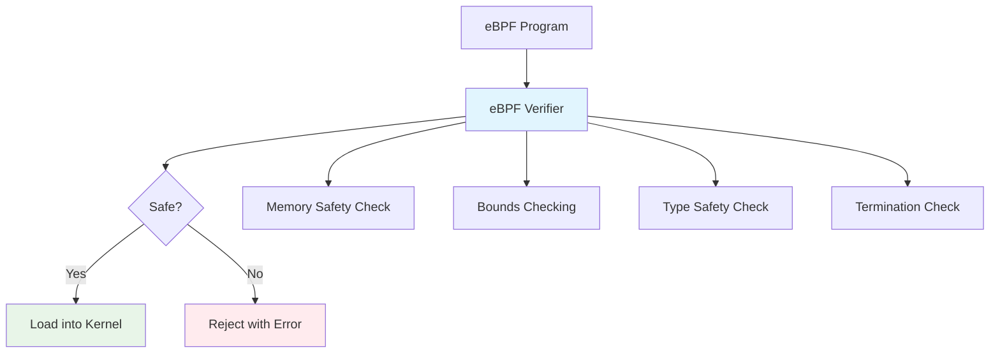

# Security Considerations

Building secure eBPF tools requires understanding the security implications of kernel programming and implementing proper safeguards. This guide covers security best practices for eBPF development.

## 🛡️ eBPF Security Model

### The Verifier: Your Security Guardian

The eBPF verifier is the primary security mechanism that ensures programs are safe to run in kernel space:



### Security Boundaries

!!! warning "Understanding Privileges"
    - **Loading eBPF programs** requires `CAP_BPF` or root privileges
    - **Accessing kernel data** requires understanding of kernel internals
    - **Network programs** may require additional capabilities
    - **Some program types** require `CAP_SYS_ADMIN`

## 🔒 Secure eBPF Programming

### 1. Memory Safety

#### Always Validate Pointers
```c
// ❌ Dangerous: Direct pointer dereference
SEC("kprobe/vfs_open")
int unsafe_file_access(struct pt_regs *ctx) {
    struct file *file = (struct file *)PT_REGS_PARM1(ctx);
    
    // This will be rejected by verifier
    char *name = file->f_path.dentry->d_name.name;
    return 0;
}

// ✅ Safe: Use helper functions
SEC("kprobe/vfs_open") 
int safe_file_access(struct pt_regs *ctx) {
    struct file *file = (struct file *)PT_REGS_PARM1(ctx);
    char filename[256];
    
    // Safely read kernel memory
    bpf_probe_read_kernel(&filename, sizeof(filename), file);
    return 0;
}
```

#### Bounds Checking
```c
// ✅ Always check array bounds
SEC("tracepoint/syscalls/sys_enter_read")
int trace_read_with_bounds_check(struct trace_event_raw_sys_enter *ctx) {
    u32 fd = ctx->args[0];
    
    // Check bounds before array access
    if (fd >= MAX_FDS) {
        return 0;
    }
    
    // Safe to access array
    u64 *counter = bpf_map_lookup_elem(&fd_counters, &fd);
    if (counter) {
        (*counter)++;
    }
    
    return 0;
}
```

### 2. Information Disclosure Prevention

#### Filter Sensitive Data
```c
// Configuration for sensitive data filtering
struct security_config {
    u8 filter_sensitive_paths;
    u8 filter_root_processes;
    u8 anonymize_pids;
    u32 max_filename_len;
};

struct {
    __uint(type, BPF_MAP_TYPE_ARRAY);
    __type(key, u32);
    __type(value, struct security_config);
    __uint(max_entries, 1);
} security_cfg SEC(".maps");

// List of sensitive path prefixes
struct {
    __uint(type, BPF_MAP_TYPE_HASH);
    __type(key, char[64]);
    __type(value, u8);
    __uint(max_entries, 100);
} sensitive_paths SEC(".maps");

SEC("tracepoint/syscalls/sys_enter_openat")
int secure_file_monitor(struct trace_event_raw_sys_enter *ctx) {
    u32 key = 0;
    struct security_config *cfg = bpf_map_lookup_elem(&security_cfg, &key);
    if (!cfg) return 0;
    
    // Get current process info
    u64 pid_tgid = bpf_get_current_pid_tgid();
    u32 pid = pid_tgid & 0xFFFFFFFF;
    u32 uid = bpf_get_current_uid_gid() & 0xFFFFFFFF;
    
    // Skip root processes if configured
    if (cfg->filter_root_processes && uid == 0) {
        return 0;
    }
    
    // Read filename safely
    char filename[256];
    bpf_probe_read_user_str(&filename, sizeof(filename), (void *)ctx->args[1]);
    
    // Check against sensitive paths
    if (cfg->filter_sensitive_paths) {
        char path_prefix[64];
        
        // Check common sensitive prefixes
        if (filename[0] == '/' && filename[1] == 'e' && 
            filename[2] == 't' && filename[3] == 'c' && filename[4] == '/') {
            return 0; // Skip /etc/* files
        }
        
        if (starts_with(filename, "/root/") || 
            starts_with(filename, "/home/")) {
            return 0; // Skip user directories
        }
    }
    
    // Create event with filtered data
    struct file_event *event = bpf_ringbuf_reserve(&events, sizeof(*event), 0);
    if (!event) return 0;
    
    // Anonymize PID if configured
    event->pid = cfg->anonymize_pids ? hash_pid(pid) : pid;
    bpf_get_current_comm(&event->comm, sizeof(event->comm));
    
    // Truncate filename if too long
    u32 max_len = cfg->max_filename_len;
    if (max_len > sizeof(event->filename)) {
        max_len = sizeof(event->filename);
    }
    
    bpf_probe_read_user_str(&event->filename, max_len, (void *)ctx->args[1]);
    
    bpf_ringbuf_submit(event, 0);
    return 0;
}

// Helper function to check path prefixes
static __always_inline bool starts_with(const char *str, const char *prefix) {
    for (int i = 0; i < 32; i++) { // Limit to prevent loops
        if (prefix[i] == '\0') return true;
        if (str[i] != prefix[i]) return false;
        if (str[i] == '\0') break;
    }
    return false;
}
```

### 3. Resource Protection

#### Rate Limiting
```c
// Per-process rate limiting
struct rate_limit_state {
    u64 last_event_time;
    u32 event_count;
    u32 max_events_per_sec;
};

struct {
    __uint(type, BPF_MAP_TYPE_LRU_HASH);
    __type(key, u32);
    __type(value, struct rate_limit_state);
    __uint(max_entries, 10000);
} rate_limits SEC(".maps");

SEC("tracepoint/sched/sched_process_exec")
int rate_limited_exec_monitor(void *ctx) {
    u32 pid = bpf_get_current_pid_tgid() & 0xFFFFFFFF;
    u64 now = bpf_ktime_get_ns();
    
    // Get or create rate limit state
    struct rate_limit_state *state = bpf_map_lookup_elem(&rate_limits, &pid);
    if (!state) {
        struct rate_limit_state new_state = {
            .last_event_time = now,
            .event_count = 1,
            .max_events_per_sec = 100,
        };
        bpf_map_update_elem(&rate_limits, &pid, &new_state, BPF_ANY);
        goto process_event;
    }
    
    // Check if we're in a new second
    if (now - state->last_event_time > 1000000000UL) { // 1 second in ns
        state->last_event_time = now;
        state->event_count = 1;
        goto process_event;
    }
    
    // Check rate limit
    if (state->event_count >= state->max_events_per_sec) {
        return 0; // Drop event due to rate limit
    }
    
    state->event_count++;
    
process_event:
    // Process the event normally
    struct exec_event *event = bpf_ringbuf_reserve(&events, sizeof(*event), 0);
    if (!event) return 0;
    
    event->pid = pid;
    event->timestamp = now;
    bpf_get_current_comm(&event->comm, sizeof(event->comm));
    
    bpf_ringbuf_submit(event, 0);
    return 0;
}
```

## 🔐 Userspace Security

### 1. Privilege Management

#### Drop Privileges After Loading
```go
func runSecureMonitor(cmd *cobra.Command, args []string) {
    // Load eBPF program (requires root)
    objs := execsnoopObjects{}
    if err := loadExecsnoopObjects(&objs, nil); err != nil {
        log.Fatalf("Loading eBPF objects: %v", err)
    }
    defer objs.Close()
    
    // Attach to tracepoint (requires root)
    link, err := link.Tracepoint("sched", "sched_process_exec", objs.TraceExec, nil)
    if err != nil {
        log.Fatalf("Attaching tracepoint: %v", err)
    }
    defer link.Close()
    
    // Drop privileges after setup
    if err := dropPrivileges(); err != nil {
        log.Fatalf("Failed to drop privileges: %v", err)
    }
    
    // Continue with event processing (now as non-root)
    processEvents(objs.Events)
}

func dropPrivileges() error {
    // Get nobody user
    nobody, err := user.Lookup("nobody")
    if err != nil {
        return fmt.Errorf("lookup nobody user: %w", err)
    }
    
    uid, _ := strconv.Atoi(nobody.Uid)
    gid, _ := strconv.Atoi(nobody.Gid)
    
    // Drop group privileges first
    if err := syscall.Setgid(gid); err != nil {
        return fmt.Errorf("setgid: %w", err)
    }
    
    // Drop user privileges
    if err := syscall.Setuid(uid); err != nil {
        return fmt.Errorf("setuid: %w", err)
    }
    
    log.Printf("Dropped privileges to uid=%d, gid=%d", uid, gid)
    return nil
}
```

### 2. Input Validation

#### Sanitize User Input
```go
type SafeFilters struct {
    PID     uint32
    Command string
    MaxLen  int
}

func validateAndSanitizeFilters(pidStr, commStr string) (*SafeFilters, error) {
    filters := &SafeFilters{MaxLen: 256}
    
    // Validate PID
    if pidStr != "" {
        pid, err := strconv.ParseUint(pidStr, 10, 32)
        if err != nil {
            return nil, fmt.Errorf("invalid PID: %w", err)
        }
        if pid == 0 {
            return nil, fmt.Errorf("PID cannot be zero")
        }
        filters.PID = uint32(pid)
    }
    
    // Sanitize command name
    if commStr != "" {
        // Remove null bytes and control characters
        cleaned := strings.Map(func(r rune) rune {
            if r == 0 || r < 32 || r == 127 {
                return -1 // Remove character
            }
            return r
        }, commStr)
        
        // Limit length
        if len(cleaned) > 15 { // Kernel comm limit
            cleaned = cleaned[:15]
        }
        
        // Validate characters
        if !regexp.MustCompile(`^[a-zA-Z0-9_.-]+$`).MatchString(cleaned) {
            return nil, fmt.Errorf("invalid characters in command name")
        }
        
        filters.Command = cleaned
    }
    
    return filters, nil
}
```

### 3. Output Security

#### Secure Event Formatting
```go
type SecureEventFormatter struct {
    anonymizePIDs   bool
    filterPaths     []string
    maxFieldLength  int
    pidHashSalt     []byte
}

func NewSecureEventFormatter() *SecureEventFormatter {
    // Generate random salt for PID hashing
    salt := make([]byte, 16)
    if _, err := rand.Read(salt); err != nil {
        log.Fatalf("Failed to generate salt: %v", err)
    }
    
    return &SecureEventFormatter{
        anonymizePIDs:  true,
        maxFieldLength: 256,
        pidHashSalt:    salt,
        filterPaths: []string{
            "/etc/",
            "/root/",
            "/home/",
            "/var/log/",
        },
    }
}

func (f *SecureEventFormatter) FormatEvent(event *RawEvent) *SecureEvent {
    secure := &SecureEvent{
        Timestamp: time.Unix(0, int64(event.Timestamp)),
    }
    
    // Hash PID for anonymization
    if f.anonymizePIDs {
        secure.PID = f.hashPID(event.PID)
    } else {
        secure.PID = fmt.Sprintf("%d", event.PID)
    }
    
    // Sanitize command name
    secure.Command = f.sanitizeString(nullTerminatedString(event.Comm[:]))
    
    // Filter and sanitize filename
    filename := nullTerminatedString(event.Filename[:])
    if f.shouldFilterPath(filename) {
        secure.Filename = "[FILTERED]"
    } else {
        secure.Filename = f.sanitizeString(filename)
    }
    
    return secure
}

func (f *SecureEventFormatter) hashPID(pid uint32) string {
    h := sha256.New()
    h.Write(f.pidHashSalt)
    binary.Write(h, binary.LittleEndian, pid)
    hash := h.Sum(nil)
    return fmt.Sprintf("pid_%x", hash[:8]) // Use first 8 bytes
}

func (f *SecureEventFormatter) sanitizeString(s string) string {
    // Remove control characters
    cleaned := strings.Map(func(r rune) rune {
        if r < 32 || r == 127 {
            return '?'
        }
        return r
    }, s)
    
    // Limit length
    if len(cleaned) > f.maxFieldLength {
        cleaned = cleaned[:f.maxFieldLength] + "..."
    }
    
    return cleaned
}

func (f *SecureEventFormatter) shouldFilterPath(path string) bool {
    for _, filterPath := range f.filterPaths {
        if strings.HasPrefix(path, filterPath) {
            return true
        }
    }
    return false
}
```

## 🚨 Common Security Pitfalls

### 1. Information Leakage
```c
// ❌ Dangerous: Exposing kernel addresses
struct bad_event {
    u32 pid;
    void *task_struct_ptr;  // Kernel address leak!
    char comm[16];
};

// ✅ Safe: Only expose necessary data
struct safe_event {
    u32 pid;
    u32 parent_pid;  // Derived from kernel data, not direct pointer
    char comm[16];
};
```

### 2. Unbounded Data Exposure
```c
// ❌ Dangerous: Unlimited data exposure
SEC("kprobe/vfs_read")
int dangerous_read_monitor(struct pt_regs *ctx) {
    // This could expose sensitive file contents!
    char *buffer = (char *)PT_REGS_PARM2(ctx);
    size_t count = (size_t)PT_REGS_PARM3(ctx);
    
    // Don't copy arbitrary user data
    struct event *e = bpf_ringbuf_reserve(&events, sizeof(*e) + count, 0);
    bpf_probe_read_user(&e->data, count, buffer);
    
    return 0;
}

// ✅ Safe: Limited, controlled data exposure
SEC("kprobe/vfs_read")
int safe_read_monitor(struct pt_regs *ctx) {
    struct read_event *event = bpf_ringbuf_reserve(&events, sizeof(*event), 0);
    if (!event) return 0;
    
    // Only expose metadata, not content
    event->pid = bpf_get_current_pid_tgid() & 0xFFFFFFFF;
    event->fd = (u32)PT_REGS_PARM1(ctx);
    event->count = (size_t)PT_REGS_PARM3(ctx);
    // No file content exposure
    
    bpf_ringbuf_submit(event, 0);
    return 0;
}
```

## 🔍 Security Auditing

### 1. eBPF Program Audit Checklist

```bash
#!/bin/bash
# Security audit script for eBPF programs

echo "=== eBPF Security Audit ==="

echo "1. Checking for loaded programs:"
bpftool prog list | grep -E "(name|type|loaded_at)"

echo "2. Checking program capabilities:"
for prog_id in $(bpftool prog list | grep -oP 'id \K\d+'); do
    echo "Program $prog_id:"
    bpftool prog dump xlated id $prog_id | head -20
done

echo "3. Checking map permissions:"
bpftool map list | grep -E "(name|type|max_entries)"

echo "4. Checking for sensitive attachments:"
bpftool prog list | grep -E "(kprobe|uprobe|tracepoint)" 

echo "5. Resource usage:"
cat /proc/sys/kernel/bpf_stats_enabled
```

### 2. Runtime Security Monitoring

```go
type SecurityMonitor struct {
    maxEventsPerSecond   int64
    maxMemoryUsage      uint64
    suspiciousPatterns  []regexp.Regexp
    alertThreshold      time.Duration
}

func (s *SecurityMonitor) MonitorEvents(events <-chan *Event) {
    eventCount := int64(0)
    ticker := time.NewTicker(time.Second)
    
    for {
        select {
        case event := <-events:
            eventCount++
            
            // Check for suspicious patterns
            if s.isSuspicious(event) {
                s.alertSuspiciousActivity(event)
            }
            
        case <-ticker.C:
            // Check rate limits
            if eventCount > s.maxEventsPerSecond {
                log.Warnf("High event rate detected: %d events/second", eventCount)
            }
            eventCount = 0
            
            // Check memory usage
            var m runtime.MemStats
            runtime.ReadMemStats(&m)
            if m.Alloc > s.maxMemoryUsage {
                log.Warnf("High memory usage: %d bytes", m.Alloc)
            }
        }
    }
}

func (s *SecurityMonitor) isSuspicious(event *Event) bool {
    // Check for suspicious filenames
    suspiciousFiles := []string{
        "/etc/passwd",
        "/etc/shadow", 
        "/root/.ssh/",
        "id_rsa",
    }
    
    for _, suspicious := range suspiciousFiles {
        if strings.Contains(event.Filename, suspicious) {
            return true
        }
    }
    
    // Check for privilege escalation attempts
    if event.Command == "sudo" || event.Command == "su" {
        return true
    }
    
    return false
}
```

## 🛡️ Security Best Practices

### Development
- [ ] **Use helper functions** instead of direct memory access
- [ ] **Validate all inputs** and bounds check arrays
- [ ] **Filter sensitive data** at the kernel level
- [ ] **Implement rate limiting** to prevent DoS
- [ ] **Use LRU maps** to bound memory usage
- [ ] **Audit program logic** for information disclosure

### Deployment
- [ ] **Run with minimal privileges** required
- [ ] **Drop privileges** after eBPF program loading
- [ ] **Validate user inputs** in userspace
- [ ] **Sanitize outputs** before displaying
- [ ] **Monitor resource usage** and set limits
- [ ] **Log security events** for audit trails

### Monitoring
- [ ] **Monitor eBPF program** resource usage
- [ ] **Set up alerts** for suspicious activity
- [ ] **Regular security audits** of deployed programs
- [ ] **Update dependencies** regularly
- [ ] **Review logs** for anomalies

## 🚨 Incident Response

### When Security Issues Arise

1. **Immediate Response**
   ```bash
   # Stop the monitoring tool
   sudo pkill your-tool
   
   # Unload eBPF programs
   sudo bpftool prog list | grep your-program
   # Note the program IDs and unload them
   ```

2. **Investigation**
   ```bash
   # Check system logs
   journalctl -u your-service --since "1 hour ago"
   
   # Review eBPF program activity
   bpftool prog tracelog
   
   # Check for privilege escalation
   grep -i "privilege\|escalation\|root" /var/log/auth.log
   ```

3. **Recovery**
   - Patch the security issue
   - Review and update security policies
   - Test fixes in isolated environment
   - Gradual rollout with monitoring

Building secure eBPF tools requires constant vigilance and adherence to security best practices. Always assume your code will be attacked and design accordingly! 🔒