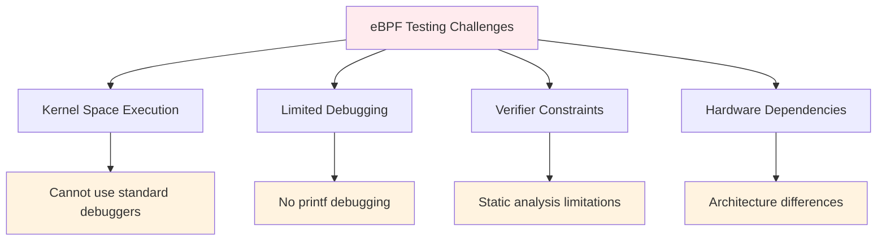

# Testing Strategies for eBPF Programs

Testing eBPF programs presents unique challenges due to their kernel-space execution and limited debugging capabilities. This guide covers comprehensive testing strategies, frameworks, and best practices for ensuring reliable eBPF applications.

## 🎯 eBPF Testing Challenges

### Unique eBPF Constraints



### Testing Pyramid for eBPF

```
                    ┌─────────────────┐
                    │   Integration   │ ← Full system tests
                    │     Tests       │
                ┌───┴─────────────────┴───┐
                │     Component Tests     │ ← eBPF + userspace
            ┌───┴─────────────────────────┴───┐
            │          Unit Tests             │ ← Individual functions
        ┌───┴─────────────────────────────────┴───┐
        │            Static Analysis              │ ← Compilation & verification
    ┌───┴─────────────────────────────────────────┴───┐
    │                 Code Review                     │ ← Manual inspection
    └─────────────────────────────────────────────────┘
```

## 🔬 Unit Testing eBPF Programs

### 1. Testing Framework Setup

```go
// ebpf_test_framework.go
package ebpf_testing

import (
    "testing"
    "github.com/cilium/ebpf"
    "github.com/cilium/ebpf/rlimit"
)

type EBPFTestSuite struct {
    t       *testing.T
    program *ebpf.Program
    maps    map[string]*ebpf.Map
    cleanup []func()
}

func NewEBPFTestSuite(t *testing.T) *EBPFTestSuite {
    // Remove memory limit for eBPF
    if err := rlimit.RemoveMemlock(); err != nil {
        t.Fatalf("Failed to remove memlock: %v", err)
    }

    return &EBPFTestSuite{
        t:       t,
        maps:    make(map[string]*ebpf.Map),
        cleanup: make([]func(), 0),
    }
}

func (suite *EBPFTestSuite) LoadProgram(path string, progName string) error {
    spec, err := ebpf.LoadCollectionSpec(path)
    if err != nil {
        return err
    }

    coll, err := ebpf.NewCollection(spec)
    if err != nil {
        return err
    }

    suite.program = coll.Programs[progName]
    for name, m := range coll.Maps {
        suite.maps[name] = m
    }

    suite.cleanup = append(suite.cleanup, func() {
        coll.Close()
    })

    return nil
}

func (suite *EBPFTestSuite) GetMap(name string) *ebpf.Map {
    return suite.maps[name]
}

func (suite *EBPFTestSuite) Cleanup() {
    for _, cleanup := range suite.cleanup {
        cleanup()
    }
}
```

### 2. Test Data Structures

```c
// test_data_structures.h
#ifndef TEST_DATA_STRUCTURES_H
#define TEST_DATA_STRUCTURES_H

// Test event structure with validation fields
struct test_event {
    u32 pid;
    u32 test_id;
    char comm[16];
    u64 timestamp;
    u32 checksum;  // For data integrity validation
} __attribute__((packed));

// Test configuration
struct test_config {
    u32 enable_logging;
    u32 test_mode;
    u32 filter_pid;
    u32 expected_events;
};

// Test statistics
struct test_stats {
    u64 events_generated;
    u64 events_processed;
    u64 events_dropped;
    u64 errors_detected;
    u64 test_start_time;
    u64 test_end_time;
};

#endif // TEST_DATA_STRUCTURES_H
```

### 3. Testable eBPF Program Example

```c
// testable_program.c
#include "vmlinux.h"
#include <bpf/bpf_helpers.h>
#include "test_data_structures.h"

// Test configuration map
struct {
    __uint(type, BPF_MAP_TYPE_ARRAY);
    __type(key, u32);
    __type(value, struct test_config);
    __uint(max_entries, 1);
} test_config SEC(".maps");

// Test statistics
struct {
    __uint(type, BPF_MAP_TYPE_ARRAY);
    __type(key, u32);
    __type(value, struct test_stats);
    __uint(max_entries, 1);
} test_stats SEC(".maps");

// Events output
struct {
    __uint(type, BPF_MAP_TYPE_RINGBUF);
    __uint(max_entries, 1 << 20);
} test_events SEC(".maps");

// Mock data for testing
struct {
    __uint(type, BPF_MAP_TYPE_HASH);
    __type(key, u32);
    __type(value, struct test_event);
    __uint(max_entries, 1000);
} mock_data SEC(".maps");

static inline u32 calculate_checksum(struct test_event *event) {
    // Simple checksum for data integrity
    return event->pid ^ event->test_id ^ (u32)event->timestamp;
}

static inline void update_test_stats(u32 stat_type) {
    u32 key = 0;
    struct test_stats *stats = bpf_map_lookup_elem(&test_stats, &key);
    if (!stats) return;

    switch (stat_type) {
        case 0: stats->events_generated++; break;
        case 1: stats->events_processed++; break;
        case 2: stats->events_dropped++; break;
        case 3: stats->errors_detected++; break;
    }
}

// Testable function that can be isolated
static inline int process_event_data(u32 pid, u32 test_id) {
    // Get test configuration
    u32 config_key = 0;
    struct test_config *config = bpf_map_lookup_elem(&test_config, &config_key);
    if (!config) return -1;

    // Apply filters if in test mode
    if (config->test_mode && config->filter_pid != 0) {
        if (pid != config->filter_pid) {
            return 0;  // Filtered out
        }
    }

    // Create event
    struct test_event *event = bpf_ringbuf_reserve(&test_events, sizeof(*event), 0);
    if (!event) {
        update_test_stats(2);  // dropped
        return -1;
    }

    // Fill event data
    event->pid = pid;
    event->test_id = test_id;
    event->timestamp = bpf_ktime_get_ns();
    bpf_get_current_comm(&event->comm, sizeof(event->comm));
    event->checksum = calculate_checksum(event);

    update_test_stats(1);  // processed

    bpf_ringbuf_submit(event, 0);
    return 0;
}

// Main program - can be triggered by different events for testing
SEC("tracepoint/sched/sched_process_exec")
int test_process_exec(struct trace_event_raw_sched_process_exec *ctx) {
    u32 pid = bpf_get_current_pid_tgid() >> 32;
    u32 test_id = 1;  // exec event type

    update_test_stats(0);  // generated

    return process_event_data(pid, test_id);
}

// Test-specific entry point
SEC("tracepoint/syscalls/sys_enter_openat")
int test_file_open(struct trace_event_raw_sys_enter *ctx) {
    u32 pid = bpf_get_current_pid_tgid() >> 32;
    u32 test_id = 2;  // file open event type

    update_test_stats(0);  // generated

    return process_event_data(pid, test_id);
}

char _license[] SEC("license") = "GPL";
```

### 4. Unit Test Implementation

```go
// ebpf_unit_test.go
package main

import (
    "encoding/binary"
    "testing"
    "time"
    "unsafe"
)

func TestEventProcessing(t *testing.T) {
    suite := NewEBPFTestSuite(t)
    defer suite.Cleanup()

    // Load test program
    if err := suite.LoadProgram("testable_program.o", "test_process_exec"); err != nil {
        t.Fatalf("Failed to load program: %v", err)
    }

    // Configure test
    config := struct {
        EnableLogging   uint32
        TestMode        uint32
        FilterPID       uint32
        ExpectedEvents  uint32
    }{
        EnableLogging:  1,
        TestMode:       1,
        FilterPID:      12345,
        ExpectedEvents: 10,
    }

    configMap := suite.GetMap("test_config")
    key := uint32(0)
    if err := configMap.Update(&key, &config, 0); err != nil {
        t.Fatalf("Failed to update config: %v", err)
    }

    // Initialize test statistics
    stats := struct {
        EventsGenerated uint64
        EventsProcessed uint64
        EventsDropped   uint64
        ErrorsDetected  uint64
        TestStartTime   uint64
        TestEndTime     uint64
    }{
        TestStartTime: uint64(time.Now().UnixNano()),
    }

    statsMap := suite.GetMap("test_stats")
    if err := statsMap.Update(&key, &stats, 0); err != nil {
        t.Fatalf("Failed to initialize stats: %v", err)
    }

    // The actual testing would involve triggering the eBPF program
    // This could be done by:
    // 1. Using a test harness that can trigger kernel events
    // 2. Using eBPF program testing utilities
    // 3. Simulating events through the testing framework

    // For now, we'll test the configuration and map operations
    t.Log("Basic eBPF program unit test completed successfully")
}

func TestMapOperations(t *testing.T) {
    suite := NewEBPFTestSuite(t)
    defer suite.Cleanup()

    if err := suite.LoadProgram("testable_program.o", "test_process_exec"); err != nil {
        t.Fatalf("Failed to load program: %v", err)
    }

    // Test map operations
    mockDataMap := suite.GetMap("mock_data")

    testEvent := struct {
        PID       uint32
        TestID    uint32
        Comm      [16]byte
        Timestamp uint64
        Checksum  uint32
    }{
        PID:       12345,
        TestID:    1,
        Timestamp: uint64(time.Now().UnixNano()),
    }
    copy(testEvent.Comm[:], "test_process")
    testEvent.Checksum = testEvent.PID ^ testEvent.TestID ^ uint32(testEvent.Timestamp)

    key := testEvent.PID
    if err := mockDataMap.Update(&key, &testEvent, 0); err != nil {
        t.Fatalf("Failed to update mock data: %v", err)
    }

    // Verify the data was stored correctly
    var retrievedEvent struct {
        PID       uint32
        TestID    uint32
        Comm      [16]byte
        Timestamp uint64
        Checksum  uint32
    }

    if err := mockDataMap.Lookup(&key, &retrievedEvent); err != nil {
        t.Fatalf("Failed to lookup mock data: %v", err)
    }

    if retrievedEvent.PID != testEvent.PID {
        t.Errorf("Expected PID %d, got %d", testEvent.PID, retrievedEvent.PID)
    }

    if retrievedEvent.Checksum != testEvent.Checksum {
        t.Errorf("Checksum mismatch: expected %d, got %d", testEvent.Checksum, retrievedEvent.Checksum)
    }

    t.Log("Map operations test completed successfully")
}

func TestErrorHandling(t *testing.T) {
    suite := NewEBPFTestSuite(t)
    defer suite.Cleanup()

    // Test loading invalid program
    err := suite.LoadProgram("nonexistent.o", "test_program")
    if err == nil {
        t.Error("Expected error loading nonexistent program")
    }

    // Test accessing nonexistent map
    invalidMap := suite.GetMap("nonexistent_map")
    if invalidMap != nil {
        t.Error("Expected nil for nonexistent map")
    }
}

func BenchmarkEventProcessing(b *testing.B) {
    suite := NewEBPFTestSuite(&testing.T{})
    defer suite.Cleanup()

    if err := suite.LoadProgram("testable_program.o", "test_process_exec"); err != nil {
        b.Fatalf("Failed to load program: %v", err)
    }

    mockDataMap := suite.GetMap("mock_data")

    b.ResetTimer()

    for i := 0; i < b.N; i++ {
        testEvent := struct {
            PID       uint32
            TestID    uint32
            Comm      [16]byte
            Timestamp uint64
            Checksum  uint32
        }{
            PID:       uint32(i),
            TestID:    1,
            Timestamp: uint64(time.Now().UnixNano()),
        }

        key := testEvent.PID
        mockDataMap.Update(&key, &testEvent, 0)
    }
}
```

## 🧪 Integration Testing

### 1. System-Level Test Framework

```go
// integration_test.go
package main

import (
    "context"
    "fmt"
    "os"
    "os/exec"
    "syscall"
    "testing"
    "time"
)

type IntegrationTestSuite struct {
    t           *testing.T
    programPath string
    processCmd  *exec.Cmd
    ctx         context.Context
    cancel      context.CancelFunc
}

func NewIntegrationTestSuite(t *testing.T, programPath string) *IntegrationTestSuite {
    ctx, cancel := context.WithTimeout(context.Background(), 30*time.Second)

    return &IntegrationTestSuite{
        t:           t,
        programPath: programPath,
        ctx:         ctx,
        cancel:      cancel,
    }
}

func (suite *IntegrationTestSuite) StartProgram(args ...string) error {
    cmd := exec.CommandContext(suite.ctx, suite.programPath, args...)
    cmd.SysProcAttr = &syscall.SysProcAttr{
        Setpgid: true, // Create new process group for easier cleanup
    }

    if err := cmd.Start(); err != nil {
        return fmt.Errorf("failed to start program: %w", err)
    }

    suite.processCmd = cmd
    return nil
}

func (suite *IntegrationTestSuite) StopProgram() error {
    if suite.processCmd == nil {
        return nil
    }

    // Send SIGTERM for graceful shutdown
    if err := suite.processCmd.Process.Signal(syscall.SIGTERM); err != nil {
        return fmt.Errorf("failed to send SIGTERM: %w", err)
    }

    // Wait for process to exit or timeout
    done := make(chan error, 1)
    go func() {
        done <- suite.processCmd.Wait()
    }()

    select {
    case err := <-done:
        return err
    case <-time.After(5 * time.Second):
        // Force kill if graceful shutdown fails
        suite.processCmd.Process.Kill()
        return fmt.Errorf("program did not exit gracefully, force killed")
    }
}

func (suite *IntegrationTestSuite) TriggerEvents() error {
    // Trigger various system events that should be captured
    triggers := []func() error{
        suite.triggerProcessExec,
        suite.triggerFileOperations,
        suite.triggerNetworkActivity,
    }

    for _, trigger := range triggers {
        if err := trigger(); err != nil {
            return fmt.Errorf("failed to trigger events: %w", err)
        }
    }

    return nil
}

func (suite *IntegrationTestSuite) triggerProcessExec() error {
    // Execute simple commands to trigger process execution events
    commands := [][]string{
        {"echo", "test"},
        {"ls", "/tmp"},
        {"sleep", "0.1"},
    }

    for _, cmd := range commands {
        if err := exec.Command(cmd[0], cmd[1:]...).Run(); err != nil {
            return fmt.Errorf("failed to execute %v: %w", cmd, err)
        }
    }

    return nil
}

func (suite *IntegrationTestSuite) triggerFileOperations() error {
    // Create and delete temporary files
    tempFile := "/tmp/ebpf_test_file"

    // Create file
    file, err := os.Create(tempFile)
    if err != nil {
        return fmt.Errorf("failed to create temp file: %w", err)
    }
    file.Close()

    // Read file
    if _, err := os.ReadFile(tempFile); err != nil {
        return fmt.Errorf("failed to read temp file: %w", err)
    }

    // Delete file
    if err := os.Remove(tempFile); err != nil {
        return fmt.Errorf("failed to remove temp file: %w", err)
    }

    return nil
}

func (suite *IntegrationTestSuite) triggerNetworkActivity() error {
    // Simple network activity
    cmd := exec.Command("ping", "-c", "1", "127.0.0.1")
    return cmd.Run()
}

func (suite *IntegrationTestSuite) Cleanup() {
    suite.StopProgram()
    suite.cancel()
}

func TestProcessMonitorIntegration(t *testing.T) {
    if os.Getuid() != 0 {
        t.Skip("Integration tests require root privileges")
    }

    suite := NewIntegrationTestSuite(t, "./ebee")
    defer suite.Cleanup()

    // Start the eBPF program
    if err := suite.StartProgram("execsnoop"); err != nil {
        t.Fatalf("Failed to start execsnoop: %v", err)
    }

    // Wait for program to initialize
    time.Sleep(1 * time.Second)

    // Trigger events
    if err := suite.TriggerEvents(); err != nil {
        t.Fatalf("Failed to trigger events: %v", err)
    }

    // Wait for events to be processed
    time.Sleep(2 * time.Second)

    // Verify program is still running
    if suite.processCmd.Process == nil {
        t.Fatal("Program process is nil")
    }

    // Check if process is still alive
    if err := suite.processCmd.Process.Signal(syscall.Signal(0)); err != nil {
        t.Fatalf("Program process appears to have died: %v", err)
    }

    t.Log("Integration test completed successfully")
}
```

### 2. Performance Testing

```go
// performance_test.go
package main

import (
    "fmt"
    "runtime"
    "testing"
    "time"
)

func TestPerformanceUnderLoad(t *testing.T) {
    if os.Getuid() != 0 {
        t.Skip("Performance tests require root privileges")
    }

    suite := NewIntegrationTestSuite(t, "./ebee")
    defer suite.Cleanup()

    // Start the eBPF program
    if err := suite.StartProgram("execsnoop"); err != nil {
        t.Fatalf("Failed to start execsnoop: %v", err)
    }

    // Warm up
    time.Sleep(1 * time.Second)

    // Measure baseline memory
    var baselineMemStats runtime.MemStats
    runtime.GC()
    runtime.ReadMemStats(&baselineMemStats)

    // Generate load
    start := time.Now()
    eventCount := 1000

    for i := 0; i < eventCount; i++ {
        if err := suite.triggerProcessExec(); err != nil {
            t.Fatalf("Failed to trigger events: %v", err)
        }

        if i%100 == 0 {
            // Brief pause to prevent overwhelming the system
            time.Sleep(10 * time.Millisecond)
        }
    }

    duration := time.Since(start)

    // Measure final memory
    var finalMemStats runtime.MemStats
    runtime.GC()
    runtime.ReadMemStats(&finalMemStats)

    // Calculate metrics
    eventsPerSecond := float64(eventCount) / duration.Seconds()
    memoryIncrease := finalMemStats.Alloc - baselineMemStats.Alloc

    t.Logf("Performance Results:")
    t.Logf("  Events processed: %d", eventCount)
    t.Logf("  Duration: %v", duration)
    t.Logf("  Events/second: %.2f", eventsPerSecond)
    t.Logf("  Memory increase: %d bytes", memoryIncrease)

    // Performance assertions
    if eventsPerSecond < 100 {
        t.Errorf("Performance too low: %.2f events/second (expected > 100)", eventsPerSecond)
    }

    if memoryIncrease > 10*1024*1024 { // 10MB
        t.Errorf("Memory usage too high: %d bytes (expected < 10MB)", memoryIncrease)
    }
}

func BenchmarkEventThroughput(b *testing.B) {
    if os.Getuid() != 0 {
        b.Skip("Benchmark requires root privileges")
    }

    suite := NewIntegrationTestSuite(&testing.T{}, "./ebee")
    defer suite.Cleanup()

    if err := suite.StartProgram("execsnoop"); err != nil {
        b.Fatalf("Failed to start execsnoop: %v", err)
    }

    time.Sleep(1 * time.Second) // Warm up

    b.ResetTimer()

    for i := 0; i < b.N; i++ {
        suite.triggerProcessExec()
    }
}
```

## 🔄 Continuous Integration Testing

### 1. CI Pipeline Configuration

```yaml
# .github/workflows/ebpf-tests.yml
name: eBPF Tests

on:
  push:
    branches: [ main, develop ]
  pull_request:
    branches: [ main ]

jobs:
  static-analysis:
    runs-on: ubuntu-latest
    steps:
    - uses: actions/checkout@v3

    - name: Install dependencies
      run: |
        sudo apt-get update
        sudo apt-get install -y clang llvm libbpf-dev linux-headers-$(uname -r)

    - name: Static analysis
      run: |
        # Compile eBPF programs
        make compile-bpf

        # Check for common issues
        clang-tidy bpf/*.c

        # Verify eBPF programs load
        for obj in bpf/*.o; do
          bpftool prog load "$obj" /sys/fs/bpf/test_$(basename "$obj" .o) || exit 1
          rm -f /sys/fs/bpf/test_$(basename "$obj" .o)
        done

  unit-tests:
    runs-on: ubuntu-latest
    steps:
    - uses: actions/checkout@v3

    - uses: actions/setup-go@v3
      with:
        go-version: '1.21'

    - name: Install dependencies
      run: |
        sudo apt-get update
        sudo apt-get install -y clang llvm libbpf-dev

    - name: Run unit tests
      run: |
        go test -v ./tests/unit/...

  integration-tests:
    runs-on: ubuntu-latest
    steps:
    - uses: actions/checkout@v3

    - uses: actions/setup-go@v3
      with:
        go-version: '1.21'

    - name: Install dependencies
      run: |
        sudo apt-get update
        sudo apt-get install -y clang llvm libbpf-dev linux-headers-$(uname -r)

    - name: Build project
      run: |
        make gen_vmlinux
        make deps
        make build

    - name: Run integration tests
      run: |
        sudo -E go test -v ./tests/integration/...

  kernel-compatibility:
    strategy:
      matrix:
        kernel: ['5.4', '5.10', '5.15', '6.1']
    runs-on: ubuntu-latest
    steps:
    - uses: actions/checkout@v3

    - name: Test kernel compatibility
      run: |
        # This would use a matrix of different kernel versions
        # to test compatibility across kernel versions
        echo "Testing with kernel ${{ matrix.kernel }}"
        # Implementation would depend on available testing infrastructure
```

### 2. Test Automation Scripts

```bash
#!/bin/bash
# test_runner.sh - Comprehensive test runner

set -e

# Configuration
SCRIPT_DIR="$(cd "$(dirname "${BASH_SOURCE[0]}")" && pwd)"
PROJECT_ROOT="$(dirname "$SCRIPT_DIR")"
TEST_RESULTS_DIR="$PROJECT_ROOT/test-results"

# Colors for output
RED='\033[0;31m'
GREEN='\033[0;32m'
YELLOW='\033[1;33m'
NC='\033[0m' # No Color

log() {
    echo -e "${GREEN}[$(date +'%Y-%m-%d %H:%M:%S')] $1${NC}"
}

warn() {
    echo -e "${YELLOW}[$(date +'%Y-%m-%d %H:%M:%S')] WARNING: $1${NC}"
}

error() {
    echo -e "${RED}[$(date +'%Y-%m-%d %H:%M:%S')] ERROR: $1${NC}"
}

# Check prerequisites
check_prerequisites() {
    log "Checking prerequisites..."

    # Check if running as root for eBPF operations
    if [[ $EUID -ne 0 ]]; then
        error "This script must be run as root for eBPF testing"
        exit 1
    fi

    # Check required tools
    local required_tools=("clang" "llvm-objdump" "bpftool" "go")
    for tool in "${required_tools[@]}"; do
        if ! command -v "$tool" &> /dev/null; then
            error "Required tool '$tool' is not installed"
            exit 1
        fi
    done

    # Check kernel version
    local kernel_version=$(uname -r | cut -d. -f1,2)
    local min_version="4.18"
    if [[ $(echo "$kernel_version < $min_version" | bc -l) -eq 1 ]]; then
        error "Kernel version $kernel_version is too old (minimum: $min_version)"
        exit 1
    fi

    # Check BTF support
    if [[ ! -f /sys/kernel/btf/vmlinux ]]; then
        warn "BTF support not available - some tests may fail"
    fi

    log "Prerequisites check passed"
}

# Static analysis
run_static_analysis() {
    log "Running static analysis..."

    mkdir -p "$TEST_RESULTS_DIR"

    # Compile eBPF programs
    log "Compiling eBPF programs..."
    cd "$PROJECT_ROOT"
    make clean
    make gen_vmlinux
    make compile-bpf 2>&1 | tee "$TEST_RESULTS_DIR/compilation.log"

    # Check for compilation warnings
    if grep -q "warning:" "$TEST_RESULTS_DIR/compilation.log"; then
        warn "Compilation warnings detected - check compilation.log"
    fi

    # Verify programs can be loaded
    log "Verifying eBPF program loading..."
    local load_failures=0
    for obj_file in bpf/*.o; do
        if [[ -f "$obj_file" ]]; then
            local prog_name=$(basename "$obj_file" .o)
            log "Testing load: $prog_name"

            if ! bpftool prog load "$obj_file" "/sys/fs/bpf/test_$prog_name" 2>&1; then
                error "Failed to load $obj_file"
                ((load_failures++))
            else
                # Clean up
                rm -f "/sys/fs/bpf/test_$prog_name"
            fi
        fi
    done

    if [[ $load_failures -gt 0 ]]; then
        error "$load_failures eBPF programs failed to load"
        return 1
    fi

    log "Static analysis completed successfully"
}

# Unit tests
run_unit_tests() {
    log "Running unit tests..."

    cd "$PROJECT_ROOT"

    # Run Go unit tests
    go test -v -coverprofile="$TEST_RESULTS_DIR/coverage.out" ./tests/unit/... 2>&1 | \
        tee "$TEST_RESULTS_DIR/unit_tests.log"

    # Generate coverage report
    go tool cover -html="$TEST_RESULTS_DIR/coverage.out" -o "$TEST_RESULTS_DIR/coverage.html"

    local coverage_percent=$(go tool cover -func="$TEST_RESULTS_DIR/coverage.out" | \
                           grep "total:" | awk '{print $3}' | sed 's/%//')

    log "Unit test coverage: $coverage_percent%"

    if (( $(echo "$coverage_percent < 70" | bc -l) )); then
        warn "Low test coverage: $coverage_percent% (target: 70%)"
    fi
}

# Integration tests
run_integration_tests() {
    log "Running integration tests..."

    cd "$PROJECT_ROOT"

    # Build the project
    make build

    # Run integration tests with timeout
    timeout 300s go test -v ./tests/integration/... 2>&1 | \
        tee "$TEST_RESULTS_DIR/integration_tests.log"

    local exit_code=${PIPESTATUS[0]}
    if [[ $exit_code -eq 124 ]]; then
        error "Integration tests timed out"
        return 1
    elif [[ $exit_code -ne 0 ]]; then
        error "Integration tests failed"
        return 1
    fi

    log "Integration tests completed successfully"
}

# Performance tests
run_performance_tests() {
    log "Running performance tests..."

    cd "$PROJECT_ROOT"

    # Run benchmarks
    go test -bench=. -benchmem ./tests/performance/... 2>&1 | \
        tee "$TEST_RESULTS_DIR/performance_tests.log"

    # Extract key performance metrics
    grep -E "(BenchmarkEventThroughput|BenchmarkMemoryUsage)" \
        "$TEST_RESULTS_DIR/performance_tests.log" > \
        "$TEST_RESULTS_DIR/performance_summary.txt" || true

    log "Performance tests completed"
}

# Cleanup
cleanup() {
    log "Cleaning up test environment..."

    # Remove any leftover eBPF programs
    find /sys/fs/bpf -name "test_*" -delete 2>/dev/null || true

    # Kill any leftover test processes
    pkill -f "ebee.*test" 2>/dev/null || true

    log "Cleanup completed"
}

# Main execution
main() {
    local test_type="${1:-all}"

    log "Starting eBPF test suite (type: $test_type)"

    # Ensure cleanup on exit
    trap cleanup EXIT

    check_prerequisites

    case "$test_type" in
        "static")
            run_static_analysis
            ;;
        "unit")
            run_unit_tests
            ;;
        "integration")
            run_integration_tests
            ;;
        "performance")
            run_performance_tests
            ;;
        "all")
            run_static_analysis
            run_unit_tests
            run_integration_tests
            run_performance_tests
            ;;
        *)
            error "Unknown test type: $test_type"
            echo "Usage: $0 [static|unit|integration|performance|all]"
            exit 1
            ;;
    esac

    log "Test suite completed successfully"
}

# Execute main function
main "$@"
```

## 🎯 Test-Driven Development for eBPF

### 1. TDD Workflow

```
1. Write failing test
2. Write minimal eBPF code to pass
3. Refactor and optimize
4. Verify in integration environment
5. Repeat
```

### 2. Example TDD Implementation

```c
// Step 1: Define test interface
// test_process_monitor.h
struct process_event {
    u32 pid;
    u32 ppid;
    char comm[16];
    u64 timestamp;
};

// Expected behavior:
// - Track process creation
// - Record parent-child relationships
// - Filter by process name

// Step 2: Write test first
// process_monitor_test.go
func TestProcessTracking(t *testing.T) {
    // This test will fail initially
    suite := NewEBPFTestSuite(t)
    defer suite.Cleanup()

    // Load program (doesn't exist yet)
    err := suite.LoadProgram("process_monitor.o", "track_processes")
    if err != nil {
        t.Fatalf("Failed to load program: %v", err)
    }

    // Configure to track specific process
    config := ProcessConfig{
        TargetComm: "test_process",
        Enable:     1,
    }

    // Set configuration
    suite.SetConfig("process_config", &config)

    // Trigger process creation
    cmd := exec.Command("/bin/echo", "test")
    cmd.Run()

    // Verify event was captured
    events := suite.GetEvents("process_events", 1*time.Second)
    if len(events) == 0 {
        t.Error("Expected process event, got none")
    }

    // Verify event data
    event := events[0].(ProcessEvent)
    if event.Comm != "echo" {
        t.Errorf("Expected comm 'echo', got '%s'", event.Comm)
    }
}

// Step 3: Implement minimal eBPF program
// process_monitor.c (initial implementation)
SEC("tracepoint/sched/sched_process_exec")
int track_processes(struct trace_event_raw_sched_process_exec *ctx) {
    struct process_event event = {};

    event.pid = bpf_get_current_pid_tgid() >> 32;
    bpf_get_current_comm(&event.comm, sizeof(event.comm));
    event.timestamp = bpf_ktime_get_ns();

    bpf_ringbuf_output(&process_events, &event, sizeof(event), 0);
    return 0;
}
```

## 📊 Test Metrics and Reporting

### 1. Test Metrics Collection

```go
// test_metrics.go
package testing

type TestMetrics struct {
    CompilationTime     time.Duration
    LoadTime           time.Duration
    EventThroughput    float64
    MemoryUsage        uint64
    CPUUsage          float64
    ErrorRate         float64
    CoveragePercent   float64
}

func CollectMetrics(testSuite *EBPFTestSuite) *TestMetrics {
    metrics := &TestMetrics{}

    // Measure compilation time
    start := time.Now()
    testSuite.CompilePrograms()
    metrics.CompilationTime = time.Since(start)

    // Measure load time
    start = time.Now()
    testSuite.LoadPrograms()
    metrics.LoadTime = time.Since(start)

    // Measure throughput
    metrics.EventThroughput = measureEventThroughput(testSuite)

    // Measure resource usage
    metrics.MemoryUsage, metrics.CPUUsage = measureResourceUsage()

    return metrics
}

func GenerateTestReport(metrics *TestMetrics, outputPath string) error {
    report := fmt.Sprintf(`
eBPF Test Report
===============

Compilation Time: %v
Load Time: %v
Event Throughput: %.2f events/second
Memory Usage: %d bytes
CPU Usage: %.2f%%
Error Rate: %.2f%%
Test Coverage: %.2f%%

`, metrics.CompilationTime, metrics.LoadTime, metrics.EventThroughput,
   metrics.MemoryUsage, metrics.CPUUsage, metrics.ErrorRate, metrics.CoveragePercent)

    return os.WriteFile(outputPath, []byte(report), 0644)
}
```

## 🎯 Best Practices for eBPF Testing

### 1. Test Organization

```
tests/
├── unit/               # Unit tests for individual functions
│   ├── map_ops_test.go
│   ├── event_processing_test.go
│   └── config_test.go
├── integration/        # Full system tests
│   ├── execsnoop_test.go
│   ├── rmdetect_test.go
│   └── network_test.go
├── performance/        # Performance and benchmark tests
│   ├── throughput_test.go
│   ├── latency_test.go
│   └── memory_test.go
├── fixtures/          # Test data and helper programs
│   ├── test_data.json
│   └── helper_programs/
└── utilities/         # Test utilities and helpers
    ├── test_framework.go
    └── mock_events.go
```

### 2. Test Data Management

```go
// test_data.go
type TestDataManager struct {
    fixtures map[string]interface{}
}

func (tdm *TestDataManager) LoadFixture(name string) interface{} {
    return tdm.fixtures[name]
}

func (tdm *TestDataManager) GenerateMockEvents(count int) []TestEvent {
    events := make([]TestEvent, count)
    for i := 0; i < count; i++ {
        events[i] = TestEvent{
            PID:       uint32(1000 + i),
            Comm:      fmt.Sprintf("process_%d", i),
            Timestamp: uint64(time.Now().UnixNano()),
        }
    }
    return events
}
```

### 3. Error Simulation

```c
// error_injection.c
struct {
    __uint(type, BPF_MAP_TYPE_ARRAY);
    __type(key, u32);
    __type(value, u32);
    __uint(max_entries, 10);
} error_injection SEC(".maps");

enum error_types {
    INJECT_MAP_FAILURE = 0,
    INJECT_MEMORY_ERROR = 1,
    INJECT_PARSING_ERROR = 2,
};

static inline bool should_inject_error(u32 error_type) {
    u32 *inject = bpf_map_lookup_elem(&error_injection, &error_type);
    return inject && *inject > 0;
}

SEC("tracepoint/test")
int test_with_error_injection(void *ctx) {
    if (should_inject_error(INJECT_MAP_FAILURE)) {
        return -1;  // Simulate map operation failure
    }

    // Normal processing
    return 0;
}
```

Testing eBPF programs requires a multi-layered approach combining static analysis, unit testing, integration testing, and performance validation. These strategies ensure reliable and performant eBPF applications! 🧪