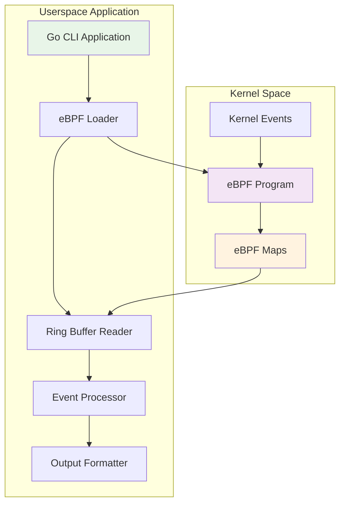
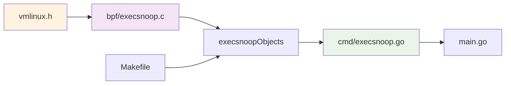
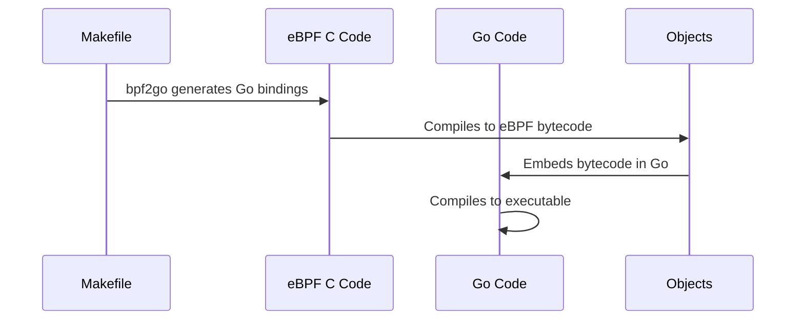
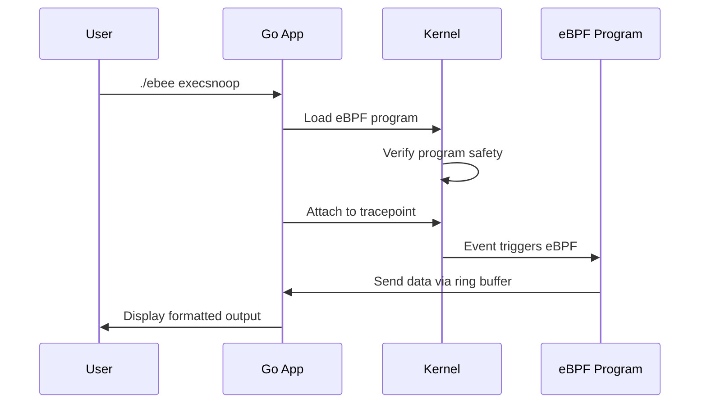

# Architecture Overview

Before we build your first eBPF tool, let's understand how eBPF applications are structured. This knowledge will serve as the foundation for everything you'll build.

## 🏗️ eBPF Application Architecture

Every eBPF application in this project follows the same architectural pattern:



## 🧩 Components Breakdown

### 1. Kernel Space Components

#### eBPF Program (`bpf/*.c`)
- **Purpose**: Runs in kernel space, triggered by events
- **Language**: C with eBPF-specific extensions
- **Limitations**: Limited stack space, no loops, must be verifiable

```c
SEC("tracepoint/sched/sched_process_exec")
int trace_exec(struct trace_event_raw_sched_process_exec *ctx) {
    // This function runs in kernel space!
    // It has access to kernel data structures
    return 0;
}
```

#### eBPF Maps (`SEC(".maps")`)
- **Purpose**: Data exchange between kernel and userspace
- **Types**: Ring buffers, hash maps, arrays, etc.
- **Shared**: Both kernel and userspace can access

```c
struct {
    __uint(type, BPF_MAP_TYPE_RINGBUF);
    __uint(max_entries, 1 << 24);  // 16MB buffer
} events SEC(".maps");
```

### 2. Userspace Components

#### Go CLI Application (`cmd/*.go`)
- **Purpose**: User interface and program orchestration
- **Framework**: Cobra CLI for command-line interface
- **Responsibilities**: Argument parsing, program lifecycle management

#### eBPF Loader
- **Purpose**: Load eBPF programs into the kernel
- **Library**: [Cilium eBPF](https://github.com/cilium/ebpf)
- **Tasks**: Program verification, map creation, attachment

#### Ring Buffer Reader
- **Purpose**: Receive events from kernel
- **Mechanism**: Zero-copy ring buffer for high performance
- **Processing**: Event deserialization and filtering

## 📁 Project Structure Deep Dive

```
ebee/
├── bpf/                       # eBPF kernel programs
│   ├── execsnoop.c           # Process monitoring eBPF program
│   ├── rmdetect.c            # File deletion eBPF program
│   └── headers/              # Kernel headers
│       └── vmlinux.h         # Kernel type definitions
├── cmd/                       # Go userspace applications
│   ├── execsnoop.go          # Process monitoring CLI
│   ├── rmdetect.go           # File deletion CLI
│   └── root.go               # CLI root command
├── main.go                    # Application entry point
└── Makefile                   # Build automation
```

### File Relationships



## 🔄 Data Flow

Understanding how data flows through an eBPF application is crucial:

### 1. Event Trigger
```
Kernel Event (e.g., process execution) → eBPF Program Triggered
```

### 2. Data Capture
```c
// In kernel space (execsnoop.c)
struct data_t *data = bpf_ringbuf_reserve(&events, sizeof(*data), 0);
data->pid = bpf_get_current_pid_tgid() & 0xFFFFFFFF;
bpf_get_current_comm(&data->comm, sizeof(data->comm));
bpf_ringbuf_submit(data, 0);
```

### 3. Data Transfer
```
Ring Buffer: Kernel Space → Userspace (zero-copy)
```

### 4. Data Processing
```go
// In userspace (execsnoop.go)
record, err := rd.Read()
var data exec_data_t
binary.Read(bytes.NewReader(record.RawSample), binary.LittleEndian, &data)
```

### 5. Data Display
```go
fmt.Printf("%d\t%s\n", data.Pid, string(data.Comm[:]))
```

## 🔗 Component Interaction

### Compilation Flow


### Runtime Flow


## 🎯 Design Patterns

### 1. Event-Driven Architecture
- eBPF programs are **reactive** - they respond to kernel events
- No polling or active monitoring from userspace
- Efficient and low-overhead

### 2. Producer-Consumer Pattern
- **Producer**: eBPF program generates events in kernel
- **Consumer**: Go application processes events in userspace
- **Buffer**: Ring buffer decouples producer from consumer

### 3. Code Generation
- `bpf2go` tool generates Go bindings from C code
- Ensures type safety between C structs and Go structs
- Embeds eBPF bytecode in Go binary

## 🛠️ Build Process

Understanding the build process helps with debugging and customization:

### 1. Code Generation
```bash
//go:generate go run github.com/cilium/ebpf/cmd/bpf2go -target native execsnoop ../bpf/execsnoop.c
```

This generates:
- `execsnoop_bpfel.go` - eBPF program loader
- `execsnoop_bpfel.o` - eBPF bytecode

### 2. Compilation Steps
```bash
make generate  # Generate Go bindings from C
make build     # Compile Go application
```

### 3. Generated Code Example
```go
// Auto-generated by bpf2go
type execsnoopObjects struct {
    TraceExec *ebpf.Program `ebpf:"trace_exec"`
    Events    *ebpf.Map     `ebpf:"events"`
}

func loadExecsnoopObjects(obj *execsnoopObjects, opts *ebpf.CollectionOptions) error {
    // Load eBPF program and maps
}
```

## 🔍 Key Concepts to Remember

!!! tip "Architecture Principles"
    1. **Separation of Concerns**: Kernel space handles data collection, userspace handles presentation
    2. **Type Safety**: Shared data structures must match between C and Go
    3. **Resource Management**: Always clean up eBPF resources (programs, maps, links)
    4. **Error Handling**: eBPF operations can fail - handle errors gracefully

!!! warning "Limitations to Consider"
    1. **eBPF Program Size**: Limited to ~1M instructions
    2. **Stack Space**: Only 512 bytes of stack in eBPF programs
    3. **No Loops**: eBPF verifier prevents unbounded loops
    4. **Helper Functions**: Only approved kernel helpers can be called

## 📚 What's Next?

Now that you understand the architecture, let's build your first tool step by step:

1. **[Writing eBPF C Code](ebpf-program.md)** - Create the kernel component
2. **[Go Integration](go-userspace.md)** - Build the userspace application
3. **[Build and Test](build-test.md)** - Put it all together

Understanding this architecture will make the following sections much easier to follow. Every tool in this project follows these same patterns - master them once, and you can build any eBPF tool! 🚀