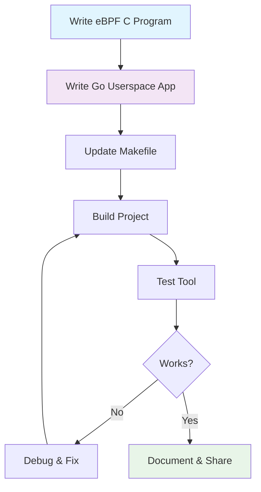

# Quick Start

Get up and running with eBPF development in under 30 minutes! This guide will get you from zero to your first working eBPF tool.

## 🚀 TL;DR - Super Quick Start

```bash
# 1. Clone the repository
git clone https://github.com/xmigrate/ebee.git
cd ebee

# 2. Install dependencies (Linux only)
make install

# 3. Generate kernel headers
make gen_vmlinux

# 4. Build the project
make deps && make build

# 5. Run your first eBPF tool!
sudo ./ebee execsnoop
```

!!! success "That's it!"
    If the above commands worked, you now have a working eBPF development environment! Keep reading to understand what just happened.

## 📋 Step-by-Step Setup

### Step 1: Clone the Repository

```bash
git clone https://github.com/xmigrate/ebee.git
cd ebee
```

### Step 2: Check Your System

!!! warning "Prerequisites"
    Make sure you have:
    - Linux kernel 4.18+ (`uname -r`)
    - Root access (`sudo whoami`)
    - Internet connection for downloads

### Step 3: Install Dependencies

=== "Linux (Automatic)"
    ```bash
    # This installs clang, llvm, golang, bpftool, etc.
    make install
    ```

=== "macOS (via Lima)"
    ```bash
    # Install Lima for Ubuntu VM
    brew install lima
    
    # Start Ubuntu VM
    limactl start scripts/default.yaml --name=default
    
    # Connect to VM
    limactl shell default
    
    # Now run Linux commands
    make install
    ```

=== "Manual Installation"
    ```bash
    # Ubuntu/Debian
    sudo apt update
    sudo apt install -y clang llvm golang-go linux-tools-generic bpftrace
    
    # RHEL/Fedora
    sudo dnf install -y clang llvm golang bpftool bpftrace
    ```

### Step 4: Generate Kernel Headers

This is the magic that makes eBPF development possible:

```bash
# Extract kernel type definitions
make gen_vmlinux
```

!!! info "What's happening?"
    This command creates `bpf/headers/vmlinux.h` containing all kernel data structures your eBPF programs need to access.

### Step 5: Build the Project

```bash
# Install Go dependencies
make deps

# Generate eBPF code and build
make build
```

### Step 6: Test Your First Tool

```bash
# Monitor process executions (requires sudo)
sudo ./ebee execsnoop
```

You should see output like:
```
Monitoring process executions... Press Ctrl+C to stop
PID     Command         Arguments
---     -------         ----------
1234    bash            bash
5678    ls              ls
9012    cat             cat
```

!!! tip "Generate Some Events"
    Open another terminal and run commands like `ls`, `cat`, or `ps` to see them appear in execsnoop!

## 🎯 What You Just Built

Congratulations! You just:

1. **Set up a complete eBPF development environment**
2. **Generated kernel headers** for type-safe eBPF programming
3. **Compiled eBPF C code** to bytecode
4. **Built a Go userspace application** that loads eBPF programs
5. **Ran a real-time process monitor** using eBPF

## 🔍 Understanding Your First Tool

Let's peek at what you just built:

### The eBPF Program (`bpf/execsnoop.c`)
```c
SEC("tracepoint/sched/sched_process_exec")
int trace_exec(struct trace_event_raw_sched_process_exec *ctx) {
    // This runs in kernel space whenever a process starts!
    struct data_t *data = bpf_ringbuf_reserve(&events, sizeof(*data), 0);
    if (!data) return 0;
    
    data->pid = bpf_get_current_pid_tgid() & 0xFFFFFFFF;
    bpf_get_current_comm(&data->comm, sizeof(data->comm));
    
    bpf_ringbuf_submit(data, 0);
    return 0;
}
```

### The Go Application (`cmd/execsnoop.go`)
```go
// Load eBPF program into kernel
objs := execsnoopObjects{}
loadExecsnoopObjects(&objs, nil)

// Attach to kernel tracepoint
link.Tracepoint("sched", "sched_process_exec", objs.TraceExec, nil)

// Read events from kernel
rd, _ := ringbuf.NewReader(objs.Events)
// ... process events and display them
```

## 🚦 Next Steps

Now that you have a working environment, choose your path:

<div class="grid cards" markdown>

-   :material-school: **Learn the Fundamentals**

    ---

    Understand how eBPF works under the hood

    [:octicons-arrow-right-24: eBPF Fundamentals](../fundamentals/concepts.md)

-   :material-tools: **Build Your Own Tool**

    ---

    Create a complete eBPF tool from scratch

    [:octicons-arrow-right-24: Your First Tool](../first-tool/architecture.md)

-   :material-rocket-launch: **Explore More Tools**

    ---

    Learn from existing tool implementations

    [:octicons-arrow-right-24: Tool Tutorials](../tools/execsnoop.md)

</div>

## 🐛 Troubleshooting

### Common Issues

!!! failure "Permission denied"
    ```bash
    # Make sure you're using sudo
    sudo ./ebee execsnoop
    ```

!!! failure "vmlinux.h not found"
    ```bash
    # Generate kernel headers
    make gen_vmlinux
    
    # Check BTF support
    ls /sys/kernel/btf/vmlinux
    ```

!!! failure "No events showing"
    ```bash
    # Test by running commands in another terminal
    ls
    cat /etc/passwd
    ps aux
    ```

!!! failure "Build errors"
    ```bash
    # Clean and rebuild
    make clean
    make deps
    make build
    ```

### Getting Help

- **Check our [troubleshooting guide](../reference/troubleshooting.md)**
- **Search [GitHub issues](https://github.com/xmigrate/ebee/issues)**
- **Ask in [GitHub discussions](https://github.com/xmigrate/ebee/discussions)**

## 🎉 Success!

You now have:

- ✅ Working eBPF development environment
- ✅ Understanding of the basic workflow
- ✅ A real monitoring tool running on your system
- ✅ Foundation to build more complex tools

**Ready to dive deeper?** Let's [understand how eBPF works](../fundamentals/concepts.md)!

## 📊 Development Workflow

This is the workflow you'll follow for every eBPF tool:



You've just completed this entire workflow! 🎯