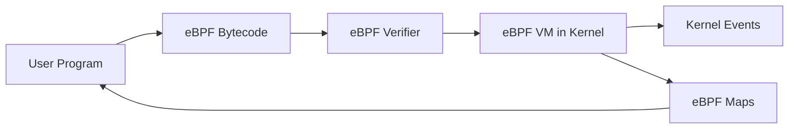

# What is eBPF?

eBPF (extended Berkeley Packet Filter) is a revolutionary technology that allows you to run sandboxed programs in the Linux kernel without changing kernel source code or loading kernel modules.

## 🧠 Core Concepts

eBPF enables you to write custom programs that run in kernel space, triggered by various events like:

- System calls
- Function calls
- Network packets
- Timer events
- Hardware events

!!! info "Why "Extended" Berkeley Packet Filter?"
    Originally designed for packet filtering (hence "Berkeley Packet Filter"), eBPF has evolved far beyond networking to become a general-purpose kernel programming framework.

## 🏗️ How eBPF Works



1. **Write Code**: Create eBPF programs in C or other supported languages
2. **Compile**: Compile to eBPF bytecode using LLVM/Clang
3. **Verify**: Kernel verifier ensures program safety
4. **Load**: Program is loaded into kernel space
5. **Execute**: Program runs when triggered by events
6. **Communicate**: Data flows between kernel and user space via eBPF maps

## 🌟 Key Benefits

### Safety First
- **Sandboxed Execution**: Programs run in a controlled environment
- **Memory Safety**: Verifier prevents invalid memory access
- **Termination Guarantee**: No infinite loops allowed
- **Resource Limits**: Bounded execution time and memory usage

### Performance
- **In-Kernel Execution**: No context switching overhead
- **Zero-Copy Data**: Efficient data transfer mechanisms
- **JIT Compilation**: Bytecode compiled to native machine code
- **Minimal Overhead**: Optimized for high-performance monitoring

### Flexibility
- **No Kernel Recompilation**: Add functionality without rebuilding kernel
- **Dynamic Loading**: Load and unload programs at runtime
- **Event-Driven**: React to any kernel event
- **Rich Ecosystem**: Growing library of tools and frameworks

## 🎯 Common Use Cases

### Observability
Monitor system behavior without modifying applications:

```c
// Monitor process executions
SEC("tracepoint/sched/sched_process_exec")
int trace_exec(void *ctx) {
    // Capture process information
    return 0;
}
```

### Security
Implement custom security policies:

```c
// Block suspicious file operations
SEC("lsm/file_open")
int lsm_file_open(struct file *file) {
    // Security logic here
    return allow ? 0 : -EPERM;
}
```

### Networking
Process network packets at line rate:

```c
// Load balancer
SEC("xdp")
int xdp_load_balancer(struct xdp_md *ctx) {
    // Packet processing logic
    return XDP_PASS;
}
```

### Performance Analysis
Measure application performance:

```c
// Function latency tracking
SEC("kprobe/do_sys_open")
int trace_open_entry(struct pt_regs *ctx) {
    // Record entry timestamp
    return 0;
}
```

## 🔧 eBPF Program Types

| Type | Use Case | Examples |
|------|----------|----------|
| **Tracepoints** | Monitor predefined kernel events | Process creation, file I/O |
| **Kprobes** | Hook any kernel function | Function entry/exit tracing |
| **Uprobes** | Hook userspace functions | Application profiling |
| **XDP** | High-performance packet processing | DDoS protection, load balancing |
| **TC** | Traffic control | QoS, packet modification |
| **LSM** | Security monitoring | Access control, audit logging |

## 🗄️ eBPF Maps

Maps are the primary way to share data between eBPF programs and userspace:

### Common Map Types

=== "Hash Maps"
    Key-value storage for arbitrary data
    ```c
    struct {
        __uint(type, BPF_MAP_TYPE_HASH);
        __type(key, u32);
        __type(value, struct data_t);
        __uint(max_entries, 1024);
    } my_map SEC(".maps");
    ```

=== "Arrays"
    Fixed-size indexed storage
    ```c
    struct {
        __uint(type, BPF_MAP_TYPE_ARRAY);
        __type(key, u32);
        __type(value, u64);
        __uint(max_entries, 256);
    } counters SEC(".maps");
    ```

=== "Ring Buffers"
    Efficient event streaming to userspace
    ```c
    struct {
        __uint(type, BPF_MAP_TYPE_RINGBUF);
        __uint(max_entries, 1 << 24);
    } events SEC(".maps");
    ```

## 🚨 eBPF Verifier

The verifier is eBPF's safety mechanism, ensuring programs are safe to run in kernel space:

### What It Checks
- **Bounds checking**: All memory accesses are validated
- **Type safety**: Variables must be used correctly
- **Control flow**: No unreachable code or infinite loops
- **Resource limits**: Program size and complexity limits
- **Privilege checks**: Ensures program has required permissions

### Common Verifier Errors
```bash
# Invalid memory access
R1 invalid mem access 'scalar'

# Unbounded variable access
R2 unbounded min value is negative

# Missing null check
R1 invalid mem access 'inv'
```

## 🎓 Learning Path

Now that you understand what eBPF is, here's your next steps:

1. **[Set up your development environment](development-setup.md)** ← Start here
2. **[Learn the fundamentals](../fundamentals/concepts.md)** - Deep dive into eBPF concepts
3. **[Build your first tool](../first-tool/architecture.md)** - Hands-on experience

## 🤔 Still Have Questions?

!!! question "Is eBPF production ready?"
    Yes! eBPF is used in production by companies like Facebook, Netflix, Cloudflare, and many others for critical infrastructure monitoring and security.

!!! question "What kernel version do I need?"
    Linux 4.18+ for most features, though 5.0+ is recommended. Some advanced features require newer kernels.

!!! question "Can eBPF crash my system?"
    The verifier prevents unsafe programs from loading. However, bugs in the verifier itself or privileged operations could potentially cause issues.

!!! question "How is eBPF different from kernel modules?"
    eBPF programs are verified safe before loading, can't crash the kernel (in theory), and are more portable across kernel versions.

---

Ready to get started? Let's [set up your development environment](development-setup.md)! 🚀