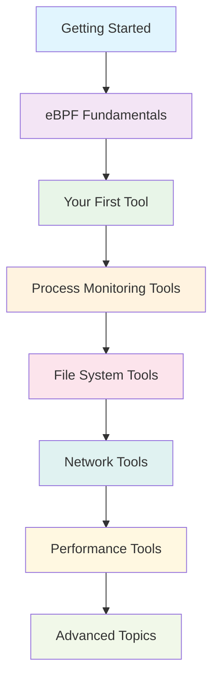

# eBPF the Hard Way!

Welcome to **eBPF the Hard Way** - a comprehensive, hands-on guide to learning eBPF development from the ground up!

## 🎯 What You'll Build

This isn't just another tutorial. You'll build real, production-ready eBPF tools from scratch, understanding every line of code and concept along the way.

!!! tip "Learning by Building"
    We believe the best way to learn eBPF is by building actual tools. Each tutorial walks you through creating a complete monitoring tool, from the eBPF kernel program to the Go userspace application.

## 🧠 What is eBPF?

eBPF (extended Berkeley Packet Filter) is a revolutionary technology that allows you to run sandboxed programs in the Linux kernel without changing kernel source code or loading kernel modules.

### Why eBPF Matters

- **🔍 Observability**: Monitor any aspect of your system in real-time
- **🛡️ Security**: Implement custom security policies and detection
- **⚡ Performance**: Near-zero overhead monitoring and analysis
- **🔧 Debugging**: Create custom debugging tools for any application

## 🎓 What You'll Learn

By working through this guide, you'll master:

=== "eBPF Fundamentals"
    - eBPF virtual machine and verifier
    - Program types and attachment points
    - Maps and data structures
    - Helper functions and kernel interaction

=== "Practical Skills"
    - Writing eBPF programs in C
    - Building userspace applications in Go
    - Debugging eBPF programs
    - Performance optimization techniques

=== "Real-World Tools"
    - Process execution monitoring
    - File system activity tracking
    - Network connection analysis
    - Performance profiling tools

## 🚀 Quick Start

Ready to dive in? Here's your learning path:

1. **[Set up your environment](getting-started/development-setup.md)** - Get everything installed
2. **[Learn eBPF basics](fundamentals/concepts.md)** - Understand the core concepts
3. **[Build your first tool](first-tool/architecture.md)** - Create a complete eBPF application
4. **[Explore advanced tools](tools/execsnoop.md)** - Learn from real examples

!!! success "Estimated Time"
    - **Quick setup**: 30 minutes
    - **First tool**: 2-3 hours
    - **Complete guide**: 1-2 weeks (at your own pace)

## 🛠️ Tools You'll Build

| Tool | Difficulty | Category | What It Does |
|------|-----------|----------|--------------|
| **[execsnoop](tools/execsnoop.md)** | 🟢 Beginner | Process Monitoring | Monitor process executions in real-time |
| **[rmdetect](tools/rmdetect.md)** | 🟢 Beginner | File System | Monitor file deletions |
| **[opensnoop](tools/opensnoop.md)** | 🟡 Intermediate | File System | Monitor file opens |
| **[tcpconnect](tools/tcpconnect.md)** | 🟡 Intermediate | Network | Monitor TCP connections |
| **[biolatency](tools/biolatency.md)** | 🔴 Advanced | Performance | Measure block I/O latency |

## 📋 Prerequisites

!!! warning "System Requirements"
    - **Linux Kernel**: 4.18+ (5.0+ recommended)
    - **Architecture**: x86_64 or arm64
    - **Root Access**: Required for loading eBPF programs
    - **BTF Support**: Check with `ls /sys/kernel/btf/vmlinux`

!!! info "Development Knowledge"
    - **C Programming**: Basic knowledge (we'll teach eBPF-specific parts)
    - **Go Programming**: Helpful but not required (examples are clear)
    - **Linux Systems**: Understanding of processes, files, networking

## 🌟 Why This Guide is Different

### 📚 **Comprehensive Yet Practical**
- Every concept is explained with working code
- No "magic" - you'll understand every line
- Progressive complexity from simple to advanced

### 🎯 **Learning-Focused**
- Clear learning objectives for each section
- Checkpoint exercises to test your understanding
- Common pitfalls and how to avoid them

### 🔧 **Production-Ready**
- Real tools you can use in production
- Best practices and performance considerations
- Proper error handling and debugging techniques

### 🤝 **Community-Driven**
- Open source and welcomes contributions
- Active community support
- Regular updates with new tools and concepts

## 🗺️ Learning Path

## 🚀 Ready to Start?

Choose your path:

-   :material-rocket-launch: **Complete Beginner**

    ---

    Start with the fundamentals and build up your knowledge step by step.

    [:octicons-arrow-right-24: Begin Learning](getting-started/what-is-ebpf.md)

-   :material-tools: **Some Experience**

    ---

    Jump straight to building your first tool if you know the basics.

    [:octicons-arrow-right-24: Build First Tool](first-tool/architecture.md)

-   :material-lightning-bolt: **Just Show Me Code**

    ---

    Dive into the tool tutorials and learn by example.

    [:octicons-arrow-right-24: See Tools](tools/execsnoop.md)

## 🆘 Need Help?

- **💬 Discussions**: Ask questions in GitHub Discussions
- **🐛 Issues**: Report bugs or request features
- **📖 Docs**: Check our comprehensive reference sections
- **🤝 Contributing**: Help improve this guide for others

---

!!! quote "Learning Philosophy"
    "The best way to learn eBPF is not by reading about it, but by building with it. This guide gives you the confidence to create, experiment, and innovate with eBPF."

**Let's build something amazing together!** 🚀