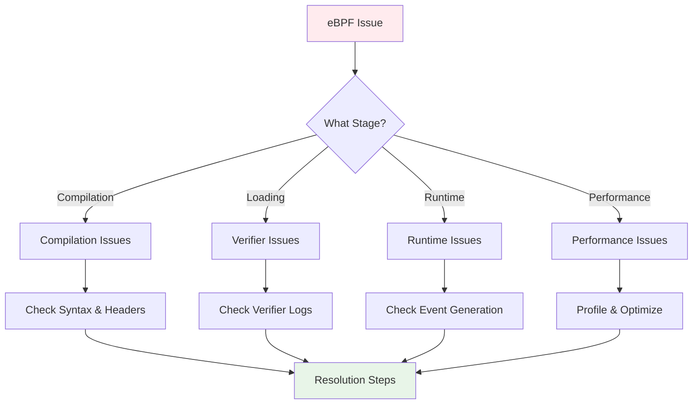

# Troubleshooting Guide

Comprehensive troubleshooting guide for common eBPF development issues. Follow the systematic approach to quickly identify and resolve problems.

## 🔍 Troubleshooting Methodology



## 🛠️ Compilation Issues

### 1. Header File Problems

!!! failure "vmlinux.h not found"
    **Error**:
    ```
    fatal error: 'vmlinux.h' file not found
    #include "vmlinux.h"
             ^~~~~~~~~~~~
    ```
    
    **Cause**: Missing kernel type definitions
    
    **Solution**:
    ```bash
    # Generate kernel headers
    make gen_vmlinux
    
    # Or manually
    sudo bpftool btf dump file /sys/kernel/btf/vmlinux format c > ./bpf/headers/vmlinux.h
    
    # Check BTF support
    ls /sys/kernel/btf/vmlinux
    ```

!!! failure "Conflicting type definitions"
    **Error**:
    ```
    error: redefinition of 'struct pt_regs'
    ```
    
    **Cause**: Mixing vmlinux.h with other kernel headers
    
    **Solution**:
    ```c
    // ❌ Don't mix headers
    #include <linux/types.h>
    #include "vmlinux.h"
    
    // ✅ Use only vmlinux.h
    #include "vmlinux.h"
    // All kernel types are included
    ```

### 2. Syntax Errors

!!! failure "Unknown section type"
    **Error**:
    ```
    error: unknown section 'tracepoint/syscalls/sys_enter_openat'
    ```
    
    **Cause**: Incorrect section name or missing SEC macro
    
    **Solution**:
    ```c
    // ❌ Wrong syntax
    SEC(tracepoint/syscalls/sys_enter_openat)
    
    // ✅ Correct syntax  
    SEC("tracepoint/syscalls/sys_enter_openat")
    int trace_openat(struct trace_event_raw_sys_enter *ctx) {
        return 0;
    }
    ```

!!! failure "Invalid helper function"
    **Error**:
    ```
    error: use of undeclared identifier 'bpf_probe_read'
    ```
    
    **Cause**: Using deprecated or unavailable helper
    
    **Solution**:
    ```c
    // ❌ Deprecated (pre-5.5 kernel)
    bpf_probe_read(&data, sizeof(data), ptr);
    
    // ✅ Modern approach
    bpf_probe_read_kernel(&data, sizeof(data), kernel_ptr);
    bpf_probe_read_user(&data, sizeof(data), user_ptr);
    ```

### 3. Build System Issues

!!! failure "bpf2go generation fails"
    **Error**:
    ```
    go:generate go run github.com/cilium/ebpf/cmd/bpf2go -target native program ../bpf/program.c
    error: failed to compile BPF program
    ```
    
    **Diagnostic Steps**:
    ```bash
    # Check if clang is installed
    clang --version
    
    # Test manual compilation
    clang -O2 -target bpf -c bpf/program.c -o /tmp/test.o -I./bpf/headers
    
    # Check generated files
    ls -la *_bpfel.go *_bpfel.o
    
    # Verbose bpf2go
    go generate -x ./cmd/
    ```

## ⚖️ Verifier Issues

### 1. Memory Access Violations

!!! failure "R1 invalid mem access 'scalar'"
    **Problem**: Direct memory dereference without bounds checking
    
    ```c
    // ❌ This will fail verification
    SEC("kprobe/vfs_open")
    int unsafe_access(struct pt_regs *ctx) {
        struct file *file = (struct file *)PT_REGS_PARM1(ctx);
        char *name = file->f_path.dentry->d_name.name; // Invalid!
        return 0;
    }
    ```
    
    **Solution**: Use helper functions
    ```c
    // ✅ Safe memory access
    SEC("kprobe/vfs_open") 
    int safe_access(struct pt_regs *ctx) {
        struct file *file = (struct file *)PT_REGS_PARM1(ctx);
        char filename[256];
        
        // Safe kernel memory read
        long ret = bpf_probe_read_kernel(&filename, sizeof(filename), file);
        if (ret < 0) {
            return 0; // Handle error
        }
        
        return 0;
    }
    ```

!!! failure "invalid indirect read from stack"
    **Problem**: Using uninitialized stack memory
    
    ```c
    // ❌ Uninitialized stack access
    SEC("tracepoint/syscalls/sys_enter_openat")
    int bad_stack_access(void *ctx) {
        char buffer[256]; // Uninitialized
        // Verifier doesn't know buffer contents are safe
        return process_data(buffer); // Fails verification
    }
    ```
    
    **Solution**: Initialize stack variables
    ```c
    // ✅ Initialized stack access
    SEC("tracepoint/syscalls/sys_enter_openat")
    int safe_stack_access(void *ctx) {
        char buffer[256] = {}; // Initialized to zero
        // or
        __builtin_memset(buffer, 0, sizeof(buffer));
        
        return process_data(buffer); // Passes verification
    }
    ```

### 2. Control Flow Issues

!!! failure "back-edge from insn X to Y"
    **Problem**: Unbounded loops detected
    
    ```c
    // ❌ Unbounded loop
    SEC("tracepoint/sched/sched_process_exec")
    int unbounded_loop(void *ctx) {
        int count = get_dynamic_count();
        for (int i = 0; i < count; i++) { // Verifier can't bound this
            process_item(i);
        }
        return 0;
    }
    ```
    
    **Solution**: Use bounded loops with unroll pragma
    ```c
    // ✅ Bounded loop
    SEC("tracepoint/sched/sched_process_exec")
    int bounded_loop(void *ctx) {
        int count = get_dynamic_count();
        
        #pragma unroll
        for (int i = 0; i < MAX_ITEMS && i < count; i++) {
            process_item(i);
        }
        return 0;
    }
    ```

!!! failure "unreachable insn"
    **Problem**: Dead code after program termination
    
    ```c
    // ❌ Unreachable code
    SEC("xdp")
    int unreachable_code(struct xdp_md *ctx) {
        return XDP_PASS;
        
        // This code is unreachable and will cause verifier error
        bpf_printk("This will never execute\n");
    }
    ```
    
    **Solution**: Remove or restructure dead code
    ```c
    // ✅ No unreachable code
    SEC("xdp")
    int clean_code(struct xdp_md *ctx) {
        // All processing logic before return
        bpf_printk("Processing packet\n");
        
        return XDP_PASS; // Single exit point
    }
    ```

### 3. Map Access Issues

!!! failure "invalid access to map value, value_size=X off=Y size=Z"
    **Problem**: Accessing map value beyond boundaries
    
    ```c
    // ❌ Unsafe map access
    struct large_struct {
        char data[1000];
        int important_field; // At offset 1000
    };
    
    SEC("tracepoint/syscalls/sys_enter_read")
    int unsafe_map_access(void *ctx) {
        u32 key = 0;
        struct large_struct *value = bpf_map_lookup_elem(&my_map, &key);
        
        // Verifier can't prove this access is safe
        return value->important_field; // May fail
    }
    ```
    
    **Solution**: Always check map lookup results and use safe access patterns
    ```c
    // ✅ Safe map access
    SEC("tracepoint/syscalls/sys_enter_read")
    int safe_map_access(void *ctx) {
        u32 key = 0;
        struct large_struct *value = bpf_map_lookup_elem(&my_map, &key);
        
        if (!value) {
            return 0; // Handle null pointer
        }
        
        // Access is now verified as safe
        return value->important_field;
    }
    ```

## 🔄 Runtime Issues

### 1. No Events Generated

!!! warning "Program loads but no events appear"
    **Diagnostic Steps**:
    
    1. **Check if events should be generated**:
    ```bash
    # Test the event source manually
    # For file events:
    touch /tmp/test_file && rm /tmp/test_file
    
    # For process events:
    sleep 1 &
    
    # For network events:
    curl http://example.com
    ```
    
    2. **Verify program attachment**:
    ```bash
    # Check loaded programs
    sudo bpftool prog list | grep your_program
    
    # Check tracepoint is available
    sudo cat /sys/kernel/debug/tracing/available_events | grep your_tracepoint
    
    # Check tracepoint is enabled
    sudo cat /sys/kernel/debug/tracing/events/syscalls/sys_enter_openat/enable
    ```
    
    3. **Add debug output**:
    ```c
    SEC("tracepoint/syscalls/sys_enter_openat")
    int debug_openat(struct trace_event_raw_sys_enter *ctx) {
        bpf_printk("openat called by PID %d\n", 
                   bpf_get_current_pid_tgid() & 0xFFFFFFFF);
        return 0;
    }
    ```
    
    4. **Check debug output**:
    ```bash
    sudo cat /sys/kernel/debug/tracing/trace_pipe
    ```

### 2. Wrong or Incomplete Data

!!! warning "Events generated but data is incorrect"
    **Common Issues**:
    
    1. **Incorrect context structure**:
    ```c
    // ❌ Wrong context type
    SEC("tracepoint/syscalls/sys_enter_openat")
    int wrong_context(struct pt_regs *ctx) { // Wrong type!
        // ctx doesn't contain the expected data
        return 0;
    }
    
    // ✅ Correct context type
    SEC("tracepoint/syscalls/sys_enter_openat")
    int correct_context(struct trace_event_raw_sys_enter *ctx) {
        // ctx->args[0] = dirfd, ctx->args[1] = filename, etc.
        return 0;
    }
    ```
    
    2. **Endianness issues**:
    ```c
    // ❌ Network byte order confusion
    struct network_event *event = bpf_ringbuf_reserve(&events, sizeof(*event), 0);
    event->dst_port = tcp->dest; // Still in network byte order!
    
    // ✅ Convert to host byte order (if needed)
    event->dst_port = bpf_ntohs(tcp->dest);
    ```
    
    3. **String handling issues**:
    ```c
    // ❌ Unsafe string copy
    char filename[256];
    bpf_probe_read_user(&filename, sizeof(filename), user_ptr); // Not null-terminated!
    
    // ✅ Safe string read
    char filename[256];
    bpf_probe_read_user_str(&filename, sizeof(filename), user_ptr); // Null-terminated
    ```

### 3. Ring Buffer Issues

!!! warning "Ring buffer events not reaching userspace"
    **Diagnostic Steps**:
    
    1. **Check ring buffer size**:
    ```bash
    # Check ring buffer utilization
    sudo bpftool map show name events
    
    # Look for max_entries and current usage
    ```
    
    2. **Monitor for drops**:
    ```c
    // Add drop counting
    struct data_t *data = bpf_ringbuf_reserve(&events, sizeof(*data), 0);
    if (!data) {
        // Increment drop counter
        u32 key = 0;
        u64 *drops = bpf_map_lookup_elem(&drop_counter, &key);
        if (drops) (*drops)++;
        return 0;
    }
    ```
    
    3. **Check userspace reader**:
    ```go
    // Add error handling to ring buffer reader
    for {
        record, err := reader.Read()
        if err != nil {
            if errors.Is(err, ringbuf.ErrClosed) {
                return
            }
            log.Printf("Ring buffer read error: %v", err)
            continue
        }
        // Process record...
    }
    ```

## ⚡ Performance Issues

### 1. High CPU Usage

!!! warning "eBPF program causing high CPU load"
    **Investigation Steps**:
    
    1. **Check program statistics**:
    ```bash
    # Get program execution stats
    sudo bpftool prog show id <prog_id> --json | jq '.run_cnt, .run_time_ns'
    
    # Calculate average execution time
    # avg_time_ns = run_time_ns / run_cnt
    ```
    
    2. **Profile with bpftool**:
    ```bash
    # Enable program profiling
    echo 1 > /proc/sys/kernel/bpf_stats_enabled
    
    # Monitor program performance
    watch -n 1 'sudo bpftool prog show --json | jq ".[] | {id, run_cnt, run_time_ns}"'
    ```
    
    3. **Optimize hot paths**:
    ```c
    // ❌ Inefficient: Multiple map lookups
    SEC("tracepoint/syscalls/sys_enter_openat")
    int inefficient_program(void *ctx) {
        u32 pid = bpf_get_current_pid_tgid() & 0xFFFFFFFF;
        
        u64 *counter1 = bpf_map_lookup_elem(&map1, &pid);
        u64 *counter2 = bpf_map_lookup_elem(&map2, &pid);
        u64 *counter3 = bpf_map_lookup_elem(&map3, &pid);
        
        if (counter1) (*counter1)++;
        if (counter2) (*counter2)++;
        if (counter3) (*counter3)++;
        return 0;
    }
    
    // ✅ Efficient: Single combined structure
    struct combined_stats {
        u64 counter1;
        u64 counter2; 
        u64 counter3;
    };
    
    SEC("tracepoint/syscalls/sys_enter_openat")
    int efficient_program(void *ctx) {
        u32 pid = bpf_get_current_pid_tgid() & 0xFFFFFFFF;
        
        struct combined_stats *stats = bpf_map_lookup_elem(&combined_map, &pid);
        if (stats) {
            stats->counter1++;
            stats->counter2++;
            stats->counter3++;
        }
        return 0;
    }
    ```

### 2. Memory Issues

!!! warning "High memory usage or ring buffer drops"
    **Solutions**:
    
    1. **Optimize event size**:
    ```c
    // ❌ Large events
    struct bloated_event {
        u32 pid;
        char comm[16];
        char filename[4096]; // Usually mostly empty
        char unused_field[1000];
    };
    
    // ✅ Compact events
    struct compact_event {
        u32 pid;
        char comm[16];
        u16 filename_len;    // Actual length
        char filename[];     // Variable length
    };
    ```
    
    2. **Implement event filtering**:
    ```c
    // Filter in kernel to reduce userspace load
    SEC("tracepoint/syscalls/sys_enter_openat")
    int filtered_openat(struct trace_event_raw_sys_enter *ctx) {
        // Early filtering
        char filename[256];
        bpf_probe_read_user_str(&filename, sizeof(filename), (void *)ctx->args[1]);
        
        // Skip temporary files
        if (filename[0] == '/' && filename[1] == 't' && 
            filename[2] == 'm' && filename[3] == 'p') {
            return 0; // Skip /tmp files
        }
        
        // Only process important files
        struct file_event *event = bpf_ringbuf_reserve(&events, sizeof(*event), 0);
        // ... process event
        return 0;
    }
    ```

## 🔧 System-Level Issues

### 1. Permission Problems

!!! failure "Operation not permitted"
    **Common Causes and Solutions**:
    
    1. **Missing capabilities**:
    ```bash
    # Check current capabilities
    capsh --print
    
    # Run with sudo
    sudo ./ebee your-tool
    
    # Or add CAP_BPF capability (Linux 5.8+)
    sudo setcap cap_bpf,cap_perfmon+ep ./ebee
    ```
    
    2. **SELinux/AppArmor restrictions**:
    ```bash
    # Check SELinux status
    getenforce
    
    # Check AppArmor status  
    sudo aa-status
    
    # Temporary disable for testing
    sudo setenforce 0  # SELinux
    sudo aa-complain /usr/bin/your-program  # AppArmor
    ```

### 2. Kernel Compatibility

!!! warning "Program fails to load on different kernel versions"
    **Compatibility Checks**:
    
    ```bash
    # Check kernel version
    uname -r
    
    # Check eBPF features
    cat /proc/sys/kernel/bpf_disabled
    
    # Check BTF support
    ls /sys/kernel/btf/vmlinux
    
    # Check available program types
    cat /proc/kallsyms | grep bpf_prog_type
    ```
    
    **Version-specific Code**:
    ```c
    // Handle kernel version differences
    #if LINUX_VERSION_CODE >= KERNEL_VERSION(5, 5, 0)
        bpf_probe_read_kernel(&data, sizeof(data), ptr);
    #else
        bpf_probe_read(&data, sizeof(data), ptr);
    #endif
    ```

## 🛠️ Debugging Tools and Commands

### Essential Commands

```bash
# System Information
uname -r                                    # Kernel version
cat /proc/version                          # Detailed kernel info
cat /proc/sys/kernel/bpf_disabled          # BPF enabled status

# Program and Map Inspection
sudo bpftool prog list                     # List programs
sudo bpftool prog show id <id>            # Program details
sudo bpftool map list                      # List maps
sudo bpftool map dump id <id>             # Map contents

# Tracing and Debugging
sudo cat /sys/kernel/debug/tracing/trace_pipe    # Debug prints
sudo cat /sys/kernel/debug/tracing/available_events | grep <event>  # Available tracepoints
dmesg | grep -i bpf                        # Kernel BPF messages

# Performance Monitoring
echo 1 > /proc/sys/kernel/bpf_stats_enabled      # Enable stats
sudo bpftool prog profile                  # Profile programs
```

### Debugging Script

```bash
#!/bin/bash
# ebpf-debug.sh - Comprehensive eBPF debugging script

echo "=== eBPF System Debug Information ==="

echo "1. Kernel and System Info:"
echo "  Kernel: $(uname -r)"
echo "  BPF disabled: $(cat /proc/sys/kernel/bpf_disabled 2>/dev/null || echo 'unknown')"
echo "  BTF available: $(ls /sys/kernel/btf/vmlinux 2>/dev/null && echo 'yes' || echo 'no')"

echo "2. Loaded eBPF Programs:"
sudo bpftool prog list 2>/dev/null | head -10

echo "3. eBPF Maps:"
sudo bpftool map list 2>/dev/null | head -10

echo "4. Recent BPF kernel messages:"
dmesg | grep -i bpf | tail -5

echo "5. Tracing status:"
echo "  Tracing enabled: $(cat /sys/kernel/debug/tracing/tracing_on 2>/dev/null || echo 'unknown')"

echo "6. Process capabilities:"
if command -v capsh >/dev/null; then
    capsh --print | grep Current
else
    echo "  capsh not available"
fi

echo "=== End Debug Info ==="
```

## 🧠 Advanced Debugging Techniques

### 1. Memory Access Pattern Analysis

```c
// Debug memory access patterns
#ifdef DEBUG_MEMORY
struct memory_debug {
    u64 access_count;
    u64 null_access_count;
    u64 bounds_violations;
};

struct {
    __uint(type, BPF_MAP_TYPE_ARRAY);
    __type(key, u32);
    __type(value, struct memory_debug);
    __uint(max_entries, 1);
} memory_debug_stats SEC(".maps");

static inline void track_memory_access(void *ptr, const char *location) {
    u32 key = 0;
    struct memory_debug *stats = bpf_map_lookup_elem(&memory_debug_stats, &key);
    if (!stats) return;

    stats->access_count++;
    if (!ptr) {
        stats->null_access_count++;
        bpf_trace_printk("NULL access at %s\n", location);
    }
}

#define SAFE_ACCESS(ptr, location) do { \
    track_memory_access(ptr, location); \
    if (!ptr) return 0; \
} while(0)
#else
#define SAFE_ACCESS(ptr, location) if (!ptr) return 0
#endif
```

### 2. Stack Usage Monitoring

```c
// Monitor stack usage (eBPF has 512-byte limit)
static inline void check_stack_usage(void) {
    char stack_marker[100];  // Test stack allocation

    // This helps identify stack pressure
    bpf_trace_printk("Stack check: %p\n", &stack_marker);
}

// Optimize stack usage
struct optimized_event {
    u32 pid;
    u32 data_len;
    char data[];  // Variable length instead of fixed arrays
} __attribute__((packed));
```

### 3. Cross-Kernel Version Debugging

```c
// Handle kernel version differences
#include <linux/version.h>

SEC("kprobe/security_file_open")
int debug_file_security(struct pt_regs *ctx) {
#if LINUX_VERSION_CODE >= KERNEL_VERSION(5, 8, 0)
    // Modern kernel - use new security hooks
    struct file *file = (struct file *)PT_REGS_PARM1(ctx);
    bpf_trace_printk("Modern security hook\n");
#elif LINUX_VERSION_CODE >= KERNEL_VERSION(4, 19, 0)
    // Intermediate kernel version
    bpf_trace_printk("Legacy security hook\n");
#else
    // Very old kernel - different approach needed
    bpf_trace_printk("Ancient kernel fallback\n");
#endif

    return 0;
}
```

## 🔬 Error Handling Patterns

### 1. Comprehensive Error Tracking

```c
// Error code enumeration
enum ebpf_error_codes {
    ERR_NONE = 0,
    ERR_NULL_POINTER = 1,
    ERR_BOUNDS_CHECK = 2,
    ERR_MAP_LOOKUP = 3,
    ERR_MAP_UPDATE = 4,
    ERR_MEMORY_READ = 5,
    ERR_STRING_READ = 6,
    ERR_RING_BUFFER = 7,
};

struct error_context {
    u32 error_code;
    u32 line_number;
    u32 pid;
    u64 timestamp;
    char function[32];
};

struct {
    __uint(type, BPF_MAP_TYPE_RINGBUF);
    __uint(max_entries, 1 << 16);
} error_events SEC(".maps");

#define REPORT_ERROR(code, line, func) do { \
    struct error_context *err = bpf_ringbuf_reserve(&error_events, sizeof(*err), 0); \
    if (err) { \
        err->error_code = code; \
        err->line_number = line; \
        err->pid = bpf_get_current_pid_tgid() >> 32; \
        err->timestamp = bpf_ktime_get_ns(); \
        bpf_probe_read_str(&err->function, sizeof(err->function), func); \
        bpf_ringbuf_submit(err, 0); \
    } \
} while(0)

// Usage example
SEC("kprobe/vfs_read")
int monitored_vfs_read(struct pt_regs *ctx) {
    struct file *file = (struct file *)PT_REGS_PARM1(ctx);

    if (!file) {
        REPORT_ERROR(ERR_NULL_POINTER, __LINE__, __func__);
        return 0;
    }

    char filename[256];
    int ret = bpf_probe_read_kernel_str(&filename, sizeof(filename), "test");
    if (ret < 0) {
        REPORT_ERROR(ERR_STRING_READ, __LINE__, __func__);
        return 0;
    }

    return 0;
}
```

### 2. Map Operation Error Handling

```c
// Safe map operations with error handling
static inline int safe_map_update(void *map, void *key, void *value, u64 flags) {
    int ret = bpf_map_update_elem(map, key, value, flags);

    switch (ret) {
        case 0:
            return 0;  // Success
        case -E2BIG:
            REPORT_ERROR(ERR_MAP_UPDATE, __LINE__, "map_full");
            break;
        case -ENOMEM:
            REPORT_ERROR(ERR_MAP_UPDATE, __LINE__, "out_of_memory");
            break;
        case -EEXIST:
            // Key already exists - might be OK depending on use case
            break;
        default:
            REPORT_ERROR(ERR_MAP_UPDATE, __LINE__, "unknown_error");
    }

    return ret;
}

// Usage with error checking
SEC("tracepoint/syscalls/sys_enter_openat")
int safe_openat_trace(struct trace_event_raw_sys_enter *ctx) {
    u32 pid = bpf_get_current_pid_tgid() >> 32;
    u64 timestamp = bpf_ktime_get_ns();

    if (safe_map_update(&process_timestamps, &pid, &timestamp, BPF_ANY) != 0) {
        // Error already reported, decide how to handle
        return 0;  // Continue or return error
    }

    return 0;
}
```

### 3. Verifier Failure Pattern Analysis

```c
// Common patterns that cause verifier failures

// Pattern 1: Unvalidated array access
int unsafe_array_access(int index) {
    int data[10];
    return data[index];  // ❌ Verifier doesn't know bounds
}

int safe_array_access(int index) {
    int data[10];
    if (index < 0 || index >= 10) return 0;  // ✅ Bounds check
    return data[index];
}

// Pattern 2: Uninitialized variable usage
int unsafe_var_usage(void) {
    int value;  // ❌ Uninitialized
    return value * 2;
}

int safe_var_usage(void) {
    int value = 0;  // ✅ Initialized
    return value * 2;
}

// Pattern 3: Complex pointer arithmetic
struct complex_struct {
    int field1;
    char field2[100];
    int field3;
};

int unsafe_pointer_math(struct complex_struct *ptr) {
    // ❌ Complex offset calculation
    char *target = (char *)ptr + sizeof(int) + 50;
    return *target;
}

int safe_struct_access(struct complex_struct *ptr) {
    if (!ptr) return 0;
    // ✅ Use proper struct access
    return ptr->field2[50];  // With bounds checking in real code
}
```

## 🏗️ Memory Management Best Practices

### 1. Stack Optimization

```c
// eBPF stack is limited to 512 bytes
struct stack_heavy {
    char big_buffer[400];    // Takes most of stack
    int small_data[10];      // May cause stack overflow
};

// ✅ Better approach: Use smaller stack, maps for large data
struct stack_light {
    u32 key;
    u16 size;
    char small_buffer[32];   // Keep stack usage minimal
};

// Use map for large temporary storage
struct {
    __uint(type, BPF_MAP_TYPE_PERCPU_ARRAY);
    __type(key, u32);
    __type(value, char[4096]);
    __uint(max_entries, 1);
} temp_storage SEC(".maps");

SEC("kprobe/large_data_handler")
int optimized_handler(struct pt_regs *ctx) {
    u32 key = 0;
    char *large_buffer = bpf_map_lookup_elem(&temp_storage, &key);
    if (!large_buffer) return 0;

    // Use large_buffer for temporary storage
    bpf_probe_read_kernel_str(large_buffer, 4096, some_pointer);

    return 0;
}
```

### 2. Memory Access Patterns

```c
// Efficient memory access patterns
struct efficient_reader {
    u32 pid;
    u32 offset;
    u32 size;
};

// ❌ Multiple small reads
int inefficient_reads(void *source) {
    char byte1, byte2, byte3, byte4;
    bpf_probe_read_kernel(&byte1, 1, source);
    bpf_probe_read_kernel(&byte2, 1, source + 1);
    bpf_probe_read_kernel(&byte3, 1, source + 2);
    bpf_probe_read_kernel(&byte4, 1, source + 3);
    return (byte1 << 24) | (byte2 << 16) | (byte3 << 8) | byte4;
}

// ✅ Single larger read
int efficient_read(void *source) {
    u32 value;
    if (bpf_probe_read_kernel(&value, sizeof(value), source) == 0) {
        return value;
    }
    return 0;
}
```

## 🌐 Cross-Platform Considerations

### 1. Architecture-Specific Code

```c
// Handle different architectures
#ifdef __x86_64__
#define ARCH_SPECIFIC_OFFSET 8
#elif defined(__aarch64__)
#define ARCH_SPECIFIC_OFFSET 16
#elif defined(__riscv)
#define ARCH_SPECIFIC_OFFSET 12
#else
#define ARCH_SPECIFIC_OFFSET 8  // Default
#endif

// Architecture-aware structure access
struct platform_specific {
    u64 common_field;
#ifdef __x86_64__
    u64 x86_specific;
#elif defined(__aarch64__)
    u64 arm_specific1;
    u64 arm_specific2;
#endif
};
```

### 2. Kernel Version Compatibility

```c
// Feature detection at compile time
#if LINUX_VERSION_CODE >= KERNEL_VERSION(5, 2, 0)
#define HAS_BPF_CORE_READ 1
#else
#define HAS_BPF_CORE_READ 0
#endif

// Runtime feature detection
static inline bool has_btf_support(void) {
    // Check if BTF is available at runtime
    return bpf_core_type_exists(struct task_struct);
}

// Conditional compilation for features
SEC("kprobe/test_function")
int adaptive_program(struct pt_regs *ctx) {
#if HAS_BPF_CORE_READ
    // Use modern CO-RE approach
    struct task_struct *task = (struct task_struct *)bpf_get_current_task();
    u32 pid = BPF_CORE_READ(task, pid);
#else
    // Fallback for older kernels
    u32 pid = bpf_get_current_pid_tgid() >> 32;
#endif

    bpf_trace_printk("PID: %d\n", pid);
    return 0;
}
```

### 3. Distribution-Specific Considerations

```go
// Go code for handling distribution differences
package main

import (
    "os"
    "strings"
)

type DistributionInfo struct {
    Name    string
    Version string
    Kernel  string
}

func detectDistribution() (*DistributionInfo, error) {
    // Check /etc/os-release
    data, err := os.ReadFile("/etc/os-release")
    if err != nil {
        return nil, err
    }

    lines := strings.Split(string(data), "\n")
    info := &DistributionInfo{}

    for _, line := range lines {
        if strings.HasPrefix(line, "ID=") {
            info.Name = strings.Trim(strings.TrimPrefix(line, "ID="), "\"")
        } else if strings.HasPrefix(line, "VERSION_ID=") {
            info.Version = strings.Trim(strings.TrimPrefix(line, "VERSION_ID="), "\"")
        }
    }

    return info, nil
}

func adjustForDistribution(info *DistributionInfo) error {
    switch info.Name {
    case "ubuntu":
        return handleUbuntuSpecifics(info.Version)
    case "rhel", "centos":
        return handleRHELSpecifics(info.Version)
    case "alpine":
        return handleAlpineSpecifics(info.Version)
    default:
        return handleGenericLinux()
    }
}
```

## 📋 Enhanced Quick Troubleshooting Checklist

### Advanced Debugging Checklist

- [ ] **Memory Management**
  - [ ] Stack usage under 512 bytes
  - [ ] No uninitialized variables
  - [ ] Proper bounds checking for all array accesses
  - [ ] Safe pointer arithmetic

- [ ] **Error Handling**
  - [ ] All map operations check return values
  - [ ] All memory reads use safe helpers
  - [ ] Error reporting mechanism in place
  - [ ] Graceful degradation on failures

- [ ] **Cross-Platform Compatibility**
  - [ ] Architecture-specific code properly guarded
  - [ ] Kernel version compatibility checked
  - [ ] Distribution-specific adjustments made
  - [ ] Fallback mechanisms for missing features

- [ ] **Performance Considerations**
  - [ ] Event filtering implemented in kernel space
  - [ ] Map types chosen appropriately
  - [ ] Ring buffer size optimized for workload
  - [ ] No unnecessary helper function calls

### Before Seeking Help

- [ ] **Check kernel version** (4.18+ required, 5.0+ recommended)
- [ ] **Verify BTF support** (`ls /sys/kernel/btf/vmlinux`)
- [ ] **Run with sudo** or appropriate capabilities
- [ ] **Check verifier logs** (`dmesg | grep -i bpf`)
- [ ] **Verify program attachment** (`sudo bpftool prog list`)
- [ ] **Test event generation** manually
- [ ] **Check ring buffer utilization**
- [ ] **Review recent changes** that might have broken functionality
- [ ] **Validate memory access patterns**
- [ ] **Check for proper error handling**
- [ ] **Verify cross-platform compatibility**

### Getting Help

When reporting issues, include:

1. **System Information**:
   - Kernel version (`uname -r`)
   - Architecture (`uname -m`)
   - Distribution and version
   - eBPF program type and attachment point
   - BTF availability

2. **Error Messages**:
   - Complete compilation errors
   - Verifier error messages from `dmesg`
   - Runtime error messages
   - Memory access violations

3. **Minimal Reproduction**:
   - Simplified code that demonstrates the issue
   - Steps to reproduce the problem
   - Expected vs actual behavior
   - Error handling code if applicable

4. **Environment Details**:
   - Running as root/sudo?
   - Any security frameworks (SELinux, AppArmor)?
   - Container environment?
   - Cross-compilation targets

5. **Performance Context**:
   - Expected vs actual performance
   - Memory usage patterns
   - Event frequency and volume
   - System resource utilization

Following this systematic approach will help you quickly identify and resolve most eBPF development issues! 🔧